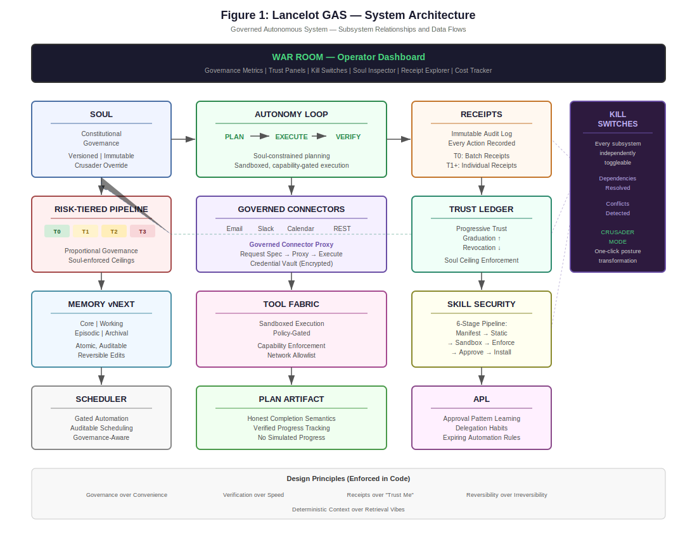

# Lancelot

[](LICENSE)
[](DISCLOSURE.md)
[](CLAUDE.md)
[]()

**A Governed Autonomous System** — an AI operator that can plan, act, remember, and recover under explicit constitutional control.


---

Lancelot is a **self-hosted, local-first autonomous AI system** for people who want an AI they can trust to *operate*, not just converse. It executes real actions, maintains structured memory, and produces auditable records of everything it does — all governed by an explicit constitutional document called the **Soul**.

This is not a chatbot. This is not a prompt wrapper. This is not a framework.
It is a **system**.

## Design Principles (Non-Negotiable)

These principles are enforced in code, not just stated in docs:

1. **Governance over convenience** — Every action passes through policy evaluation
2. **Verification over speed** — Planner/Verifier pipeline validates outcomes
3. **Deterministic context over retrieval vibes** — Structured tiered memory, not lossy RAG
4. **Receipts over "trust me"** — Every action produces an auditable receipt
5. **Reversibility over irreversible autonomy** — Atomic operations, rollback by default

## Architecture at a Glance

<p align="center">
  
</p>

Every subsystem is **independently disableable** via feature flags. If something breaks, kill it — the rest keeps running.

## Key Capabilities

| Subsystem | What It Does | Learn More |
|-----------|-------------|------------|
| **Soul** | Constitutional governance — defines what Lancelot can and cannot do | [Governance](docs/governance.md) |
| **Memory** | Tiered, commit-based memory with quarantine and rollback | [Memory](docs/memory.md) |
| **Skills** | Modular capabilities with manifest-declared permissions | [Developing Skills](docs/developing-skills.md) |
| **Tool Fabric** | Provider-agnostic execution with sandboxing and policy gates | [Architecture](docs/architecture.md) |
| **Receipts** | Auditable record of every action, decision, and outcome | [Receipts](docs/receipts.md) |
| **Scheduler** | Gated cron/interval automation with approval pipelines | [Configuration](docs/configuration-reference.md) |
| **War Room** | Operator dashboard for full system observability | [War Room Guide](docs/war-room.md) |

## Quickstart

### One-Command Install (Recommended)

Requires **Docker Desktop** and **Node.js 18+**:

```bash
npx create-lancelot
```

The installer handles everything: prerequisites check, API key setup, model download, Docker build, and startup. You'll have a running instance in about 5 minutes.

Options:
- `npx create-lancelot --resume` — resume an interrupted install
- `npx create-lancelot --skip-model` — skip the 5GB local model download
- `npx create-lancelot --provider gemini` — pre-select a provider

<details>
<summary><strong>Manual Installation</strong></summary>

#### Prerequisites

- Docker Desktop
- At least one LLM API key (Gemini, OpenAI, Anthropic, or xAI)
- NVIDIA GPU recommended for local model (works without, just slower)

#### Steps

```bash
# Clone
git clone https://github.com/myles1663/lancelot.git
cd lancelot

# Configure — the installer creates .env for you, but for manual setup:
# Add your API keys and settings to .env

# Launch (starts Docker + auto-opens War Room in browser)
./launch.sh            # Linux / macOS / Git Bash
.\launch.ps1           # PowerShell (Windows)

# Or start manually without auto-open:
docker compose up -d
```

The launch scripts start the containers, wait for the health check to pass, then automatically open the War Room in your default browser.

#### Verify

```bash
# Health check
curl http://localhost:8000/health/live

# Send a test message
curl -X POST http://localhost:8000/chat \
  -H "Content-Type: application/json" \
  -d '{"text": "hello"}'
```

Open the **War Room** at `http://localhost:8000` to see the operator dashboard.


For detailed setup including GPU configuration, multi-provider routing, and network hardening, see the [Installation Guide](docs/installation.md).

</details>

## What Makes Lancelot Different

Most AI agent frameworks give the model a bag of tools and hope for the best. Lancelot treats the model as **untrusted logic inside a governed, observable, reversible system**.

- **The Soul is law.** The model cannot override its constitutional document. If the Soul forbids an action, it cannot be executed — regardless of prompt, context, or model intent.
- **Every action has a receipt.** LLM calls, tool executions, file operations, memory edits, scheduler runs, verification steps — all produce durable, auditable records. If there's no receipt, it didn't happen.
- **Memory is structured, not vibes.** Four tiers (Core, Working, Episodic, Archival) with commit-based editing, quarantine for risky writes, and exact rollback. No vector-search-and-pray.
- **Verification is mandatory.** The Planner/Executor/Verifier loop means results are checked, not assumed. Failures are surfaced, never hidden.
- **Everything has a kill switch.** Every subsystem is feature-flagged. Shell execution, networking, scheduling, skill installation, memory writes — all independently disableable.

For a detailed comparison with other agent systems, see [How Lancelot Compares](docs/comparison.md).

## Security

Lancelot is **safe by construction**, not by convention:

- Prompt injection detection with 16 patterns + homoglyph normalization
- Capability-based tool access with default-deny posture
- Sandboxed execution (Docker containers, workspace boundary enforcement)
- Symlink-safe path validation, atomic file writes
- Secrets never stored in memory, never sent to models unless required
- Local PII redaction before any external API call
- Feature-flag kill switches for every high-risk subsystem
- 96 vulnerabilities identified and remediated across two hardening passes

Full details: [Security Posture](docs/security.md)

## Who This Is For

Lancelot is built for people who want **agency with accountability**:

- Developers and DevOps engineers who need an AI that can actually execute
- Security-conscious operators who won't deploy ungoverned agents
- Founders and technical leads building AI-powered workflows
- Anyone who wants an AI they can trust to act — and prove what it did

## Who This Is Not For

- If you want a consumer chatbot, use ChatGPT
- If you want a lightweight agent demo, use a framework
- If you want to move fast and break things, Lancelot will slow you down — on purpose

## Project Values

Read the [Anti-Roadmap](docs/anti-roadmap.md) — what we will *not* build, and why. It says more about this project than any feature list.

<details>
<summary><strong>Project Structure</strong></summary>

```
lancelot/
├── src/
│   ├── core/              # Orchestration, routing, security
│   │   ├── memory/        # Tiered memory: block store, commits, compiler
│   │   ├── soul/          # Constitutional identity: store, linter, amendments
│   │   ├── skills/        # Modular skills: schema, registry, executor, factory
│   │   ├── health/        # Heartbeat: health types, monitor, API
│   │   ├── scheduler/     # Job scheduling: schema, service, executor
│   │   └── feature_flags.py
│   ├── tools/             # Tool Fabric: contracts, policies, providers
│   ├── warroom/           # React War Room (Vite + React 18 + TypeScript)
│   ├── agents/            # Planner, Verifier, Crusader
│   ├── ui/                # Legacy Streamlit UI, Launcher
│   ├── integrations/      # Telegram, Google Chat, MCP
│   └── shared/            # Utilities, logging, receipts
├── installer/             # create-lancelot CLI installer (npm)
├── config/                # YAML configuration files
├── docs/                  # Documentation
├── soul/                  # Soul version files
├── tests/                 # Test suite (1900+ tests)
└── static/                # UI assets
```

</details>

## Documentation

| Document | Description |
|----------|-------------|
| [Quickstart](docs/quickstart.md) | Clone to first governed action in 15 minutes |
| [Installation Guide](docs/installation.md) | Comprehensive setup for all deployment methods |
| [Architecture](docs/architecture.md) | Full system walkthrough with diagrams |
| [Governance Deep Dive](docs/governance.md) | Soul, Policy Engine, Trust Ledger, APL |
| [Security Posture](docs/security.md) | Threat model, enforcement layers, hardening |
| [Memory System](docs/memory.md) | Tiered memory, quarantine, rollback |
| [Receipts](docs/receipts.md) | Audit trail and action tracing |
| [War Room Guide](docs/war-room.md) | Operator dashboard manual |
| [Configuration Reference](docs/configuration-reference.md) | Every env var, YAML file, and option |
| [Developing Connectors](docs/developing-connectors.md) | Build governed integrations |
| [Developing Skills](docs/developing-skills.md) | Build capabilities that pass the security pipeline |
| [Authoring Souls](docs/authoring-souls.md) | Customize Lancelot's constitutional governance |
| [How Lancelot Compares](docs/comparison.md) | Factual comparison with the agent landscape |
| [Anti-Roadmap](docs/anti-roadmap.md) | What we will not build, and why |
| [Changelog](CHANGELOG.md) | Version history |
| [Contributing](CONTRIBUTING.md) | How to contribute |
| [Disclosure](DISCLOSURE.md) | Patent status, licensing, development methodology |
| [Security Policy](SECURITY.md) | Responsible disclosure process |

## License

AGPL-3.0 — See [LICENSE](LICENSE) for details. Commercial licensing available for organizations that cannot comply with AGPL terms.

---

> If you want a clever agent demo, use a framework.
> If you want an AI you can **trust to operate**, use a **Governed Autonomous System**.
