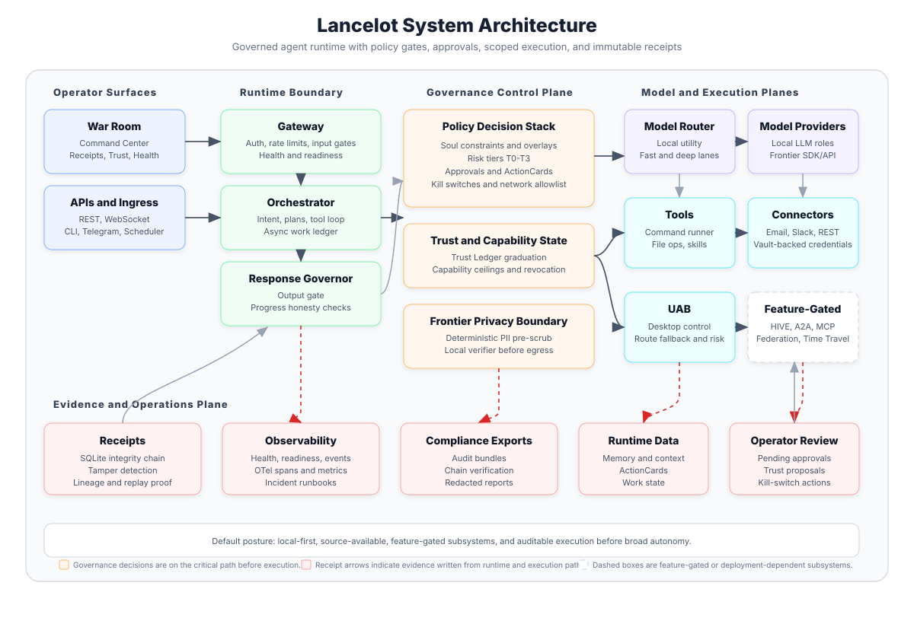

# Lancelot

Lancelot is a governed operating layer for AI agents: a self-hosted runtime where models can use tools, control desktop applications, coordinate scoped sub-agents, remember context, and still be constrained by policy, approvals, kill switches, and immutable action receipts.

The premise is that useful agents need more than prompts and tool calls. They need an execution environment that can decide when the model is allowed to act, when a human must approve, when work should be stopped, and how every outcome can be reconstructed later.

The core design choice is to treat the model as untrusted planning logic inside a system that can say no. The model proposes actions; Lancelot classifies risk, checks policy, requires approval when needed, routes execution through governed connectors or UAB, and records what happened.

Lancelot is source-available under BSL 1.1. Non-production use is free; production use requires a commercial license.

## Install Expectations

- Requires Docker Desktop, Docker Compose, Node.js 18+, Git, and one LLM provider credential.
- Plan for at least 10 GB free disk. The local GGUF utility model is about 5 GB; Docker images and runtime data use the rest.
- First install time depends mostly on image pulls, model download speed, and whether the local model is CPU-only or GPU-assisted.
- The War Room can come up while the local model is still warming. Readiness endpoints report degraded lanes explicitly instead of hiding them.
- If Docker, ports, provider keys, or model download fail, start with the [Quickstart troubleshooting section](docs/quickstart.md#troubleshooting) and the full [Installation Guide](docs/installation.md).

## Quickstart

1. Install Docker Desktop and Node.js 18+.
2. Run `npx create-lancelot`.
3. The installer will collect one provider credential, pull the prebuilt core and local-model images, and start the stack.
4. Open http://localhost:8000.
5. Verify liveness: `curl http://localhost:8000/health/live`
6. Send a smoke test: `curl -X POST http://localhost:8000/chat -H "Content-Type: application/json" -d '{"text":"hello"}'`

Manual setup:

```bash
git clone <repo-url>
cd lancelot
# Optional: create .env only when you need deployment overrides.
# cp .env.example .env
docker compose pull lancelot-core
docker compose pull local-llm
docker compose up -d
```

For installation details and provider-specific setup, see [docs/installation.md](docs/installation.md).

Lancelot is built for developers, operators, and technical teams who need governed automation rather than a lightweight agent demo or consumer chatbot.

## Verify the Governance Loop

You can inspect the core guarantees without trusting a demo transcript. From a clone with the Python and frontend dependencies installed, these checks do not require a live frontier model account:

```bash
# Receipt integrity, immutability, and tamper detection.
python -m pytest -q tests/test_receipts.py

# Scoped HIVE task execution and boundary enforcement.
python -m pytest -q tests/hive/test_runtime.py

# Kill switch propagation and fail-closed behavior.
python -m pytest -q tests/test_kill_switch_contract.py

# Hot-toggle subsystem contracts and route gating.
python -m pytest -q tests/test_subsystem_runtime_contract.py

# War Room frontend typecheck and production build.
(cd src/warroom && npm ci && npm run type-check && npm run build)
```

For a fuller command-by-command path, including live receipt-chain validation inside Docker, see the [Proof Walkthrough](docs/proof-walkthrough.md).
For release-candidate checks, dependency lockfiles, and Docker image pinning guidance, see [Release Verification](docs/release-verification.md).

The latest release-readiness pass recorded `7,216 passed`, `24 skipped`, `31 deselected`, and `90.5085%` Python line coverage with:

```bash
python -m pytest -q --cov=src --cov-report=term-missing --cov-report=json:coverage-full.json
```

## What Lancelot Is Not

- Not a consumer chatbot or companion app.
- Not a generic agent SDK where governance is optional.
- Not unrestricted computer control. Desktop and tool actions are intended to be scoped, classified, approved when needed, and receipt-traced.
- Not a managed SaaS. The default posture is local-first and self-hosted.

## Current Maturity

| Area | Status |
| --- | --- |
| Governance checks, approvals, kill switches, and receipts | Core path to inspect first |
| Structured memory, context compilation, quarantine, and memory receipts | Core path to inspect first |
| Health/readiness, async chat runs, and War Room build | Covered by public proof tests and CI |
| UAB routing, fallback behavior, and action-risk taxonomy | Implemented with focused test coverage |
| HIVE scoped sub-agents | Implemented as an optional governed capability surface |
| Federation, A2A, MCP governance, Time Travel, Observability | Deployment-profile gated, route-gated, and covered by focused subsystem tests |
| Broad desktop automation coverage | Strongest on supported host setups and frameworks; not universal app control |

## Evaluation FAQ

### Is Lancelot open source?

No. Lancelot is source-available under BSL 1.1. You can use, copy, modify, and redistribute it for non-production evaluation, development, and testing. Production use requires a commercial license. See [LICENSE](LICENSE) for the exact terms.

### What should I evaluate first?

Start with governance, receipts, health/readiness, the core tool bridge, and the War Room. Those are the default paths the README proof commands are intended to exercise.

### Why are advanced subsystems gated?

Lancelot is designed to run as either a lightweight governed developer tool or a fuller enterprise operator runtime. Advanced surfaces such as HIVE, Federation, A2A, MCP governance, Time Travel, Observability, ActionCards, ToolFlow streaming, Google OAuth, and UAB are enabled per deployment profile and controlled through War Room kill switches. Where the subsystem is process-local, toggles start or stop the runtime without a container restart; higher-authority host-control surfaces still require explicit operator setup.

### Is UAB universal desktop automation?

No. UAB is strongest on supported host setups and desktop frameworks. It is a governed route for application control, not permissionless "let the model click anything" automation.

### Was this built with AI assistance?

Yes. Lancelot was built through AI-assisted development. The project should be evaluated by its contracts, tests, failure modes, and reviewable boundaries rather than by trusting the generation process.

### Should I expose this directly to the internet?

No. The recommended posture is local-first and self-hosted. For production-style use, put it behind private network or VPN access and follow the [Production Hardening Guide](docs/production-hardening.md).

## Core Components

### Governance

The governance layer evaluates every agent action against policy before execution. It combines Soul-defined constraints, risk classification, approval requirements, and kill switches so the model cannot bypass the system with prompt text alone.

### UAB

The Universal Application Bridge gives Lancelot a governed path to desktop application control. It routes operations through framework-aware hooks and fallbacks so app automation stays explicit, inspectable, and policy-bound instead of being treated like a generic tool call.

### HIVE

HIVE handles task decomposition into bounded sub-agents. Each spawned task gets explicit scope, app/category limits, and runtime enforcement so delegation remains constrained instead of turning into open-ended autonomous execution.

### Receipts

The receipt system is the audit trail. Actions are staged, finalized into an immutable log, and linked into an integrity chain so operators can reconstruct what happened and verify that records were not silently rewritten.

## Governed Action Flow

1. A model or operator request proposes an action.
2. Lancelot classifies the action risk and checks the active Soul policy.
3. Kill switches, approval rules, and scoped runtime boundaries decide whether execution can continue.
4. The approved action runs through a governed tool provider or UAB route.
5. The outcome is written as a finalized receipt linked into the integrity chain.

## Architecture

<p align="center">
  
</p>

The diagram shows the system boundary clearly: governance sits in front of execution, receipts capture outcomes, and feature-gated subsystems can be disabled without collapsing the entire stack.

## Proof Points

Key guarantees are backed by contract tests you can run directly:

- Release verification: `python scripts/verify-public-release.py`
- Full Python suite coverage baseline: `90.5085%` line coverage in the latest release-readiness pass
- Receipt immutability and integrity-chain validation: [tests/test_receipts.py](tests/test_receipts.py)
- HIVE scoped execution and boundary enforcement: [tests/hive/test_runtime.py](tests/hive/test_runtime.py)
- Kill switch propagation and fail-closed behavior: [tests/test_kill_switch_contract.py](tests/test_kill_switch_contract.py)
- UAB route selection and fallback behavior: [packages/uab/tests/router-methods.test.mjs](packages/uab/tests/router-methods.test.mjs), [packages/uab/tests/connector-fallbacks.test.mjs](packages/uab/tests/connector-fallbacks.test.mjs)
- UAB action-risk taxonomy: [packages/uab/tests/permissions-risk.test.mjs](packages/uab/tests/permissions-risk.test.mjs), [tests/test_uab_bridge_provider.py](tests/test_uab_bridge_provider.py)
- UAB readiness polling: [packages/uab/tests/server-readiness.test.mjs](packages/uab/tests/server-readiness.test.mjs)

```bash
# Python governance contract tests
pytest \
  tests/test_receipts.py \
  tests/hive/test_runtime.py \
  tests/test_kill_switch_contract.py \
  tests/test_feature_f1_f8.py::TestHealthCheckEnhanced \
  tests/test_feature_f1_f8.py::TestReadinessEndpoint \
  tests/test_chat_runs.py::test_local_model_health_summary_accepts_ready_role_lane \
  tests/test_chat_runs.py::test_fast_runtime_status_command_formats_health_snapshot \
  tests/test_chat_runs.py::test_chat_run_status_classifier_identifies_operator_blocking \
  tests/test_chat_runs.py::test_execute_async_chat_run_marks_completion_and_emits_events \
  tests/test_chat_runs.py::test_execute_async_chat_run_does_not_overwrite_operator_cancel \
  tests/test_chat_runs.py::test_execute_async_chat_run_keeps_fast_runtime_commands_outside_worker_slot \
  tests/test_chat_runs.py::test_chat_progress_event_updates_async_run \
  tests/test_chat_runs.py::test_chat_progress_event_preserves_degraded_disclosure \
  tests/test_chat_runs.py::test_chat_run_payload_includes_receipt_proof_from_retry_lineage \
  tests/test_chat_runs.py::test_chat_run_payload_omits_receipt_proof_for_active_runs \
  tests/test_chat_runs.py::test_chat_async_endpoint_queues_run_without_waiting_for_result \
  tests/test_chat_runs.py::test_chat_run_cancel_endpoint_marks_run_cancelled \
  tests/test_chat_runs.py::test_chat_run_retry_endpoint_queues_new_run \
  tests/test_chat_runs.py::test_chat_run_retry_endpoint_queues_blocked_run \
  tests/test_control_plane.py \
  tests/test_control_plane_auth_hardening.py \
  tests/test_token_url_hardening.py::test_live_websocket_rejects_query_param_tokens \
  tests/test_orchestrator_approval.py \
  tests/test_orchestrator_context.py \
  tests/test_orchestrator_frontier.py \
  tests/test_orchestrator_generation.py \
  tests/test_orchestrator_governance.py \
  tests/test_orchestrator_identity.py \
  tests/test_orchestrator_provider.py \
  tests/test_orchestrator_routing.py \
  tests/test_orchestrator_response_delivery.py \
  tests/test_tool_loop_approval.py \
  tests/test_tool_loop_receipts.py \
  tests/test_tool_loop_frontier.py \
  tests/test_tool_loop_governance.py \
  tests/test_tool_loop_completion.py \
  tests/test_tool_loop_results.py \
  tests/test_tool_loop_structured.py \
  tests/test_tool_loop_local.py \
  tests/test_composition_coverage.py::test_agentic_generate_blocks_escalated_tool_without_write_permission \
  tests/test_composition_coverage.py::test_agentic_generate_groups_multiple_escalated_tool_calls \
  tests/test_composition_coverage.py::test_agentic_generate_rejects_missing_tool_inputs_before_approval

# UAB build and test suite
(cd packages/uab && npm ci && npm test)

# War Room frontend typecheck and production build
(cd src/warroom && npm ci && npm run type-check && npm run build)

# Docker Compose configuration validation
if [ ! -f .env ]; then cp .env.example .env && created_env=1; fi
docker compose config --quiet
if [ "${created_env:-0}" = "1" ]; then rm .env; fi
```

## Development Note

Lancelot was built through AI-assisted development. The engineering bar for the repo is not whether generated code is detectable; it is whether the system has explicit contracts, failure-mode tests, and reviewable boundaries. The files above are the best starting point for evaluating that claim.

## Known Limitations

- Advanced capability surfaces are deployment-profile gated. They are intended to be enabled when the use case needs them, not loaded into every lightweight local setup by default.
- Lancelot trades some speed and autonomy for governance. Classification, policy checks, approval pauses, local-model readiness, and receipt finalization add overhead compared with a direct model-to-tool loop.
- UAB is strongest on supported desktop frameworks and host setups. It is not universal automation for every application.
- The system is local-first and self-hosted, not a managed SaaS.
- The configuration surface is large. Operators should treat `config/*.yaml` and `.env` as deployment artifacts, not casual defaults.
- Some less central modules are still being consolidated; evaluate the core governance, receipt, health, and tool-bridge paths first.

## Deep Dives

For the full documentation index, architecture notes, subsystem guides, and operational references, see [docs/INDEX.md](docs/INDEX.md).

Short architecture decision records:

- [Local-first, self-hosted control plane](docs/adr/0001-local-first-self-hosted.md)
- [SQLite-backed receipts](docs/adr/0002-sqlite-receipts.md)
- [Feature-gated subsystems](docs/adr/0003-feature-gated-subsystems.md)

## License

Business Source License 1.1 (BSL 1.1, source-available). Non-production use is free. Production use requires a commercial license; see [LICENSE](LICENSE) for the exact terms.
