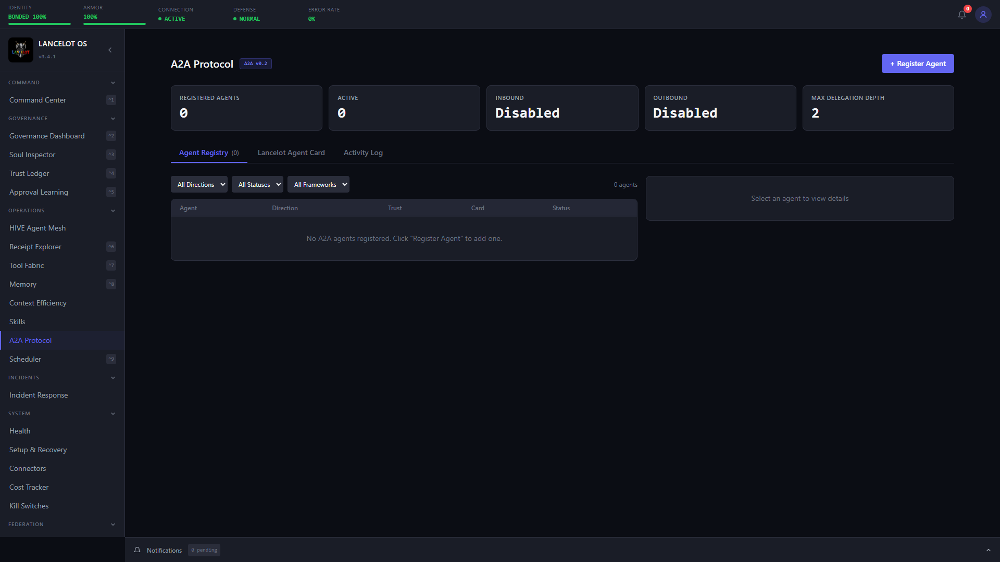

# A2A Protocol Support

Lancelot implements Google's **Agent-to-Agent (A2A) v0.2** protocol as a governed transport layer for cross-agent communication with **non-Lancelot agents treated as hostile external systems by default**. Every inbound and outbound A2A interaction passes through preregistered peer authentication, Agent Card verification, Soul evaluation, risk classification, trust tracking, and T3 approval gates.

**Runtime toggle:** `FEATURE_A2A=false` by default. Enable via environment variable or the War Room Kill Switches panel.

For the architectural context, see [Architecture](architecture.md). For the trust model, see [Trust Ledger](trust-ledger.md).

<p align="center">
  
</p>

---

## A2A vs Federation

| | A2A | Federation |
|---|-----|-----------|
| **Purpose** | Lancelot ↔ non-Lancelot agents | Lancelot ↔ Lancelot instances |
| **Trust model** | Hostile external interoperability | Governed peer mesh |
| **Protocol** | Google A2A v0.2 | Custom federation protocol |
| **Identity source** | Preregistered peer registry + credential proof | Federation signing + Soul compatibility |

**Lancelot-to-Lancelot A2A is rejected.** If a remote Agent Card declares `governance_framework: "lancelot"`, the inbound pipeline blocks the request and directs the peer to Federation instead.

---

## Soul Configuration

### Inbound Permissions

```yaml
inbound_a2a_permissions:
  allow_inbound: true
  default_trust_tier: 3
  allowed_callers:
    - agent_id: "crewai-support-bot"
  blocked_callers:
    - agent_id: "untrusted-agent"
  require_agent_card: true
  skill_filter:
    - "research"
    - "summarize"
  require_preregistration: true
```

| Field | Type | Default | Description |
|-------|------|---------|-------------|
| `allow_inbound` | bool | `false` | Master switch for accepting inbound A2A tasks |
| `default_trust_tier` | int | `3` | Trust tier assigned to known inbound peers when their registry record does not override it |
| `allowed_callers` | list | `[]` | Optional allowlist keyed by `agent_id` or `agent_framework` |
| `blocked_callers` | list | `[]` | Caller blocklist checked before allow rules |
| `require_agent_card` | bool | `true` | Require the preregistered caller's pinned Agent Card to fetch and verify successfully |
| `skill_filter` | list | `[]` | Skills exposed to A2A callers (empty = all A2A-visible skills) |
| `require_preregistration` | bool | `false` | Additional Soul gate on top of the runtime preregistration requirement; auto-registered peers do not pass this gate |

### Outbound Permissions

```yaml
outbound_a2a_permissions:
  allow_outbound: true
  allowed_targets:
    - agent_id: "partner-research-bot"
      allowed_task_types: ["general", "research"]
  max_delegation_depth: 3
  require_agent_card_verification: true
```

| Field | Type | Default | Description |
|-------|------|---------|-------------|
| `allow_outbound` | bool | `false` | Master switch for delegating tasks to remote agents |
| `allowed_targets` | list | `[]` | Optional allowlist keyed by `agent_id` or `agent_framework` with task-type bounds |
| `max_delegation_depth` | int | `2` | Maximum delegation chain depth |
| `require_agent_card_verification` | bool | `true` | Verify the remote agent's pinned Agent Card before delegating |

---

## Hardened Runtime Contract

### Inbound Pipeline

```
External Agent -> POST /a2a/tasks/send
  Stage 1: Authentication (preregistered bearer token or API key only)
  Stage 2: Caller Identity Resolution (registry-backed identity, Lancelot rejection)
  Stage 3: Skill Security Pipeline (prompt-injection and payload checks)
  Stage 4: Soul Evaluation (allow/block rules, preregistration, Agent Card verification)
  Stage 5: Risk Classification
  Stage 6: T3 Approval Gate
  Stage 7: Governed Execution
  Stage 8: Response + Trust Update
```

**Key behaviors**
- Unknown callers are rejected before identity resolution. The runtime no longer auto-registers inbound peers on first contact.
- Inbound identity comes from the preregistered registry record, not caller-supplied `X-Agent-ID`, `X-Agent-Framework`, or `X-Agent-Card-URL` headers.
- Only preregistered `bearer_token` and `api_key` peers are accepted in the hardened runtime.
- When `require_agent_card` is enabled, the peer's pinned Agent Card must fetch and verify successfully before the task proceeds.
- Task status and SSE reads are bound to the same authenticated peer that submitted the task.

### Outbound Pipeline

```
Internal Request -> OutboundPipeline.delegate()
  Stage 1: Remote Agent Resolution
  Stage 2: Soul Evaluation
  Stage 3: Agent Card Verification
  Stage 4: Network Allowlist
  Stage 5: Skill Security / PII Scrub
  Stage 6: Risk Classification
  Stage 7: T3 Approval Gate
  Stage 8: Credential Injection from Vault
  Stage 9: Delegation + Polling
  Stage 10: Response Inspection + Receipt/Trust Update
```

**Key behaviors**
- PII scrubbing removes SSNs, credit card numbers, and email addresses before egress. When the live runtime has the canonical frontier scrubber bound, outbound A2A uses that scrubber first for task content and returned text artifacts; otherwise it falls back to deterministic structured-pattern redaction so egress still fails closed on the common categories.
- `max_delegation_depth` prevents unbounded delegation chains.
- Agent Card verification is required by default before delegation.
- Verification is now pinned: a peer must have a previously accepted Agent Card snapshot in the registry, and any card drift requires an explicit operator re-verification before delegation resumes.
- The outbound network allowlist now matches the remote Agent Card host/origin against the pinned allowlist entries instead of only checking that an allowlist exists.
- Credentials are resolved from the vault at dispatch time for `bearer_token` and `api_key` peers; missing credentials block the delegation.
- Remote tasks that return `submitted` or `working` are polled to completion through the governed client.

---

## Agent Registry

SQLite-backed registry tracks all known remote agents:

| Field | Description |
|-------|-------------|
| `agent_id` | Unique identifier pinned by the operator |
| `display_name` | Human-readable name |
| `agent_card_url` | URL used to fetch and verify the Agent Card |
| `agent_framework` | Expected framework family (`crewai`, `langchain`, `google_adk`, `unknown`) |
| `auth_type` | Required peer auth mode (`bearer_token`, `api_key`, `none`) |
| `credentials_ref` | Vault key for the peer secret used on inbound auth or outbound delegation |
| `direction` | Communication direction (`inbound`, `outbound`, `both`) |
| `inbound_trust_tier` | Trust tier for inbound tasks from this agent |
| `outbound_trust_tier` | Trust tier for outbound delegation to this agent |
| `status` | `active`, `suspended`, or `revoked` |
| `card_status` | `verified`, `stale`, or `unverified` |
| `interaction_count` | Total interactions |
| `success_count` | Successful interactions |
| `kill_switch_id` | Per-agent kill switch: `A2A_[AGENT_ID]` |

**Operational guidance**
- Treat A2A peers like external connectors, not like friendly internal mesh nodes.
- Preregister peers explicitly and pin their `agent_id`, `auth_type`, `credentials_ref`, and `agent_card_url`.
- Use `POST /api/a2a/agents/{id}/verify` to establish or refresh the pinned Agent Card after intentional peer changes.
- Use Federation for Lancelot-to-Lancelot trust, Soul compatibility, and governed peer workflows.

---

## API Endpoints

### Protocol Endpoints

| Method | Path | Description |
|--------|------|-------------|
| GET | `/.well-known/agent.json` | Lancelot's Agent Card |
| POST | `/a2a/tasks/send` | Submit task to Lancelot |
| GET | `/a2a/tasks/{task_id}` | Get task status for the same authenticated peer that submitted it |
| GET | `/a2a/tasks/{task_id}/subscribe` | SSE stream for the same authenticated peer that submitted it |

### Management Endpoints

| Method | Path | Description |
|--------|------|-------------|
| GET | `/api/a2a/status` | A2A subsystem status |
| GET | `/api/a2a/agents` | List registered agents |
| GET | `/api/a2a/agents/{id}` | Get agent details |
| POST | `/api/a2a/agents` | Register remote agent |
| DELETE | `/api/a2a/agents/{id}` | Revoke remote agent |
| POST | `/api/a2a/agents/{id}/verify` | Re-verify Agent Card |
| GET | `/api/a2a/card` | Get Lancelot's Agent Card |
| POST | `/api/a2a/card/regenerate` | Regenerate Agent Card |
| POST | `/api/a2a/delegate` | Delegate task to a remote agent |
| GET | `/api/a2a/receipts` | Query A2A receipts |

### Runtime Status Contract

`GET /api/a2a/status` is now a runtime-truthful management surface.

Key fields:

- `enabled`
- `inbound_enabled`
- `outbound_enabled`
- `registry_ready`
- `outbound_pipeline_ready`
- `client_ready`
- `runtime_degraded`
- `degraded_reasons`
- `runtime_errors`

This endpoint now degrades explicitly when the live Soul resolver, registry, or outbound runtime wiring fails. It should no longer be treated as healthy just because the feature flag is enabled.

---

## Core Source Files

```
src/a2a/
├── __init__.py
├── types.py
├── registry.py
├── agent_card.py
├── inbound_pipeline.py
├── outbound_pipeline.py
├── client.py
├── server.py
└── api.py
```
