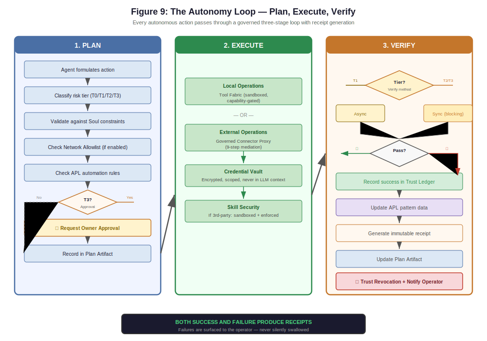

# Architecture

A full walkthrough of Lancelot's system architecture — how the subsystems connect, how a request flows from input to governed execution, and the key design decisions behind each component.

For how to get the system running, see the [Quickstart](quickstart.md). For the governance model specifically, see [Governance](governance.md).

---

## System Overview

Lancelot is composed of independent, kill-switchable subsystems coordinated by a central orchestrator. Every subsystem can be disabled via feature flags without breaking the rest of the system.

<p align="center">
  
</p>

---

## End-to-End Action Flow

Here's what happens when a user sends a message, from input to governed response:

### 1. Input Processing

```
User Input
  → Rate Limiter (60 requests/min)
  → Size Check (1 MB max)
  → InputSanitizer (16 banned phrases, 10 regex patterns,
    Cyrillic homoglyph normalization, zero-width character stripping)
  → Orchestrator
```

The input layer is a hard boundary. Prompt injection attempts are detected and blocked before the message reaches any LLM.

### 2. Intent Classification

The orchestrator classifies the message into one of five intent types:

| Intent | Description | Route |
|--------|-------------|-------|
| `PLAN_REQUEST` | Complex goal requiring multi-step planning | Planning Pipeline |
| `EXEC_REQUEST` | Direct action request (high-risk) | Planning Pipeline → Permission |
| `EXEC_REQUEST` | Direct action request (low-risk: search, draft, summarize) | Agentic Loop (just-do-it) |

> **v0.2.27 Low-Risk Classifier Fix:** The `_is_low_risk_exec` method now includes write-oriented action verbs (`create`, `write`, `save`, `update`, `modify`, `edit`) in its high-risk signal list. Previously, requests containing these verbs could be classified as low-risk and routed directly to the agentic loop, bypassing the PlanningPipeline, TaskGraph, and Permission flow. This fix ensures that all write-oriented actions go through full governance.
| `MIXED_REQUEST` | Contains both planning and execution | Planning Pipeline |
| `KNOWLEDGE_REQUEST` | Information retrieval / research | Flagship Fast/Deep |
| `CONVERSATIONAL` | General conversation | Local or Flagship Fast |

**V23 Unified Classifier** (`FEATURE_UNIFIED_CLASSIFICATION`): When enabled, a single Gemini Flash call with structured output replaces the multi-function keyword chain. Returns intent, confidence, is_continuation, and requires_tools in one JSON response. Falls back to the keyword chain on failure.

**Legacy pipeline** (when unified classifier disabled): Two-stage — (1) deterministic keyword matching (`classify_intent()`) for fast initial routing, then (2) LLM-based verification via the local model (`_verify_intent_with_llm()`) for ambiguous cases where messages >80 chars match PLAN/EXEC keywords incidentally.

**V24 Competitive Scan Memory** (`FEATURE_COMPETITIVE_SCAN`, default `false`, requires `MEMORY_VNEXT`): When a `KNOWLEDGE_REQUEST` is detected as competitive research, `src/core/competitive_scan.py` stores the scan in episodic memory, retrieves previous scans for the same target, and generates a diff against the last result. This gives longitudinal competitive intelligence without re-running full research each time.

### 3. Model Routing

The Model Router selects the appropriate LLM lane based on task type, risk level, and complexity:

| Priority | Lane | Models | When Used |
|----------|------|--------|-----------|
| 1 | `local_redaction` | Qwen3-8B (local) | PII redaction — always runs locally first |
| 2 | `local_utility` | Qwen3-8B (local) | Intent classification, summarization, JSON extraction |
| 3 | `flagship_fast` | Gemini Flash / GPT-4o-mini / Claude Sonnet 4.5 / Grok-3-mini | Standard reasoning, tool calls, orchestration |
| 4 | `flagship_deep` | Gemini Pro / GPT-4o / Claude Opus 4 / Grok-3 | Complex planning, high-risk decisions |
| — | `cache` | Gemini 2.5 Flash / GPT-4o-mini / Claude Haiku 4.5 / Grok-3-mini | Lightweight caching and low-latency lookups |

**Escalation triggers:** If the fast lane fails, if risk keywords are detected, or if the task involves multi-step planning, the router automatically escalates to the deep lane. Every routing decision produces a `RouterDecision` record with lane, model, rationale, timing, and outcome.

**V27 Dual-Mode Providers** (`FEATURE_PROVIDER_SDK`, v0.2.13): Providers now operate in one of two modes, configured per-provider via the `mode` field in `models.yaml` and selected during onboarding through the `LANCELOT_PROVIDER_MODE` env var:

- **SDK mode** — Full Python SDK integration (e.g. `google-genai`, `openai`, `anthropic`, `xai`). Supports extended thinking, streaming responses, and native tool calling. In SDK mode the ModelRouter routes through `ProviderClient.generate()` rather than the REST-based `FlagshipClient.complete()`.
- **API mode** — Lightweight REST calls via `FlagshipClient`. No SDK dependency, lower memory footprint, suitable for constrained environments.

The `ProviderProfile` dataclass carries a `mode` field (`"sdk"` | `"api"`) and each `LaneConfig` now accepts an optional `thinking` dict (see Extended Thinking below). A new onboarding state, `PROVIDER_MODE_SELECTION`, appears between `HANDSHAKE` and `LOCAL_UTILITY_SETUP` to let the owner choose the provider mode at first run.

### 4. Planning Pipeline (for complex requests)

For `PLAN_REQUEST` or `MIXED_REQUEST` intents, the Planning Pipeline builds a structured plan:

1. **Classify** — Confirm the intent and extract the goal
2. **Build PlanArtifact** — Generate a structured plan with: goal, context, assumptions, plan_steps, decision_points, risks, done_when, next_action
3. **Render** — Convert to human-readable markdown
4. **Governor Check** — Validate against Soul constraints and policy
5. **Output Gate** — Block simulated-progress language (the Response Governor prevents phrases like "I'm working on it" without a real job running)

### 5. Execution (Plan-Execute-Verify)

For plans that require execution, the three-agent loop runs:

<p align="center">
  
</p>

Each step generates a receipt linked to the parent plan via `parent_id` and `quest_id`, forming a traceable chain.

**V25 Autonomy Loop v2** (`FEATURE_DEEP_REASONING_LOOP`, v0.2.11): Three new phases extend the autonomy loop with pre-execution reasoning, structured governance feedback, and experiential learning.

**Phase 1 — Deep Reasoning Pass.** Before the agentic loop begins, a dedicated reasoning pass analyzes the request using a deep model with high thinking budget. The orchestrator evaluates `_should_use_deep_reasoning()` triggers (request complexity, tool requirements, risk indicators) and, when triggered, calls `_build_reasoning_instruction()` to assemble a reasoning-focused system prompt. The `_deep_reasoning_pass()` method then calls `provider.generate()` with the deep model lane and elevated thinking tokens. The output is captured as a `ReasoningArtifact` (defined in `src/core/reasoning_artifact.py`) and injected as structured context into `_agentic_generate()`. This means Lancelot thinks deeply about what it needs to do — identifying capability gaps, anticipating risks, and forming a strategy — before it takes any action. The reasoning output is also scanned for `CAPABILITY GAP:` markers, which identify tools or skills the system lacks for the current task.

**V27 Extended Thinking** (v0.2.13): When the Anthropic provider is running in SDK mode, the deep reasoning pass leverages Claude's native extended thinking capability. The thinking budget is configurable per-lane via the `thinking` key in `models.yaml` (e.g. `thinking: { enabled: true, budget_tokens: 10000 }` on the `deep` lane). The `AnthropicProviderClient` parses thinking blocks from the API response and extracts them into the `ReasoningArtifact`, giving the orchestrator access to the model's internal chain-of-thought alongside the final output.

**Phase 3 — Governed Negotiation.** When governance blocks an action, the system no longer returns a generic `BLOCKED` message. Instead, it constructs a `GovernanceFeedback` dataclass (from `reasoning_artifact.py`) containing the blocked action, the policy rule that triggered the block, and a set of structured alternative approaches the model can pursue. This feedback is injected back into the agentic loop context, allowing the model to adapt its plan — choosing a lower-risk path, requesting approval, or decomposing the action — rather than stalling.

**Phase 6 — Task Experience Memory.** After task completion, the orchestrator calls `_record_task_experience()`, which stores a `TaskExperience` dataclass (from `reasoning_artifact.py`) in episodic memory under the `task_experience` namespace. Each experience record captures the original request, the reasoning artifact, capability gaps encountered, actions taken, the outcome, and a duration. On future requests, the context compiler can retrieve relevant past experiences, enabling Lancelot to learn from previous successes and failures — avoiding repeated mistakes and reusing strategies that worked.

**v0.2.27 TaskRun Status Fix.** After `_execute_with_llm` succeeds in the agentic loop, the TaskRun status is now explicitly updated to `SUCCEEDED`. Previously, the TaskRun status reflected the TaskRunner's template-step failure even though the agentic loop had successfully completed the task. This fix ensures that the TaskRun status accurately reflects the actual outcome of execution.

### 6. Risk Classification & Governance

Every action is classified into one of four risk tiers:

| Tier | Name | Examples | Governance |
|------|------|----------|------------|
| **T0** | Inert | File reads, git status, memory reads | Policy cache lookup, batch receipt |
| **T1** | Reversible | File writes, git commit, memory writes | Rollback snapshot, async verification |
| **T2** | Controlled | Shell execution, network fetch | Sync verification, tier boundary flush |
| **T3** | Irreversible | Network POST, deploy, delete | Approval gate, sync verification |

The governance overhead scales with risk. T0 actions are near-instant (precomputed policy lookup). T3 actions require explicit owner approval before execution.

**Tier boundary enforcement:** Before any T2 or T3 action:
1. All pending batch receipts are flushed to disk
2. All pending async verifications are drained and completed
3. Any verification failure triggers rollback of preceding T1 actions

### 7. Tool Execution

Actions that require tool use go through the Tool Fabric:

```
Tool Request
  → PolicyEngine.evaluate() (command denylist, path traversal,
    workspace boundary, sensitive paths, network policy, risk level)
  → ProviderRouter.select() (match capability to provider)
  → Provider.execute() (Docker sandbox, local sandbox, etc.)
  → ToolReceipt (sanitized inputs/outputs, policy decisions)
```

Seven capability types are available: `ShellExec`, `RepoOps`, `FileOps`, `WebOps`, `UIBuilder`, `DeployOps`, `VisionControl`. Each has explicit security constraints.

### 8. Receipt Generation

Every action — LLM call, tool execution, file operation, memory edit, scheduler run, verification step, governance decision — produces a receipt:

```json
{
  "id": "receipt_abc123",
  "timestamp": "2026-02-14T10:30:00Z",
  "action_type": "llm_call",
  "action_name": "flagship_fast",
  "inputs": {"text": "[sanitized]"},
  "outputs": {"response": "[sanitized]"},
  "status": "success",
  "duration_ms": 1234,
  "token_count": 500,
  "cognition_tier": "CLASSIFICATION",
  "parent_id": "receipt_parent456",
  "quest_id": "quest_789"
}
```

Receipts form the ground truth of system behavior. They are persisted to `lancelot_data/receipts/` and are searchable through the War Room.

---

## Subsystem Details

### Soul (Constitutional Governance)

The Soul is a versioned YAML document that defines Lancelot's invariant behavior. It is immutable at runtime — the running system cannot modify its own Soul.

**What the Soul defines:**
- **Mission** — What Lancelot does and for whom
- **Allegiance** — Single-owner loyalty
- **Autonomy posture** — What can be done autonomously vs. what requires approval
- **Risk rules** — Safety boundaries and enforcement flags
- **Approval rules** — Timeout, escalation, channels
- **Tone invariants** — Communication rules (never mislead, acknowledge uncertainty)
- **Memory ethics** — PII handling, secret exclusion
- **Scheduling boundaries** — Limits on automated jobs

**Soul linter:** Five invariant checks run at load time:
1. Destructive actions must appear in `requires_approval` (CRITICAL)
2. Tone invariants must prohibit silent degradation (CRITICAL)
3. Scheduling must prevent autonomous irreversible actions (CRITICAL)
4. Approval rules must define at least one channel (CRITICAL)
5. Memory ethics must contain at least one rule (WARNING)

If any CRITICAL invariant fails, the Soul is rejected and the previous version remains active.

**Amendment workflow:** `PENDING` → owner approves → `APPROVED` → owner activates → `ACTIVATED` (with linter validation). This prevents accidental or unauthorized governance changes.

**V24 — System instruction architecture:** The Soul now includes a `SELF-KNOWLEDGE` section containing 10 subsystem descriptions that Lancelot loads at startup. This gives the model accurate self-referential knowledge (capabilities, architecture, limitations) without relying on the model's pretraining. A companion soul directive requires **sourced intelligence** — all research-type responses must cite URLs, enforced by the Response Governor.

For a deeper dive, see [Governance](governance.md).

### Memory (Tiered, Commit-Based)

Lancelot maintains structured memory across four tiers:

| Tier | Persistence | Purpose |
|------|-------------|---------|
| **Core Blocks** | Permanent (pinned) | Persona, mission, operating rules, workspace state |
| **Working Memory** | Task-scoped | Current task context, intermediate results |
| **Episodic Memory** | Session-scoped | Conversation history, recent interactions |
| **Archival Memory** | Long-term | Accumulated knowledge, searchable via FTS |

**Commit-based editing:** Memory edits are atomic transactions. Each edit creates a snapshot before modification, applies changes, and can be rolled back to any previous state.

**Quarantine:** Risky memory writes (those that modify core blocks or contain sensitive patterns) land in quarantine. Promotion to active memory requires owner verification or approval.

**Context compiler:** Before each LLM call, the context compiler assembles memory tiers into a token-budgeted context window. Priority is Core > Working > Episodic > Archival, with LRU eviction when the budget is exceeded.

For more details, see [Memory](memory.md).

### Skills (Modular Capabilities)

Skills are Lancelot's extensibility mechanism — modular capabilities with declarative manifests.

**Skill manifest:** Each skill declares its name, version, required permissions, inputs/outputs, risk level, and scheduling eligibility in a `skill.yaml` file.

**Lifecycle:** Install → Enable → Execute → Disable → Uninstall

**Ownership model:**
- **SYSTEM** skills: Built-in (command_runner, repo_writer, network_client, service_runner, github_search)
- **USER** skills: Installed by the owner
- **MARKETPLACE** skills: Third-party, restricted to `read_input`, `write_output`, `read_config` permissions only

**V24 — `github_search`** (`FEATURE_GITHUB_SEARCH`, default `true`): Queries the GitHub REST API for repositories, commits, issues, and releases. Returns structured results with source URLs, enabling sourced intelligence in research responses.

**Skill Factory:** A proposal pipeline for creating new skills. `generate_skeleton()` creates a complete skill directory (manifest, execute.py, tests). Proposals require owner approval before installation.

### Tool Fabric (Provider-Agnostic Execution)

The Tool Fabric provides sandboxed tool execution with seven capability protocols:

| Capability | Examples | Security |
|-----------|----------|----------|
| `ShellExec` | Run commands | Command denylist (shlex-tokenized), workspace boundary |
| `FileOps` | Read/write files | Path traversal check, symlink rejection, atomic writes |
| `RepoOps` | Git operations | Workspace boundary enforcement |
| `WebOps` | HTTP requests | Domain allowlist, network policy |
| `UIBuilder` | Generate UI | Template sandboxing |
| `DeployOps` | Deploy services | T3 risk, requires approval |
| `VisionControl` | Screenshot/analyze | Sandboxed browser |

**Execution pipeline:**
1. **PolicyEngine** evaluates the request against all security gates
2. **ProviderRouter** selects the appropriate execution provider
3. **Provider** executes in isolation (Docker sandbox for shell/code, direct for file ops)
4. **ToolReceipt** captures sanitized inputs, outputs, and policy decisions

**Security gates:** Command denylist (shlex-based token matching, not substring), path traversal detection, workspace boundary enforcement, sensitive file protection, network domain allowlist, and risk-tier assessment.

### Health Monitor (Heartbeat)

Continuous background monitoring at 30-second intervals.

**Endpoints:**
- `GET /health/live` — Liveness probe (always 200 if running)
- `GET /health/ready` — Full readiness snapshot

**HealthSnapshot:** Reports `ready`, `onboarding_state`, `local_llm_ready`, `scheduler_running`, `degraded_reasons`, and timestamps.

**State transitions** (healthy ↔ degraded ↔ recovered) generate receipts, making it possible to audit when degradation occurred and what recovered it.

### Scheduler (Gated Automation)

SQLite-backed job scheduler supporting cron and interval triggers.

**Gating pipeline:** Before any scheduled job executes:
1. System must be in READY state (onboarding complete)
2. Local LLM must be healthy
3. Job-specific gates must pass
4. Owner-gated jobs require explicit approval

**Job receipts:** Every run, failure, and skip generates a typed receipt (`scheduled_job_run`, `scheduled_job_failed`, `scheduled_job_skipped`).

### OAuth Token Manager (Anthropic OAuth)

**V28** (`FEATURE_ANTHROPIC_OAUTH`, v0.2.14): `src/core/oauth_token_manager.py` provides an alternative authentication path for the Anthropic provider using OAuth 2.0 with PKCE, replacing the static API key when enabled.

**Token lifecycle:**
1. **Initiation** — `POST /oauth/initiate` (Provider API) starts the PKCE flow: generates `code_verifier` + `code_challenge`, builds the Anthropic authorization URL, and returns it to the owner.
2. **Callback** — `GET /auth/anthropic/callback` (Gateway) receives the authorization code, exchanges it for access + refresh tokens via the Anthropic token endpoint, and stores both tokens in the encrypted vault.
3. **Usage** — The `AnthropicProviderClient` calls `OAuthTokenManager.get_token()` to obtain a valid access token. If the token is expired, the manager refreshes it transparently.
4. **Background refresh** — A daemon thread (`_refresh_loop`) wakes every 5 minutes, checks token expiry, and proactively refreshes before the access token expires. Thread safety is enforced via `threading.Lock` on all read/write paths.
5. **Revocation** — `POST /oauth/revoke` invalidates both tokens at Anthropic and removes them from the vault.
6. **Status** — `GET /oauth/status` returns current token validity, expiry time, and provider binding.

**Required header** (v0.2.15): When using OAuth Bearer authentication, all requests to the Anthropic API must include the `anthropic-beta: oauth-2025-04-20` header. The `AnthropicProviderClient` attaches this header automatically whenever an OAuth token is in use.

**Fallback:** When the feature flag is disabled or no OAuth token is present, the Anthropic provider falls back to API key authentication. OAuth and API key auth are mutually exclusive per session; OAuth takes priority when a valid token exists.

### Google OAuth Manager (Gmail + Calendar)

**v0.2.26** (`FEATURE_GOOGLE_OAUTH`, default disabled): `src/core/google_oauth_manager.py` provides OAuth 2.0 Authorization Code + PKCE flow for Google APIs, enabling Gmail and Calendar connectors to authenticate with properly scoped, vault-stored, auto-refreshing credentials.

**How it works:**
1. **Initiation** — `POST /api/google-oauth/start` generates a PKCE challenge, builds the Google consent URL with Gmail + Calendar scopes, and returns it to the owner.
2. **Callback** — `GET /google/callback` receives the authorization code, exchanges it for access + refresh tokens, encrypts them, and stores them in the vault.
3. **Token fan-out** — A single OAuth grant is stored under both `email.gmail_token` and `calendar.google_token` vault keys, so both connectors resolve credentials from one token without duplicate OAuth flows.
4. **Background refresh** — A daemon thread wakes every 5 minutes and proactively refreshes tokens before expiry. Thread safety via `threading.Lock`.
5. **Startup recovery** — On container start, existing tokens are loaded from vault and the refresh thread resumes automatically.
6. **Revocation** — `POST /api/google-oauth/revoke` invalidates tokens at Google and removes them from the vault.
7. **Status** — `GET /api/google-oauth/status` returns token validity, expiry, and scope binding.

**Network allowlist:** Requires `accounts.google.com` and `oauth2.googleapis.com` in `config/network_allowlist.yaml`.

**Fallback:** When the feature flag is disabled or no Google OAuth token is present, Gmail and Calendar connectors are unavailable. The flag has no effect on other providers or subsystems.

### War Room (Operator Dashboard)

The War Room is a React SPA (Vite + React 18 + TypeScript + Tailwind) providing full system observability:

- **Command** — Chat interface for interacting with Lancelot. Assistant messages render full markdown (headers, bold, tables, code blocks, lists) via `react-markdown` + `remark-gfm` with Tailwind Typography prose classes. User messages remain plain text.
- **Health** — System status, subsystem health, degradation alerts
- **Governance** — Risk tier distribution, policy decisions, approval queue
- **Trust** — Per-connector trust scores, graduation history
- **APL** — Approval pattern learning rules, proposals, confidence
- **Receipts** — Searchable audit trail with drill-down traces
- **Scheduler** — Active jobs, run history, skip reasons
- **Memory** — Tier sizes, quarantine queue, recent commits

The War Room communicates with Lancelot exclusively through the Gateway REST API — it has no direct access to internal objects.

---

## Security Architecture

Security is enforced in layers, not delegated to the model:

```
Input Layer:   Rate Limiter → Size Check → InputSanitizer (16 patterns, homoglyphs)
                                    ↓
Governance:    Soul constraints → Policy Engine → Risk classification
                                    ↓
Execution:     Command denylist → Path traversal → Workspace boundary → Docker sandbox
                                    ↓
Output:        Receipt generation → PII redaction → Structured output parsing → Claim verification → Presentation → Response assembly
```

**v0.2.27 Assembler Fix (Response Assembly):** The `extract_verbose_sections` function in `src/core/response/policies.py` was changed from a **whitelist** to a **blocklist** approach. Previously, any `##` section not matching the `_CHAT_HEADERS` whitelist was routed to War Room artifacts, which caused empty chat responses when agentic loop output contained `##` headers not on the whitelist. Now, only sections matching `_VERBOSE_HEADERS` (Assumptions, Decision Points, Risks, Done When, Context, MVP Path, Test Plan, Estimate, References) are routed to verbose/War Room artifacts — everything else stays in the chat response.

**Key principles:**
- The model is treated as **untrusted logic** inside a governed system
- Governance is enforced **outside the model** (Soul + Policy Engine)
- Tool outputs are treated as **untrusted input** — never executed directly
- Secrets are **never stored in memory**, never logged in plaintext, never sent to models unless explicitly required. OAuth tokens are encrypted at rest in the vault and refreshed via a thread-safe background daemon
- All subsystems have **kill switches** (feature flags)

For the full security model, see [Security Posture](security.md).

---

## Subsystem Independence

A core architectural principle: **any subsystem can be disabled without breaking the system.**

| If You Disable... | What Happens |
|-------------------|-------------|
| Soul | Actions run without constitutional constraints (not recommended) |
| Skills | Only built-in capabilities available |
| Health Monitor | No background health checks, endpoints still respond |
| Scheduler | No automated jobs, manual execution still works |
| Memory vNext | Falls back to basic context management |
| GitHub Search | `github_search` skill unavailable, other research tools still work |
| Competitive Scan | No scan memory or diffing; research still works, just stateless |
| Deep Reasoning Loop | No pre-execution reasoning pass; agentic loop runs without strategic analysis |
| Provider SDK | Falls back to API mode (FlagshipClient REST); extended thinking and native tool calling unavailable |
| Anthropic OAuth | Falls back to API key authentication for Anthropic; all other providers unaffected |
| Google OAuth | Gmail and Calendar connectors unavailable; all other providers and subsystems unaffected |
| Tool Fabric | No tool execution, conversation-only mode |

This is implemented through feature flags (`FEATURE_SOUL`, `FEATURE_SKILLS`, `FEATURE_DEEP_REASONING_LOOP`, `FEATURE_PROVIDER_SDK`, `FEATURE_ANTHROPIC_OAUTH`, `FEATURE_GOOGLE_OAUTH`, etc.) that gate each subsystem at initialization. When a subsystem is disabled, its code paths are skipped and its API endpoints return appropriate "not available" responses.

---

## Technology Stack

| Layer | Technology |
|-------|-----------|
| Language | Python 3.11+ |
| API Framework | FastAPI (Uvicorn ASGI) |
| War Room | React 18 + Vite + TypeScript + Tailwind |
| Legacy UI | Streamlit |
| Data Validation | Pydantic v2 |
| Configuration | PyYAML |
| LLM Providers | Google GenAI, OpenAI, Anthropic, xAI SDKs (SDK mode) / REST via FlagshipClient (API mode) |
| Auth | OAuth 2.0 PKCE (Anthropic, Google), API keys (all providers), vault-backed token storage |
| Local Inference | llama-cpp-python (GGUF format) |
| Persistence | SQLite (scheduler, memory), JSON (registries, receipts) |
| Encryption | cryptography library |
| Containerization | Docker + Docker Compose |
| Testing | pytest (1900+ tests) |

---

## Design Decisions

1. **Context over retrieval.** Lancelot uses long-context windows (128k+ tokens) with deterministic context loading instead of vector-based RAG. This eliminates the information loss inherent in embedding similarity search.

2. **Lane-based routing for cost optimization.** The local model handles 60-80% of tasks (classification, redaction, summarization) at zero API cost. Only complex reasoning escalates to cloud providers.

3. **Constitutional governance, not prompt engineering.** The Soul is a data structure enforced by code, not a system prompt that the model might ignore. If the Soul forbids an action, the code blocks it before the model is consulted.

4. **Proportional governance overhead.** T0 actions (reads, status checks) get near-instant policy lookup. T3 actions (irreversible operations) get full approval gates and sync verification. The overhead matches the risk.

5. **Receipts as ground truth.** Every action produces a durable record. This enables post-hoc auditing, decision chain reconstruction, and trust scoring based on observed outcomes rather than model confidence.

6. **Single-owner allegiance.** Lancelot serves one owner. This eliminates an entire category of security concerns (multi-tenant data isolation, role-based access control, permission escalation between users) and keeps the governance model simple.

7. **Docker-first deployment.** The Tool Fabric relies on Docker for execution sandboxing. Bare-metal is supported but loses the container isolation that makes tool execution safe.

**V29 Launcher pre-flight checks** (v0.2.15): The launcher scripts (`launch.ps1`, `launch.sh`) run a pre-flight sequence before `docker compose up`: verify the Docker CLI is installed, verify the Docker daemon is running, and check that ports 8000 and 8080 are available. Any failure produces a human-readable error with a suggested fix and a link to the GitHub issues page (`https://github.com/myles1663/lancelot/issues`) for support.
