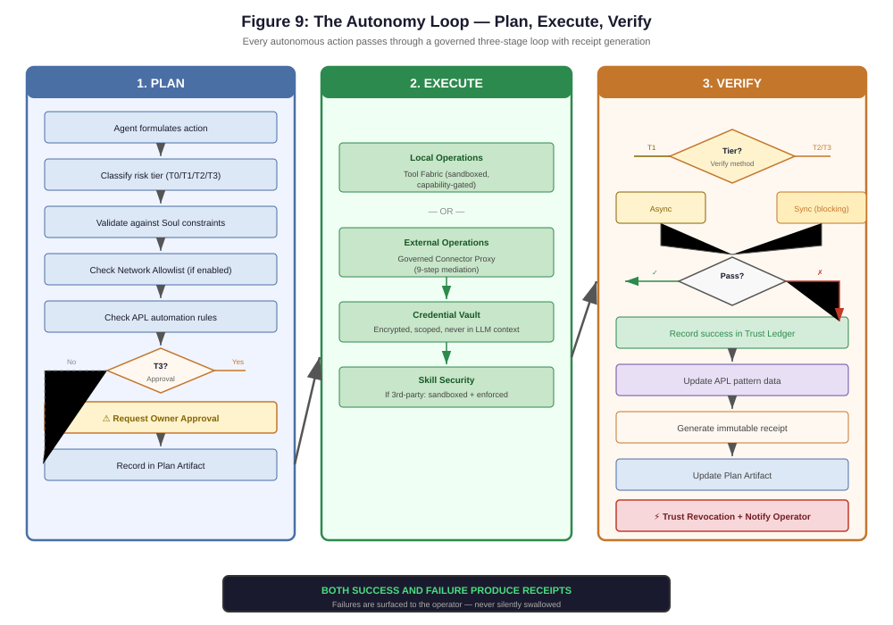

# Architecture

A full walkthrough of Lancelot's system architecture — how the subsystems connect, how a request flows from input to governed execution, and the key design decisions behind each component.

For how to get the system running, see the [Quickstart](quickstart.md). For the governance model specifically, see [Governance](governance.md). For the authentication target state, see [Authentication Architecture](authentication.md).

---

## System Overview

Lancelot is composed of independent, kill-switchable subsystems coordinated by a central orchestrator. Every subsystem can be disabled via feature flags without breaking the rest of the system.

The network allowlist is a first-class governance subsystem with a single canonical evaluator. Core outbound checks, Tool Fabric network policy, and the War Room allowlist editor all route through the same loader, matcher, and config path rather than maintaining separate interpretations of `config/network_allowlist.yaml`.

Not every named governance concept is implemented as a single top-level package. Operator-critical controls such as the network allowlist and kill-switch contract are now centralized, while some supporting concepts remain intentionally clustered across a small set of focused modules. The plan artifact is implemented that way today: builder, renderer, and type modules form one bounded planning artifact cluster rather than a standalone API service.

**Orchestrator Decomposition:** The monolithic `orchestrator.py` has been decomposed into the orchestrator proper plus a `src/core/orch_helpers/` package containing 13 extracted pure functions across three modules: `intent_helpers.py` (6 functions), `safety_helpers.py` (5 functions), and `response_helpers.py` (2 functions). The orchestrator retains thin delegator methods that call the extracted helpers, preserving the existing call-site interface. The first extraction pass is conservative: only stateless pure functions were extracted; stateful methods and anything touching `self` remain in `orchestrator.py`.

<p align="center">
  
</p>

---

## End-to-End Action Flow

Here's what happens when a user sends a message, from input to governed response:

### 1. Input Processing

```
User Input
  → Rate Limiter (60 requests/min)
  → Size Check (1 MB max)
  → InputSanitizer (16 banned phrases, 10 regex patterns,
    Cyrillic homoglyph normalization, zero-width character stripping)
  → Orchestrator
```

The input layer is a hard boundary. Prompt injection attempts are detected and blocked before the message reaches any LLM.

**Injection Detection Gate:** After `InputSanitizer.sanitize()` in `chat()`, if the `[SUSPICIOUS INPUT DETECTED]` prefix is present, the method returns a clear refusal immediately instead of routing the flagged input through the pipeline. This short-circuits processing of detected injection attempts before any downstream subsystem is invoked.

**Gateway Channel Passthrough:** The `/chat` endpoint reads `channel` from the JSON body (default: `"warroom"`), enabling proper Telegram truncation when API clients specify `channel="telegram"`.

### 2. Intent Classification

The orchestrator classifies the message into one of five intent types:

| Intent | Description | Route |
|--------|-------------|-------|
| `PLAN_REQUEST` | Complex goal requiring multi-step planning | Planning Pipeline |
| `EXEC_REQUEST` | Direct action request (high-risk) | Planning Pipeline → Permission |
| `EXEC_REQUEST` | Direct action request (low-risk: search, draft, summarize) | Agentic Loop (just-do-it) |

> **Low-Risk Classifier Fix:** The `_is_low_risk_exec` method includes write-oriented action verbs (`create`, `write`, `save`, `update`, `modify`, `edit`) in its high-risk signal list. This ensures that all write-oriented actions go through full governance.

> **Unified Classifier Write-Verb Guard:** When the unified classifier returns `action_low_risk`, the orchestrator cross-checks for write verbs (create, delete, send, deploy, etc.) before routing to the agentic loop. Read/search actions are trusted as low-risk. Write actions stay in the `EXEC_REQUEST` governance path with permission gates, preventing the classifier from bypassing governance for destructive operations.
| `MIXED_REQUEST` | Contains both planning and execution | Planning Pipeline |
| `KNOWLEDGE_REQUEST` | Information retrieval / research | Flagship Fast/Deep |
| `CONVERSATIONAL` | General conversation | Local or Flagship Fast |

**Intent Helper Extraction:** The six intent-classification helper functions (including keyword matching, low-risk detection, and continuation logic) have been extracted from `orchestrator.py` into `src/core/orch_helpers/intent_helpers.py`. The orchestrator's classification methods delegate to these pure functions, making them independently testable without instantiating the full orchestrator.

**Unified Classifier** (`FEATURE_UNIFIED_CLASSIFICATION`): When enabled, a single Gemini Flash call with structured output replaces the multi-function keyword chain. Returns intent, confidence, is_continuation, and requires_tools in one JSON response. Falls back to the keyword chain on failure.

**Legacy pipeline** (when unified classifier disabled): Two-stage — (1) deterministic keyword matching (`classify_intent()`) for fast initial routing, then (2) LLM-based verification via the local model (`_verify_intent_with_llm()`) for ambiguous cases where messages >80 chars match PLAN/EXEC keywords incidentally.

**Competitive Scan Memory** (`FEATURE_COMPETITIVE_SCAN`, default `false`, requires `FEATURE_MEMORY_VNEXT`): When a `KNOWLEDGE_REQUEST` is detected as competitive research, `src/core/competitive_scan.py` stores the scan in episodic memory, retrieves previous scans for the same target, and generates a diff against the last result. This gives longitudinal competitive intelligence without re-running full research each time.

### 3. Model Routing

The Model Router selects the appropriate LLM lane based on task type, risk level, and complexity:

| Priority | Lane | Models | When Used |
|----------|------|--------|-----------|
| 1 | `local_redaction` | Local scrub role router | Frontier-bound scrub cascade: deterministic pre-scrub, local region finding, local segment verification, deterministic residual validation |
| 2 | `local_utility` | Local utility role | Intent classification, summarization, JSON extraction |
| 3 | `flagship_fast` | Gemini Flash / GPT-4o-mini / Claude Sonnet 4.5 / Grok-3-mini / Nemotron Nano | Standard reasoning, tool calls, orchestration |
| 4 | `flagship_deep` | Gemini Pro / GPT-4o / Claude Opus 4 / Grok-3 / Nemotron Super | Complex planning, high-risk decisions |
| — | `cache` | Gemini 2.5 Flash / GPT-4o-mini / Claude Haiku 4.5 / Grok-3-mini / Nemotron Nano 9B | Lightweight caching and low-latency lookups |

**Escalation triggers:** If the fast lane fails, if risk keywords are detected, or if the task involves multi-step planning, the router automatically escalates to the deep lane. Every routing decision produces a `RouterDecision` record with lane, model, rationale, timing, and outcome.

**Dual-Mode Providers** (`FEATURE_PROVIDER_SDK`): Providers operate in one of two modes, configured per-provider via the `mode` field in `models.yaml` and selected during onboarding through the `LANCELOT_PROVIDER_MODE` env var:

- **SDK mode** — Full Python SDK integration (e.g. `google-genai`, `openai`, `anthropic`, `xai`). Supports extended thinking, streaming responses, and native tool calling. In SDK mode the ModelRouter routes through `ProviderClient.generate()` rather than the REST-based `FlagshipClient.complete()`.
- **API mode** — Lightweight REST calls via `FlagshipClient`. No SDK dependency, lower memory footprint, suitable for constrained environments.

The `ProviderProfile` dataclass carries a `mode` field (`"sdk"` | `"api"`) and each `LaneConfig` now accepts an optional `thinking` dict (see Extended Thinking below). A new onboarding state, `PROVIDER_MODE_SELECTION`, appears between `HANDSHAKE` and `LOCAL_UTILITY_SETUP` to let the owner choose the provider mode at first run.

When a frontier provider is selected, user prompts and tool-result payloads are governed by the frontier scrub policy before they are sent to `ProviderClient.generate()` / `generate_with_tools()`. In `required` or `preferred` mode, the runtime uses the local redaction lane when local scrubbing is available. In `required` mode, frontier egress is blocked if local scrubbing is unavailable or if the local scrub output still contains detectable structured PII. That residual-PII check now normalizes zero-width characters and common Unicode separator variants before matching, so obfuscated emails, SSNs, phone numbers, DOBs, and card numbers still fail closed. In `preferred` mode, direct frontier fallback is allowed and written as an immutable `pii_scrub_fallback` receipt, while successful structured scrubs and fail-closed blocks emit `pii_scrub_applied` and `pii_scrub_blocked` receipts respectively. The local model therefore serves two distinct runtime roles: low-grade/low-risk execution and privacy-preserving redaction before frontier egress.

The local privacy path is role-based. The default deployment can run every role against the same local model service, but production operators can split the roles with `LOCAL_LLM_SCRUB_REGION_FINDER_URL`, `LOCAL_LLM_SCRUB_SEGMENT_VERIFIER_URL`, and `LOCAL_LLM_UTILITY_URL`. The intended low-latency shape is a small local model for `scrub_region_finder` that scans the full deterministic-pre-scrubbed payload and returns line regions, plus a larger local model for `scrub_segment_verifier` and `utility`. This keeps the larger model on short suspicious segments and low-risk utility tasks instead of forcing it through every large frontier payload.

The default local runtime remains the known-good `qwen3-8b` profile on
`llama_cpp_python`. Bonsai acceleration is opt-in through named lockfile
profiles and the Prism-backed runtime. In that shape `bonsai-1.7b` serves the
region-finder role, while `bonsai-8b` serves segment verification and local
utility work after host-local latency validation. `ternary-bonsai-8b` remains
pinned as an opt-in experimental profile, but operators should not enable it
without a short verifier smoke on their target GPU/runtime. The FastAPI wrapper
and readiness smoke remain the public contract, so a failed Prism backend
degrades the local roles instead of silently allowing frontier egress.

For large frontier payloads with privacy semantic cues, or payloads where deterministic pre-scrub already found structured PII, `LocalPIIScrubber` runs a four-stage cascade:

1. Deterministic structured pre-scrub for known PII patterns.
2. Deterministic candidate filtering to keep broad privacy words from sending harmless context through the local model.
3. Local region-finder pass over bounded numbered windows of the pre-scrubbed payload.
4. Local segment-verifier pass over only the flagged line ranges.
5. Deterministic residual validation against the original text before egress.

Large payloads with no deterministic PII and no privacy semantic cues take a deterministic-clean fast path. That avoids pushing ordinary engineering/status output through the local model scanner while preserving the model cascade for content that mentions credentials, accounts, tickets, customers, addresses, passwords, or related privacy terms. The region-finder role defaults to 6,000-character windows with a bounded window count so larger governed payloads get local model coverage without unbounded latency.

For small payloads that do not need the cascade, the existing router/direct local-redaction path remains in place and validates the candidate against the original text. That preserves the fail-closed behavior where bad local model output is rejected rather than hidden by pre-scrubbing.

That privacy boundary now exists as a dedicated subsystem: `src/core/frontier_scrubber.py`. `LocalPIIScrubber.scrub_text()` is the canonical frontier-bound text API, `scrub_payload()` handles recursive provider payload sanitization, and `status()` exposes the persisted scrub policy plus live fallback state for operators and tests.

### 4. Planning Pipeline (for complex requests)

**Simple Action Detector:** In the `EXEC_REQUEST` path, the orchestrator's `_build_simple_action_plan()` method detects single-action requests (create file, send message, run command) via a keyword→skill mapping. When matched, it produces a targeted 3-step `PlanArtifact` directly, bypassing the generic plan builder and LLM enrichment. This saves an API call and produces cleaner permission requests for straightforward actions.

**EXEC_REQUEST Continuation Guard:** `EXEC_REQUEST` continuations are not rerouted to the agentic loop, which would bypass permission gates. Only `PLAN_REQUEST` and `MIXED_REQUEST` continuations bypass the planning pipeline; `EXEC_REQUEST` continuations stay in the governance flow, preserving the approval and permission gates for high-risk action requests across multi-turn conversations.

For `PLAN_REQUEST` or `MIXED_REQUEST` intents, the Planning Pipeline builds a structured plan:

1. **Classify** — Confirm the intent and extract the goal
2. **Build PlanArtifact** — Generate a structured plan with: goal, context, assumptions, plan_steps, decision_points, risks, done_when, next_action
3. **Render** — Convert to human-readable markdown
4. **Governor Check** — Validate against Soul constraints and policy
5. **Output Gate** — Block simulated-progress language (the Response Governor prevents phrases like "I'm working on it" without a real job running)

### 5. Execution (Plan-Execute-Verify)

For plans that require execution, the three-agent loop runs:

<p align="center">
  
</p>

Each step generates a receipt linked to the parent plan via `parent_id` and `quest_id`, forming a traceable chain.

**Deep Reasoning Loop** (`FEATURE_DEEP_REASONING_LOOP`): The execution loop includes pre-execution reasoning, structured governance feedback, and experiential learning.

**Deep Reasoning Pass.** Before the agentic loop begins, a dedicated reasoning pass analyzes the request using a deep model with high thinking budget. The orchestrator evaluates `_should_use_deep_reasoning()` triggers (request complexity, tool requirements, risk indicators) and, when triggered, calls `_build_reasoning_instruction()` to assemble a reasoning-focused system prompt. The `_deep_reasoning_pass()` method then calls `provider.generate()` with the deep model lane and elevated thinking tokens. The output is captured as a `ReasoningArtifact` (defined in `src/core/reasoning_artifact.py`) and injected as structured context into `_agentic_generate()`. This means Lancelot thinks deeply about what it needs to do — identifying capability gaps, anticipating risks, and forming a strategy — before it takes any action. The reasoning output is also scanned for `CAPABILITY GAP:` markers, which identify tools or skills the system lacks for the current task.

**Extended Thinking:** When the Anthropic provider is running in SDK mode, the deep reasoning pass leverages Claude's native extended thinking capability. The thinking budget is configurable per-lane via the `thinking` key in `models.yaml` (e.g. `thinking: { enabled: true, budget_tokens: 10000 }` on the `deep` lane). The `AnthropicProviderClient` parses thinking blocks from the API response and extracts them into the `ReasoningArtifact`.

**Governed Negotiation.** When governance blocks an action, the system no longer returns a generic `BLOCKED` message. Instead, it constructs a `GovernanceFeedback` dataclass (from `reasoning_artifact.py`) containing the blocked action, the policy rule that triggered the block, and a set of structured alternative approaches the model can pursue. This feedback is injected back into the agentic loop context, allowing the model to adapt its plan — choosing a lower-risk path, requesting approval, or decomposing the action — rather than stalling.

**Task Experience Memory.** After task completion, the orchestrator calls `_record_task_experience()`, which stores a `TaskExperience` dataclass (from `reasoning_artifact.py`) in episodic memory under the `task_experience` namespace. Each experience record captures the original request, the reasoning artifact, capability gaps encountered, actions taken, the outcome, and a duration. On future requests, the context compiler can retrieve relevant past experiences, enabling Lancelot to learn from previous successes and failures — avoiding repeated mistakes and reusing strategies that worked.

**TaskRun Status Fix.** After `_execute_with_llm` succeeds in the agentic loop, the TaskRun status is explicitly updated to `SUCCEEDED`. This ensures that the TaskRun status accurately reflects the actual outcome of execution.

**Structured Reformat Gate:** `_agentic_generate()` accepts a `skip_structured_reformat` parameter. When called from `_execute_with_llm()` or `_enrich_plan_with_llm()`, the structured JSON reformat step is skipped. This eliminates a redundant LLM round-trip on execution and plan enrichment paths.

**Safety & Response Helper Extraction:** Five safety-related pure functions (risk checks, governance validations, input boundary enforcement) were extracted into `src/core/orch_helpers/safety_helpers.py`, and two response-assembly helpers were extracted into `src/core/orch_helpers/response_helpers.py`. Together with the intent helpers, this completes the first orchestrator decomposition pass: 13 stateless functions moved out, thin delegators left in place.

### 6. Risk Classification & Governance

Every action is classified into one of four risk tiers:

| Tier | Name | Examples | Governance |
|------|------|----------|------------|
| **T0** | Inert | File reads, git status, memory reads | Policy cache lookup, batch receipt |
| **T1** | Reversible | File writes, git commit, memory writes | Rollback snapshot, async verification |
| **T2** | Controlled | Shell execution, network fetch | Sync verification, tier boundary flush |
| **T3** | Irreversible | Network POST, deploy, delete | Approval gate, sync verification |

The governance overhead scales with risk. T0 actions use a fast precomputed policy lookup. T3 actions require explicit owner approval before execution.

### Runtime Pause and Emergency Stop

Lancelot now has a real persisted runtime pause layer in the control plane. This is separate from conversational intent handling.

The runtime pause boundary blocks new work at these ingress points:

- War Room chat execution
- scheduler dispatch
- HIVE task intake and sub-agent spawning
- inbound A2A task execution
- TaskRun execution

Emergency stop is the stronger operator control. It forces the persisted runtime pause state and invokes the live local HIVE stop path when available. The War Room pause and emergency-stop controls are therefore real backend controls, not chat commands disguised as buttons.

**Tier boundary enforcement:** Before any T2 or T3 action:
1. All pending batch receipts are flushed to disk
2. All pending async verifications are drained and completed
3. Any verification failure triggers rollback of preceding T1 actions

### 7. Tool Execution

Actions that require tool use go through the Tool Fabric:

```
Tool Request
  → PolicyEngine.evaluate() (command denylist, path traversal,
    workspace boundary, sensitive paths, network policy, risk level)
  → ProviderRouter.select() (match capability to provider)
  → Provider.execute() (Docker sandbox, local sandbox, etc.)
  → ToolReceipt (sanitized inputs/outputs, policy decisions)
```

Eight capability types are available: `ShellExec`, `RepoOps`, `FileOps`, `WebOps`, `UIBuilder`, `DeployOps`, `VisionControl`, `AppControl` (UAB — CDP, direct-API, COM, UIA, extension, and vision-backed control with 61 action types). Each has explicit security constraints.

### 8. Receipt Generation

Every action — LLM call, tool execution, file operation, memory edit, scheduler run, verification step, governance decision — produces a receipt:

```json
{
  "id": "receipt_abc123",
  "timestamp": "2026-02-14T10:30:00Z",
  "action_type": "llm_call",
  "action_name": "flagship_fast",
  "inputs": {"text": "[sanitized]"},
  "outputs": {"response": "[sanitized]"},
  "status": "success",
  "duration_ms": 1234,
  "token_count": 500,
  "cognition_tier": "CLASSIFICATION",
  "parent_id": "receipt_parent456",
  "quest_id": "quest_789"
}
```

Receipts form the ground truth of system behavior. They are persisted to `lancelot_data/receipts/` and are searchable through the War Room.

**Receipt Context Endpoint:** `GET /api/receipts/{id}/context` returns the receipt's child receipts, parent summary, and quest sibling count in a single response. This powers the Receipt Explorer's context connections panel, enabling drill-down from any receipt to its parent chain, child operations, and sibling receipts within the same quest without requiring multiple API calls.

### Runtime-Truthful Status Surfaces

Recent hardening standardized status surfaces across multiple subsystems so operators do not get healthy-looking empty responses when a subsystem is mounted but degraded.

This contract now applies to:

- Federation `/api/federation/status`
- A2A `/api/a2a/status`
- HIVE `/api/hive/status`
- Time-Travel `/api/timetravel/status`
- MCP `/api/mcp/servers`

Common fields where applicable:

- `runtime_degraded`
- `degraded_reasons`
- `runtime_errors`

Operational meaning:

- **disabled** means intentionally unavailable
- **not initialized** means expected but not wired
- **runtime degraded** means mounted but failing live checks

---

## Subsystem Details

### Soul (Constitutional Governance)

The Soul is a versioned YAML document that defines Lancelot's invariant behavior. It is immutable at runtime — the running system cannot modify its own Soul.

**What the Soul defines:**
- **Mission** — What Lancelot does and for whom
- **Allegiance** — Single-owner loyalty
- **Autonomy posture** — What can be done autonomously vs. what requires approval
- **Risk rules** — Safety boundaries and enforcement flags
- **Approval rules** — Timeout, escalation, channels
- **Tone invariants** — Communication rules (never mislead, acknowledge uncertainty)
- **Memory ethics** — PII handling, secret exclusion
- **Scheduling boundaries** — Limits on automated jobs

**Soul linter:** Five invariant checks run at load time:
1. Destructive actions must appear in `requires_approval` (CRITICAL)
2. Tone invariants must prohibit silent degradation (CRITICAL)
3. Scheduling must prevent autonomous irreversible actions (CRITICAL)
4. Approval rules must define at least one channel (CRITICAL)
5. Memory ethics must contain at least one rule (WARNING)

If any CRITICAL invariant fails, the Soul is rejected and the previous version remains active.

**Amendment workflow:** `PENDING` → owner approves → `APPROVED` → owner activates → `ACTIVATED` (with linter validation). This prevents accidental or unauthorized governance changes.

**System instruction architecture:** The Soul includes a `SELF-KNOWLEDGE` section containing subsystem descriptions that Lancelot loads at startup. This gives the model accurate self-referential knowledge (capabilities, architecture, limitations) without relying on the model's pretraining. A companion soul directive requires **sourced intelligence**: all research-type responses must cite URLs, enforced by the Response Governor.

For a deeper dive, see [Governance](governance.md).

### Memory (Tiered, Commit-Based)

Lancelot maintains structured memory across four tiers:

| Tier | Persistence | Purpose |
|------|-------------|---------|
| **Core Blocks** | Permanent (pinned) | Persona, mission, operating rules, workspace state |
| **Working Memory** | Task-scoped | Current task context, intermediate results |
| **Episodic Memory** | Session-scoped | Conversation history, recent interactions |
| **Archival Memory** | Long-term | Accumulated knowledge, searchable via FTS |

**Commit-based editing:** Memory edits are applied through governed commits. Core block edits create snapshots before modification and can be rolled back through the memory admin path. Working, episodic, and archival item commits persist undo logs, allowing item-level rollback of inserts, updates, deletes, and rollback operations.

**Quarantine:** Agent edits to allowed core blocks land in quarantine by default, owner-only core blocks reject agent edits outright, and retrieved memory that matches prompt-injection patterns is excluded from compiled context and surfaced for review.

**Context compiler:** Before each LLM call, the context compiler assembles memory tiers into a token-budgeted context window. Priority is Core > Working > Episodic > Archival. Items that exceed the context budget, fall below confidence thresholds, are quarantined, or match prompt-injection patterns are excluded with an explicit reason. Included items record `last_retrieved_at`, giving compaction and scale policies evidence of which memories were actually useful. The orchestrator records the active objective into quest-scoped working memory before compilation, appends the compact Active Work Ledger state for long-running Command Center work, and the scheduler ensures working compaction with working-to-episodic promotion, journaled episodic summarization to archival, archival decay, and integrity audit jobs stay registered.

For more details, see [Memory](memory.md).

### Skills (Modular Capabilities)

Skills are Lancelot's extensibility mechanism — modular capabilities with declarative manifests.

**Skill manifest:** Each skill declares its name, version, required permissions, inputs/outputs, risk level, and scheduling eligibility in a `skill.yaml` file.

**Lifecycle:** Install → Enable → Execute → Disable → Uninstall

**Ownership model:**
- **SYSTEM** skills: Built-in (command_runner, repo_writer, network_client, service_runner, github_search)
- **USER** skills: Installed by the owner
- **MARKETPLACE** skills: Third-party, restricted to `read_input`, `write_output`, `read_config` permissions only

**`github_search`** (`FEATURE_GITHUB_SEARCH`, default `true`): Queries the GitHub REST API for repositories, commits, issues, and releases. Returns structured results with source URLs, enabling sourced intelligence in research responses.

**Skill Factory:** A governed proposal pipeline for creating new skills. The factory writes a review package (`skill.yaml`, `security_manifest.yaml`, `execute.py`, generated tests, README), evaluates that package through the shared Skill Security Pipeline, persists artifact hashes, and requires owner approval before the exact reviewed artifact can be installed.

### Tool Fabric (Provider-Agnostic Execution)

The Tool Fabric provides sandboxed tool execution with seven capability protocols:

| Capability | Examples | Security |
|-----------|----------|----------|
| `ShellExec` | Run commands | Command denylist (shlex-tokenized), workspace boundary |
| `FileOps` | Read/write files | Path traversal check, symlink rejection, atomic writes |
| `RepoOps` | Git operations | Workspace boundary enforcement |
| `WebOps` | HTTP requests | Domain allowlist, network policy |
| `UIBuilder` | Generate UI | Template sandboxing |
| `DeployOps` | Deploy services | T3 risk, requires approval |
| `VisionControl` | Screenshot/analyze | Sandboxed browser |

**Execution pipeline:**
1. **PolicyEngine** evaluates the request against all security gates
2. **ProviderRouter** selects the appropriate execution provider
3. **Provider** executes in isolation (Docker sandbox for shell/code, direct for file ops)
4. **ToolReceipt** captures sanitized inputs, outputs, and policy decisions

**Security gates:** Command denylist (shlex-based token matching, not substring), path traversal detection, workspace boundary enforcement, sensitive file protection, network domain allowlist, and risk-tier assessment.

### Universal Application Bridge (UAB)

Lancelot now embeds the standalone UAB 1.3.0 core, but preserves the existing host-side JSON-RPC contract on port `7900` through a compatibility daemon so the Python bridge and governance path do not change.

The Universal Application Bridge enables Lancelot to interact with desktop applications through native UI automation frameworks — not brittle vision+mouse simulation. UAB runs as a host-side daemon (Node.js, port 7900) that communicates with the Lancelot container via JSON-RPC 2.0. The embedded standalone package also provides a `UABConnector` library, MCP Server, Agent SDK, and CLI for use by other agent frameworks.

**Architecture:**

```
Lancelot Core (Docker)               Host Machine
┌─────────────────────┐              ┌──────────────────────────┐
│  UABProvider         │  JSON-RPC   │  UAB Daemon (:7900)      │
│  (Python client)     │────────────→│  ├── Framework Plugins   │
│                      │  over HTTP  │  │   ├── Electron (CDP)  │
│  Registers as Tool   │             │  │   ├── Browser (CDP)   │
│  Fabric provider     │             │  │   ├── ChromeExt (WS)  │
│  (AppControl cap)    │             │  │   ├── Qt (UIA)        │
│                      │             │  │   ├── WPF (UIA)       │
│  Also available via: │             │  │   ├── GTK (UIA)       │
│  - UABConnector      │             │  │   ├── Flutter (UIA)   │
│  - MCP Server        │             │  │   ├── Java (JAB→UIA)  │
│  - Agent SDK         │             │  │   ├── Office (COM)    │
│  - CLI               │             │  │   ├── Win32 (UIA)     │
└─────────────────────┘              │  │   └── Vision (AI)     │
                                     │  ├── CompositeEngine     │
                                     │  ├── SpatialIndex        │
                                     │  ├── AppRegistry         │
                                     │  └── Connection Manager  │
                                     └──────────────────────────┘
```

**Supported runtime adapters:** The embedded `UABConnector` path that Lancelot governs now registers `direct-api`, optional `chrome-extension`, `browser-cdp`, `electron-cdp`, `office-com+uia`, `qt-uia`, `gtk-uia`, `java-jab-uia`, `flutter-uia`, and `win-uia`. The standalone `UABService` swaps the connector-only `direct-api` / extension bridge paths for the `vision` fallback. The daemon auto-detects which route an application can support and selects the appropriate adapter via the `ControlRouter`.

**Unified element model:** All framework interactions are normalized into a common set of dataclasses — `UIElement`, `DetectedApp`, `AppActionResult`, `AppState`, `ConnectionResult` — so the rest of Lancelot sees a single interface regardless of the underlying framework. 61 action types (up from 34), including browser session/cookie/storage/navigation/tab operations.

**Spatial Map Engine:** The `CompositeEngine` combines UIA tree, bounding rects, text reading, and optional Vision into a `SpatialMap` that replaces screenshots for most use cases. Structured data is faster and more accurate for AI processing. The Python bridge exposes `spatial_map()`, `text_map()`, and `find_by_description()` methods.

**Compatibility bridge:** The host daemon now fronts the newer `UABConnector` and standalone server runtime while still answering the legacy JSON-RPC methods Lancelot expects. New connector-backed methods such as `scan`, `apps`, `find`, `focused`, `findByPath`, `watchChanges`, `atomicChain`, and `smartInvoke` are available without changing the container-side governance flow.

**Risk classification (3-tier):**
- **LOW** — read-only actions: detect, enumerate, query, state, screenshot, browser reads
- **MEDIUM** — mutating actions: click, type, select, scroll, keypress, hotkey, navigate, executeScript
- **HIGH** — destructive/irreversible: close, invoke, move, resize, sendEmail, clearCookies, clearStorage, closeTab

Sensitive applications (password managers, banking apps, email clients, shells) auto-escalate risk: read operations become MEDIUM, mutations become HIGH.

**Receipt system:** Every UAB action produces an `AppControlReceipt` with risk classification, app name, action type, and success/failure. Per-session summaries are stored as `AppSessionEntry` records. Storage: `data/receipts/uab/`.

**Feature flag:** `FEATURE_TOOLS_UAB` (default: false, requires `FEATURE_TOOLS_FABRIC` + `FEATURE_TOOLS_HOST_BRIDGE`). The daemon must run on the host machine (not inside Docker) because UI frameworks require host-level access. On Windows, `scripts\install-uab.bat` installs a `LancelotUABDaemon` Scheduled Task backed by `scripts\run-uab-daemon.bat` for persistent auto-start.

For the full reference, see [UAB](uab.md).

### Hive Agent Mesh

The Hive Agent Mesh enables Lancelot to decompose complex multi-step goals into subtasks and execute them via ephemeral sub-agents — each with its own scoped Soul, governance bridge, and lifecycle.

**Architecture:**

```
Operator Goal
  → ArchitectAgent (LLM-powered decomposition via flagship_deep)
    → TaskDecomposer → list of TaskSpec objects
      → AgentLifecycleManager (spawns sub-agents per task)
        → SubAgentRuntime (per-agent execution loop)
          → GovernanceBridge (RiskClassifier → TrustLedger → MCPSentry)
            → Action execution (Tool Fabric / UAB / LLM)
              → Receipt emission
```

**Agent state machine:**

```
SPAWNING → READY → EXECUTING ⟷ PAUSED → COMPLETING → COLLAPSED
```

Transitions are driven by: lifecycle events (spawn complete), operator interventions (pause, resume, kill, modify), governance decisions (violation → collapse), and runtime events (timeout, max actions exceeded, error).

**Control methods:** Each sub-agent is assigned a control level:
- **FULLY_AUTONOMOUS** — executes without per-action confirmation (T3 still requires approval)
- **SUPERVISED** — operator notified of actions but doesn't need to confirm
- **MANUAL_CONFIRM** — every action requires operator approval

**Scoped Soul governance:** Each sub-agent receives a scoped Soul derived from the parent with the **monotonic restriction principle** — scoped Souls can only be more restrictive, never less. Category narrowing now uses a canonical capability map instead of substring matching, `TaskSpec` is frozen at the type boundary (tuple allowlists plus deep-frozen context) so post-construction mutation cannot widen scope, spawn derives an immutable `ScopedCapabilityBoundary` from the parent Soul plus that frozen task scope, live UAB steps are checked against that immutable boundary before execution, and the runtime overwrites caller-supplied action scope fields with the task record's authoritative boundary and allowlists before execution. The Soul overlay (`soul/overlays/hive.yaml`) adds five non-negotiable rules:

1. `hive_no_autonomous_t3` — Sub-agents may NEVER autonomously execute T3 actions
2. `hive_collapse_on_governance_violation` — Governance failure collapses the agent immediately
3. `hive_scoped_soul_monotonic` — Scoped Souls can only tighten constraints
4. `hive_intervention_requires_reason` — All interventions require a non-empty reason
5. `hive_never_retry_identical` — Replans must produce a genuinely new plan (hash tracking)

**Operator intervention:** Pause, resume, kill, modify (kill + replan with feedback), kill-all emergency. All interventions require a reason string for audit accountability.

**UAB integration:** When `FEATURE_HIVE_UAB` is enabled, the `HiveUABExecutor` uses LLM-planned step sequences to drive desktop applications, with heuristic fallback for common patterns.

**Feature flag:** `FEATURE_HIVE` (default: false). `FEATURE_HIVE_UAB` (default: false, requires both `FEATURE_HIVE` and `FEATURE_TOOLS_UAB`).

For the full reference, see [Hive](hive.md). For governance details, see [Governance — Scoped Soul Governance](governance.md#scoped-soul-governance-hive-agent-mesh).

### Federation Data Plane

The Federation Data Plane enables multi-instance Lancelot coordination — hierarchical parent-child trees or peer-to-peer meshes — with Soul-governed task handoff, cost governance, and cross-instance audit trails.

**Architecture:**

```
Instance A (Root)                    Instance B (Child)
┌────────────────────┐               ┌────────────────────┐
│  FederationIdentity │  Ed25519     │  FederationIdentity │
│  (keypair + signing)│  signed HTTP │  (keypair + signing)│
│                     │◄────────────►│                     │
│  TopologyRegistry   │  heartbeat   │  TopologyRegistry   │
│  SoulTransport      │  soul push   │  SoulTransport      │
│  HandoffProtocol    │  task handoff│  HandoffProtocol    │
│  KillSwitch         │  kill cmds   │  KillSwitch         │
│  CostAggregation    │  cost data   │  CostAggregation    │
│  AuditEngine        │              │  AuditEngine        │
└────────────────────┘               └────────────────────┘
```

**Deployment modes:** STANDALONE (single instance), HIERARCHICAL (parent-child tree with root Soul governance), FEDERATED (peer mesh). Mode is derived from topology shape, not configured directly.

**Soul propagation (3-tier risk model):** T1 changes (tone/naming) are pushed directly via heartbeat. T2 changes (autonomy posture) use pause → push → activate → resume. T3 changes (risk rules, budgets) require full stop → push → per-instance confirmation.

**Task handoff:** Structured task transfer with HandoffContract (assumptions, success criteria, data schema), Soul context, and receipt chain for audit continuity. The `ContradictionDetector` validates downstream outputs against upstream contract assumptions.

**Security:** Per-instance Ed25519 identity, all inter-instance requests signed with canonical string construction, nonce-based replay protection (±30s window), SQLite-backed peer registry with WAL mode.

**Feature flag:** `FEATURE_FEDERATION` (default: false).

For the full reference, see [Federation](federation.md).

### MCP Governance (Model Context Protocol)

The MCP subsystem provides governed access to external MCP-compliant tool servers through an 8-gate fail-closed governance pipeline.

**Architecture:**

```
Agent requests MCP tool call
  → Gate 1: Soul Permission (mcp_permissions in Soul doc)
  → Gate 2: Kill Switch (FEATURE_MCP + per-server flags)
  → Gate 3: Server Status (registered, not suspended)
  → Gate 4: Network Allowlist (domain validation)
  → Gate 5: Argument Screening (6 injection categories)
  → Gate 6: Credential Resolution (Vault-scoped per server)
  → Gate 7: MCP Execution (HTTP+SSE JSON-RPC 2.0)
  → Gate 7b: Response Guard (credential scrub, injection removal)
  → Gate 8: Receipt Persistence (MANDATORY — failure = result discarded)
```

**Transport restriction:** HTTP+SSE only. Stdio process spawning is explicitly excluded as an attack surface in a containerized governance system.

**Argument screening:** 6 injection pattern categories (SQL, path traversal, command injection, prompt injection, NoSQL, size limits). Any Gate 5 hit blocks the invocation; compound attack detection (2+ categories) escalates severity to critical.

**Response guard:** Scrubs 13 credential patterns and 6 prompt injection markers from MCP server responses before agent context. 500KB size limit.

**Federation ceiling:** Child/peer MCP permissions monotonically narrowed from root Soul. Uses same narrowing contract as HIVE scoped Souls — child permissions ⊆ root permissions.

**Feature flag:** `FEATURE_MCP` (default: false).

For the full reference, see [MCP](mcp.md).

### Connectors

Connectors are governed integrations with external services (email, Slack, calendar, etc.). Every connector produces an HTTP request specification; the `ConnectorProxy` is the only component that makes actual network calls. `GovernedConnectorProxy` adds risk classification, policy evaluation, trust tracking, and receipt emission.

**Architecture:** Connector.execute() → ConnectorResult (request spec) → ConnectorProxy (credential injection, domain validation, HTTP execution) → GovernedConnectorProxy (risk classification, policy, trust ledger, receipts).

**Credential isolation:** 7 injection modes (Bearer, API Key, Basic, Bot Token, URL Token, OAuth 1.0a, composed Basic). Domain validation uses exact hostname matching against the connector's declared `target_domains`.

**Feature flag:** `FEATURE_CONNECTORS` (default: false, requires `FEATURE_TOOLS_FABRIC`).

For the full reference, see [Connectors](connectors.md).

### Health Monitor (Heartbeat)

Continuous background monitoring at 30-second intervals.

**Endpoints:**
- `GET /health/live` — Liveness probe (always 200 if running)
- `GET /health/ready` — Full readiness snapshot

**HealthSnapshot:** Reports `ready`, `onboarding_state`, `local_llm_ready`, `scheduler_running`, `degraded_reasons`, and timestamps.

**State transitions** (healthy ↔ degraded ↔ recovered) generate receipts, making it possible to audit when degradation occurred and what recovered it.

### Scheduler (Gated Automation)

SQLite-backed job scheduler supporting cron and interval triggers.

**Gating pipeline:** Before any scheduled job executes:
1. System must be in READY state (onboarding complete)
2. Local LLM must be ready for inference (recent smoke check passed)
3. Job-specific gates must pass
4. Owner-gated jobs require explicit approval

**Job receipts:** Every run, failure, and skip generates a typed receipt (`scheduled_job_run`, `scheduled_job_failed`, `scheduled_job_skipped`).

### OAuth Token Manager (Anthropic OAuth)

**Anthropic OAuth** (`FEATURE_ANTHROPIC_OAUTH`): `src/core/oauth_token_manager.py` provides an alternative authentication path for the Anthropic provider using OAuth 2.0 with PKCE, replacing the static API key when enabled.

**Token lifecycle:**
1. **Initiation** — `POST /oauth/initiate` (Provider API) starts the PKCE flow: generates `code_verifier` + `code_challenge`, builds the Anthropic authorization URL, and returns it to the owner.
2. **Callback** — `GET /auth/anthropic/callback` (Gateway) receives the authorization code, exchanges it for access + refresh tokens via the Anthropic token endpoint, and stores both tokens in the encrypted vault.
3. **Usage** — The `AnthropicProviderClient` calls `OAuthTokenManager.get_token()` to obtain a valid access token. If the token is expired, the manager refreshes it transparently.
4. **Background refresh** — A daemon thread (`_refresh_loop`) wakes every 5 minutes, checks token expiry, and proactively refreshes before the access token expires. Thread safety is enforced via `threading.Lock` on all read/write paths.
5. **Revocation** — `POST /oauth/revoke` invalidates both tokens at Anthropic and removes them from the vault.
6. **Status** — `GET /oauth/status` returns current token validity, expiry time, and provider binding.

**Required header:** When using OAuth Bearer authentication, all requests to the Anthropic API must include the `anthropic-beta: oauth-2025-04-20` header. The `AnthropicProviderClient` attaches this header automatically whenever an OAuth token is in use.

**Fallback:** When the feature flag is disabled or no OAuth token is present, the Anthropic provider falls back to API key authentication. OAuth and API key auth are mutually exclusive per session; OAuth takes priority when a valid token exists.

### OpenAI Codex OAuth Manager (ChatGPT Pro Subscription)

`src/core/openai_codex_oauth_manager.py` provides OAuth 2.0 with PKCE authentication for OpenAI's Codex API, enabling ChatGPT Plus/Pro subscribers to use their subscription for Lancelot API access at flat rate (no per-token billing).

**Token lifecycle:**
1. **Initiation** — `POST /api/v1/providers/oauth/openai-codex/initiate` starts the PKCE flow: generates `code_verifier` + `code_challenge`, builds the OpenAI authorization URL (`auth.openai.com/oauth/authorize`), and returns it to the owner.
2. **Callback** — `GET /auth/callback` (Gateway) receives the authorization code, exchanges it for access + refresh tokens via `auth.openai.com/oauth/token`, and stores tokens in the encrypted vault (`openai.codex.access_token`, `openai.codex.refresh_token`, `openai.codex.token_expiry`, `openai.codex.account_id`).
3. **CLI auth source** — The official Codex CLI reads the mounted host session from `~/.codex/auth.json` inside the container (`/home/lancelot/.codex/auth.json`). Lancelot imports the same OAuth access token as model-transport credential material without invoking the Codex CLI agent runtime for normal turns.
4. **Background refresh** — A daemon thread (`codex-oauth-refresh`) wakes every 2 minutes, checks token expiry, and proactively refreshes 5 minutes before the access token expires.
5. **Revocation** — `POST /api/v1/providers/oauth/openai-codex/revoke` clears all stored tokens from the vault.
6. **Status** — `GET /api/v1/providers/oauth/openai-codex/status` returns current token validity, expiry time, and account binding.

**Client ID:** Uses OpenAI's public Codex client (`app_EMoamEEZ73f0CkXaXp7hrann`). Scopes: `openid profile email offline_access`.

**Provider routing:** When `LANCELOT_PROVIDER=openai-codex`, the provider factory creates `OpenAICodexResponsesProviderClient`, which calls the ChatGPT Codex Responses backend (`https://chatgpt.com/backend-api/codex`) with Codex OAuth credentials. The standard OpenAI Platform API path remains separate; ChatGPT subscription tokens are not accepted by `api.openai.com/v1` model-request scope. If native Responses initialization cannot obtain OAuth credentials, Lancelot can fall back to `CodexCLIProviderClient` for recovery. Model profiles from `config/models.yaml` (`openai-codex` section) configure fast/deep/cache lanes.

**Governed tool execution:** Codex is the planner, not the executor. Function calls returned by the Codex Responses provider are fed into the orchestrator's standard agentic loop, which applies the same declared-tool validation, safety classification, approval/Sentry checks, receipt emission, and `SkillExecutor` runtime used by other providers. The CLI recovery path also retries native-tool sandbox failures as declared Lancelot tool calls instead of surfacing a raw sandbox error to the user.

**Onboarding:** Option [6] in provider selection. Selecting Codex now checks for mounted host Codex auth first; when `~/.codex/auth.json` is already present on the host, onboarding marks credentials verified immediately and advances without requiring browser OAuth. Browser OAuth remains the fallback only when mounted CLI auth is unavailable, and successful fallback still sets `LANCELOT_PROVIDER=openai-codex` and `LANCELOT_AUTH_MODE=OAUTH`.

### Google OAuth Manager (Gmail + Calendar)

**Google OAuth** (`FEATURE_GOOGLE_OAUTH`, default disabled): `src/core/google_oauth_manager.py` provides OAuth 2.0 Authorization Code + PKCE flow for Google APIs, enabling Gmail and Calendar connectors to authenticate with properly scoped, vault-stored, auto-refreshing credentials.

**How it works:**
1. **Initiation** — `POST /api/google-oauth/start` generates a PKCE challenge, builds the Google consent URL with Gmail + Calendar scopes, and returns it to the owner.
2. **Callback** — `GET /google/callback` receives the authorization code, exchanges it for access + refresh tokens, encrypts them, and stores them in the vault.
3. **Token fan-out** — A single OAuth grant is stored under both `email.gmail_token` and `calendar.google_token` vault keys, so both connectors resolve credentials from one token without duplicate OAuth flows.
4. **Background refresh** — A daemon thread wakes every 5 minutes and proactively refreshes tokens before expiry. Thread safety via `threading.Lock`.
5. **Startup recovery** — On container start, existing tokens are loaded from vault and the refresh thread resumes automatically.
6. **Revocation** — `POST /api/google-oauth/revoke` invalidates tokens at Google and removes them from the vault.
7. **Status** — `GET /api/google-oauth/status` returns token validity, expiry, and scope binding.

**Network allowlist:** Requires `accounts.google.com` and `oauth2.googleapis.com` in `config/network_allowlist.yaml`.

**Fallback:** When the feature flag is disabled or no Google OAuth token is present, Gmail and Calendar connectors are unavailable. The flag has no effect on other providers or subsystems.

### Incident Response Playbooks

(`src/incidents/`, 7 modules, `FEATURE_INCIDENT_RESPONSE`, default disabled)

Structured response protocols for governance events. The subsystem monitors the receipt stream via a non-blocking hook in the receipt bridge, evaluates 12 trigger rules with fixed-window burst counters and per-trigger dedup, and opens incident records with attached playbook checklists.

**Key architectural properties:**
- **Read-only with respect to governance** — reads receipts, does not write to the governance pipeline
- **Separate persistence** — incident records stored as JSON in `data/incidents/`, distinct from receipt system
- **Playbook registry** — 12 base YAML playbooks across 5 categories (governance, security, cost, availability, compliance) with 3 industry variant overlays (finance, healthcare, regulated-general)
- **Industry variant overlays** — append-after strategy using explicit `insert_after` field to extend base playbooks
- **PDF reports** — generated via shared ReportLab helpers (`src/shared/pdf_helpers.py`) extracted for cross-subsystem reuse
- **14 REST endpoints** — 11 at `/api/incidents/` (lifecycle management) + 3 at `/api/playbooks/` (registry and reload)
- **10 receipt types** — INCIDENT_OPENED through PLAYBOOK_UPDATED; 8 identity-required
- **War Room panel** — Incidents Dashboard at `/incidents` with stats, table, detail, playbook checklist, timeline, and close flow

For the full reference, see [Incident Response](incident-response.md).

### War Room (Operator Dashboard)

The War Room is a React SPA (Vite + React 18 + TypeScript + Tailwind) providing full system observability:

- **Command** — Chat interface for interacting with Lancelot. Assistant messages render full markdown (headers, bold, tables, code blocks, lists) via `react-markdown` + `remark-gfm` with Tailwind Typography prose classes. User messages remain plain text.
- **Health** — System status, subsystem health, degradation alerts
- **Governance** — Risk tier distribution, policy decisions, approval queue
- **Trust** — Per-connector trust scores, graduation history
- **APL** — Approval pattern learning rules, proposals, confidence
- **Receipts** — Searchable audit trail with drill-down traces
- **Scheduler** — Active jobs, run history, skip reasons
- **Memory** — Tier sizes, quarantine queue, recent commits

The War Room communicates with Lancelot exclusively through the Gateway REST API — it has no direct access to internal objects.

**Receipt Explorer UI Polish:** The Receipts panel received a comprehensive UI upgrade. A new Gateway endpoint `GET /api/receipts/{id}/context` returns child receipts, parent summary, and quest sibling count for any given receipt, enabling the frontend to render full operation context without multiple round-trips. The receipt table includes an **action type** column with color-coded badges (e.g. `llm_call`, `tool_exec`, `governance_decision`), making it possible to visually scan receipt streams by operation category. The expanded detail panel shows **context connections**: quest links to trace the originating quest, parent links to navigate up the receipt chain, and child operation counts to drill down, alongside **human-readable I/O** and **metadata pills** for duration, token count, and cognition tier. A **quest filter mode** allows filtering the receipt table to a single `quest_id`, tracing an operation lifecycle from initial request through planning, execution, and verification steps.

---

## Security Architecture

Security is enforced in layers, not delegated to the model:

```
Input Layer:   Rate Limiter → Size Check → InputSanitizer (16 patterns, homoglyphs)
                                    ↓
Governance:    Soul constraints → Policy Engine → Risk classification
                                    ↓
Execution:     Command denylist → Path traversal → Workspace boundary → Docker sandbox
                                    ↓
Output:        Receipt generation → PII redaction → Structured output parsing → Claim verification → Presentation → Response assembly
```

**Assembler Fix (Response Assembly):** The `extract_verbose_sections` function in `src/core/response/policies.py` uses a **blocklist** approach. Only sections matching `_VERBOSE_HEADERS` (Assumptions, Decision Points, Risks, Done When, Context, MVP Path, Test Plan, Estimate, References) are routed to verbose/War Room artifacts; everything else stays in the chat response.

**Key principles:**
- The model is treated as **untrusted logic** inside a governed system
- Governance is enforced **outside the model** (Soul + Policy Engine)
- Tool outputs are treated as **untrusted input** — never executed directly
- Secrets are **never stored in memory**, never logged in plaintext, never sent to models unless explicitly required. OAuth tokens are encrypted at rest in the vault and refreshed via a thread-safe background daemon
- All subsystems have **kill switches** (feature flags)

For the full security model, see [Security Posture](security.md).

---

## Subsystem Independence

A core architectural principle: **any subsystem can be disabled without breaking the system.**

| If You Disable... | What Happens |
|-------------------|-------------|
| Soul | Actions run without constitutional constraints (not recommended) |
| Skills | Only built-in capabilities available |
| Health Monitor | No background health checks, endpoints still respond |
| Scheduler | No automated jobs, manual execution still works |
| Structured memory | Falls back to basic context management |
| GitHub Search | `github_search` skill unavailable, other research tools still work |
| Competitive Scan | No scan memory or diffing; research still works, just stateless |
| Deep Reasoning Loop | No pre-execution reasoning pass; agentic loop runs without strategic analysis |
| Provider SDK | Falls back to API mode (FlagshipClient REST); extended thinking and native tool calling unavailable |
| Anthropic OAuth | Falls back to API key authentication for Anthropic; all other providers unaffected |
| Google OAuth | Gmail and Calendar connectors unavailable; all other providers and subsystems unaffected |
| Tool Fabric | No tool execution, conversation-only mode |
| UAB | No desktop app control (embedded connector/service adapters, Composite Engine, Spatial Map, MCP Server, Agent SDK all unavailable); all other tool capabilities still available |
| Hive | No sub-agent decomposition; single-agent execution still works |
| Hive UAB | No UAB actions within Hive agents; standalone UAB and Hive still work independently |
| Federation | No multi-instance coordination; standalone operation only |
| MCP | No external MCP tool server access; built-in connectors and tools still available |
| Connectors | No external service integrations; direct tool execution still works |
| Compliance Export | No one-click audit artifacts; receipt DAG still available for manual audit |
| Observability | No OTel export, webhooks, or Metrics API; War Room and receipt explorer still provide full visibility |
| Time-Travel | No fork/replay/inspect of quest histories; receipt DAG is still viewable in Receipt Explorer |
| A2A | No agent-to-agent communication; Lancelot operates as a standalone agent without inbound/outbound A2A capabilities |
| Incident Response | No incident auto-detection, playbook checklists, or PDF reports; receipt DAG and manual audit still available |
| Soul Template Library | Always available (no feature flag). Depends on Soul Store, Soul Linter, Soul Amendments. Template registry and apply flow unavailable only if Soul subsystem itself is disabled |

This is implemented through deployment-profile feature flags (`FEATURE_SOUL`, `FEATURE_SKILLS`, `FEATURE_DEEP_REASONING_LOOP`, `FEATURE_GOOGLE_OAUTH`, `FEATURE_A2A`, `FEATURE_INCIDENT_RESPONSE`, etc.) that gate each subsystem. Process-local optional subsystems are hot-toggleable through the SubsystemManager; when disabled, route-gated API endpoints return appropriate "not available" responses.

---

## Technology Stack

| Layer | Technology |
|-------|-----------|
| Language | Python 3.11+ |
| API Framework | FastAPI (Uvicorn ASGI) |
| War Room | React 18 + Vite + TypeScript + Tailwind |
| Legacy UI | Streamlit |
| Data Validation | Pydantic v2 |
| Configuration | PyYAML |
| LLM Providers | Google GenAI, OpenAI, Anthropic, xAI SDKs (SDK mode) / REST via FlagshipClient (API mode) |
| Auth | OAuth 2.0 PKCE (Anthropic, Google), API keys (all providers), vault-backed token storage |
| Local Inference | llama-cpp-python (GGUF format) |
| Persistence | SQLite (scheduler, memory), JSON (registries, receipts) |
| Encryption | cryptography library |
| Containerization | Docker + Docker Compose |
| Dependency Management | uv (deterministic lockfile via `pyproject.toml` + `uv.lock`) |
| Testing | pytest release verification suite |

---

## Design Decisions

1. **Context over retrieval.** Lancelot uses long-context windows (128k+ tokens) with deterministic context loading instead of vector-based RAG. This eliminates the information loss inherent in embedding similarity search.

2. **Lane-based routing for cost optimization.** When local execution is enabled and the local lane is healthy, the local model can absorb a large share of low-risk utility work (classification, redaction, summarization) at zero API cost. Complex reasoning and higher-capability work escalate to frontier providers.

3. **Constitutional governance, not prompt engineering.** The Soul is a data structure enforced by code, not a system prompt that the model might ignore. If the Soul forbids an action, the code blocks it before the model is consulted.

4. **Proportional governance overhead.** T0 actions (reads, status checks) use fast policy-cache decisions. T3 actions (irreversible operations) get full approval gates and sync verification. The overhead matches the risk.

5. **Receipts as ground truth.** Every action produces a durable record. This enables post-hoc auditing, decision chain reconstruction, and trust scoring based on observed outcomes rather than model confidence.

6. **Single-owner allegiance.** Lancelot serves one owner. This eliminates an entire category of security concerns (multi-tenant data isolation, role-based access control, permission escalation between users) and keeps the governance model simple.

7. **Docker-first deployment.** The Tool Fabric relies on Docker for execution sandboxing. Bare-metal is supported but loses the container isolation that makes tool execution safe.

**Launcher pre-flight checks:** The launcher scripts (`launch.ps1`, `launch.sh`) run a pre-flight sequence before `docker compose up`: verify the Docker CLI is installed, verify the Docker daemon is running, and check that ports 8000 and 8080 are available. Any failure produces a human-readable error with a suggested fix and a link to the GitHub issues page (`https://github.com/myles1663/lancelot/issues`) for support.

**uv dependency locking:** Docker builds use [uv](https://github.com/astral-sh/uv) instead of pip for Python dependency management. Dependencies are declared in `pyproject.toml` and locked via `uv.lock`, providing deterministic, reproducible builds: the exact same package versions are installed every time regardless of when or where the image is built.

**Orchestrator decomposition strategy:** The first pass extracts only stateless pure functions from the orchestrator into `src/core/orch_helpers/`, keeping the existing call-site interface intact via thin delegators. This is a deliberate incremental approach: the orchestrator's stateful methods and `self`-dependent logic remain untouched, minimizing regression risk while improving testability and readability of the extracted helpers.
