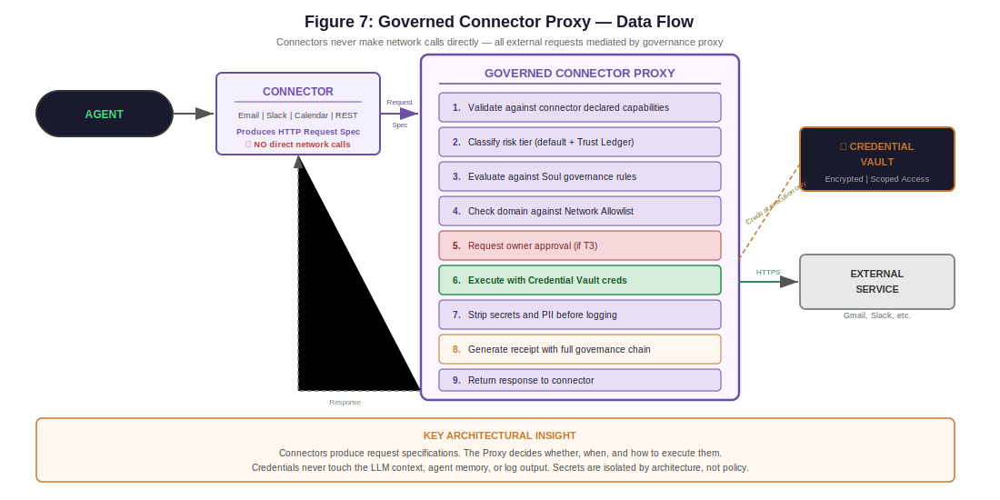

# Developing Connectors

A step-by-step guide to building a governed connector for Lancelot — from manifest to registration to governance integration.

Connectors are how Lancelot communicates with external services (email, Slack, Stripe, Telegram, etc.). Every connector goes through the governance pipeline — manifests declare capabilities, credentials go through the vault, and every operation produces a receipt.

---

## Concepts

### What Is a Connector?

A connector is a governed interface to an external service. It:

- Declares what it does and what it needs via a **ConnectorManifest**
- Never makes network calls directly — it produces request specs for the **ConnectorProxy**
- Registers credentials through the **Vault** (encrypted storage)
- Has every operation classified by risk tier and traced by receipts

### The Connector Lifecycle

```
Define Manifest → Implement ConnectorBase → Register Credentials
  → Register Connector → Test → Activate
```

### Governed Connector Proxy

Connectors never make network calls directly. All external requests are mediated by the Governed Connector Proxy, which enforces governance at every step:

<p align="center">
  
</p>

---

## Step 1: Define the Manifest

Every connector starts with a `ConnectorManifest` — an immutable declaration of what the connector does and what it needs.

```python
from connectors.base import ConnectorManifest, CredentialSpec

manifest = ConnectorManifest(
    id="webhook",
    name="Webhook Connector",
    version="1.0.0",
    author="your-name",
    source="first-party",
    description="Sends JSON payloads to configured webhook URLs",
    target_domains=["*.example.com"],
    required_credentials=[
        CredentialSpec(
            name="webhook_url",
            type="url",
            vault_key="WEBHOOK_URL",
            required=True,
            scopes=[]
        ),
        CredentialSpec(
            name="webhook_secret",
            type="secret",
            vault_key="WEBHOOK_SECRET",
            required=False,
            scopes=[]
        )
    ],
    data_reads=[],
    data_writes=["webhook.send_payload"],
    does_not_access=["user_files", "memory", "soul"]
)
```

### Manifest Fields

| Field | Required | Description |
|-------|----------|-------------|
| `id` | Yes | Unique identifier (lowercase, alphanumeric + hyphens) |
| `name` | Yes | Human-readable display name |
| `version` | Yes | Semantic version string |
| `author` | Yes | Who built this connector |
| `source` | Yes | `"first-party"` or `"third-party"` |
| `description` | Yes | What the connector does |
| `target_domains` | Yes | External domains this connector communicates with |
| `required_credentials` | Yes | List of `CredentialSpec` objects |
| `data_reads` | Yes | What data this connector reads (capabilities) |
| `data_writes` | Yes | What data this connector writes (capabilities) |
| `does_not_access` | No | Explicit declaration of what this connector does NOT touch |

**Important:** The manifest is validated at registration. Call `manifest.validate()` to catch issues early.

### Credential Specs

Each credential the connector needs is declared as a `CredentialSpec`:

```python
CredentialSpec(
    name="api_key",           # Human-readable name
    type="api_key",           # Type: api_key, oauth_token, url, secret, etc.
    vault_key="SLACK_API_KEY", # Key in the vault where this is stored
    required=True,            # Is this required for the connector to work?
    scopes=["chat:write"]     # OAuth scopes or permission scopes needed
)
```

Credentials are stored in the Vault (`config/vault.yaml` defines the storage configuration). They are encrypted at rest using Fernet encryption via the `LANCELOT_VAULT_KEY` environment variable.

---

## Step 2: Implement ConnectorBase

All connectors inherit from `ConnectorBase` and implement three abstract methods:

```python
from connectors.base import ConnectorBase, ConnectorManifest, ConnectorStatus

class WebhookConnector(ConnectorBase):

    def __init__(self, manifest: ConnectorManifest):
        super().__init__(manifest)

    def get_operations(self) -> list[dict]:
        """Declare all operations this connector supports."""
        return [
            {
                "name": "send_payload",
                "description": "Send a JSON payload to the configured webhook URL",
                "risk_tier": "T2",  # Network write = controlled
                "inputs": {
                    "payload": {"type": "object", "required": True},
                    "headers": {"type": "object", "required": False}
                },
                "outputs": {
                    "status_code": {"type": "integer"},
                    "response_body": {"type": "string"}
                }
            }
        ]

    def execute(self, operation: str, params: dict) -> dict:
        """
        Execute an operation. DO NOT make network calls here.
        Return a request spec for the ConnectorProxy.
        """
        if operation == "send_payload":
            return {
                "method": "POST",
                "url": self.get_credential("webhook_url"),
                "headers": {
                    "Content-Type": "application/json",
                    **(params.get("headers", {}))
                },
                "body": params["payload"],
                "timeout": 30
            }
        raise ValueError(f"Unknown operation: {operation}")

    def validate_credentials(self) -> bool:
        """Check that all required credentials are present and valid."""
        url = self.get_credential("webhook_url")
        if not url or not url.startswith("https://"):
            return False
        return True
```

### Key Rules

1. **Never make network calls directly.** The `execute()` method returns a request specification (URL, method, headers, body). The ConnectorProxy handles the actual HTTP call — this ensures all network traffic goes through the governance pipeline and domain allowlist.

2. **Declare operations honestly.** Each operation in `get_operations()` includes a `risk_tier`. Declaring a lower tier than the operation warrants will be caught by the Policy Engine.

3. **Use `self.get_credential()`** to retrieve credentials from the Vault. Never hardcode credentials or read them from environment variables directly.

---

## Step 3: Register Credentials

Before a connector can be activated, its credentials must be stored in the Vault.

Credentials are configured in `config/vault.yaml` and stored encrypted in `data/vault/credentials.enc`.

To add credentials for your connector:

1. Add the vault keys to your `.env` file:
   ```ini
   WEBHOOK_URL=https://hooks.example.com/incoming
   WEBHOOK_SECRET=your-secret-here
   ```

2. The Vault reads these on startup and stores them encrypted. All access is logged to `data/vault/access.log`.

---

## Step 4: Register the Connector

Add your connector to `config/connectors.yaml`:

```yaml
connectors:
  webhook:
    enabled: true
    settings:
      max_retries: 3
      timeout_seconds: 30
```

And configure rate limits:

```yaml
rate_limits:
  per_connector:
    webhook:
      max_requests_per_minute: 30
      burst_limit: 5
```

---

## Step 5: Governance Integration

Your connector's operations are automatically governed through the risk tier system:

| Your Declared Risk Tier | Governance Applied |
|------------------------|-------------------|
| T0 (Inert) | Policy cache lookup, batch receipt |
| T1 (Reversible) | Policy cache, rollback snapshot, async verification |
| T2 (Controlled) | Sync verification, tier boundary flush |
| T3 (Irreversible) | Approval gate, sync verification |

**Scope escalation** may upgrade your operation's tier:
- Writing to domains not in `target_domains` → escalated to T3
- Operations matching Soul risk overrides → escalated per Soul configuration

**Trust graduation** applies to your connector:
- After enough successful operations, the Trust Ledger may propose graduating your connector to a lower tier
- Soul ceilings can prevent graduation (e.g., "Stripe always T3")

---

## Step 6: Testing

### Test with the EchoConnector Pattern

Before testing with real external services, verify your connector logic using an echo/mock pattern:

```python
class TestWebhookConnector:

    def test_operations_declared(self):
        connector = WebhookConnector(manifest)
        ops = connector.get_operations()
        assert len(ops) == 1
        assert ops[0]["name"] == "send_payload"

    def test_execute_returns_request_spec(self):
        connector = WebhookConnector(manifest)
        # Mock credential retrieval
        connector.get_credential = lambda key: "https://hooks.example.com/test"

        result = connector.execute("send_payload", {
            "payload": {"event": "test", "data": "hello"}
        })

        assert result["method"] == "POST"
        assert result["url"] == "https://hooks.example.com/test"
        assert result["body"]["event"] == "test"

    def test_validate_credentials(self):
        connector = WebhookConnector(manifest)
        connector.get_credential = lambda key: "https://hooks.example.com/test"
        assert connector.validate_credentials() is True

    def test_invalid_credentials(self):
        connector = WebhookConnector(manifest)
        connector.get_credential = lambda key: ""
        assert connector.validate_credentials() is False
```

### Verify Governance Traces

After registering your connector, run an operation and check the receipt in the War Room:
- Does the receipt show the correct risk tier?
- Did the Policy Engine approve the operation?
- Is the connector's domain in the allowlist?

---

## Common Patterns

### Pagination

For connectors that read paginated data:

```python
def execute(self, operation: str, params: dict) -> dict:
    if operation == "list_messages":
        return {
            "method": "GET",
            "url": f"{self.get_credential('api_url')}/messages",
            "params": {
                "limit": params.get("limit", 50),
                "cursor": params.get("cursor", None)
            }
        }
```

### OAuth Token Refresh

Declare refresh capability in your operations and handle token refresh as a separate operation:

```python
def get_operations(self):
    return [
        {"name": "refresh_token", "risk_tier": "T1", ...},
        {"name": "send_message", "risk_tier": "T2", ...}
    ]
```

### Authentication Types

The ConnectorProxy supports several credential injection modes via the `metadata.auth_type` field in your `ConnectorResult`:

| Auth Type | How It Works | Example Connector |
|-----------|-------------|-------------------|
| `bearer` / `oauth_token` | Injects `Authorization: Bearer {token}` | Gmail, Outlook |
| `api_key` | Injects `X-API-Key: {value}` | Generic REST |
| `bot_token` | Injects `Authorization: Bot {token}` | Discord |
| `url_token` | Substitutes `{token}` in the URL path | Telegram |
| `basic_auth_composed` | Composes `Authorization: Basic {base64(user:pass)}` from two vault keys | SMS (Twilio) |
| `oauth1` | Full OAuth 1.0a HMAC-SHA1 signature (4 vault keys) | X (Twitter) |

For `basic_auth_composed`, set `metadata.basic_auth_username_key` to the vault key for the username. For `oauth1`, set `metadata.oauth_consumer_key`, `oauth_consumer_secret`, `oauth_token_key`, and `oauth_token_secret`.

### Error Handling

Return errors in a structured format:

```python
def execute(self, operation: str, params: dict) -> dict:
    if not self.validate_credentials():
        return {"error": "credentials_invalid", "message": "API key is missing or expired"}
    # ...
```

### Retry Logic

Configure retries in `config/connectors.yaml` rather than in your connector code. The ConnectorProxy handles retries with exponential backoff:

```yaml
settings:
  retry_max_attempts: 3
  retry_backoff_seconds: 1
```

---

## What NOT to Do

| Don't | Why |
|-------|-----|
| Make HTTP calls directly in `execute()` | Bypasses the ConnectorProxy, governance pipeline, and domain allowlist |
| Store credentials in connector code | Credentials belong in the Vault, encrypted at rest |
| Store credentials outside the Vault | Same — all credentials go through the Vault for audit logging |
| Make ungoverned network calls | Every external call must go through the governed pipeline |
| Underdeclare risk tiers | The Policy Engine will catch it, and your operations will be blocked |
| Overdeclare capabilities | Requesting capabilities you don't use wastes trust score opportunities |

---

## Connector Registry


Registered connectors appear in the War Room Connector Status panel, showing:
- Enabled/disabled status
- Rate limit usage
- Credential health
- Trust score
- Recent activity and errors

The operator can enable, disable, or suspend any connector from the War Room at any time.
