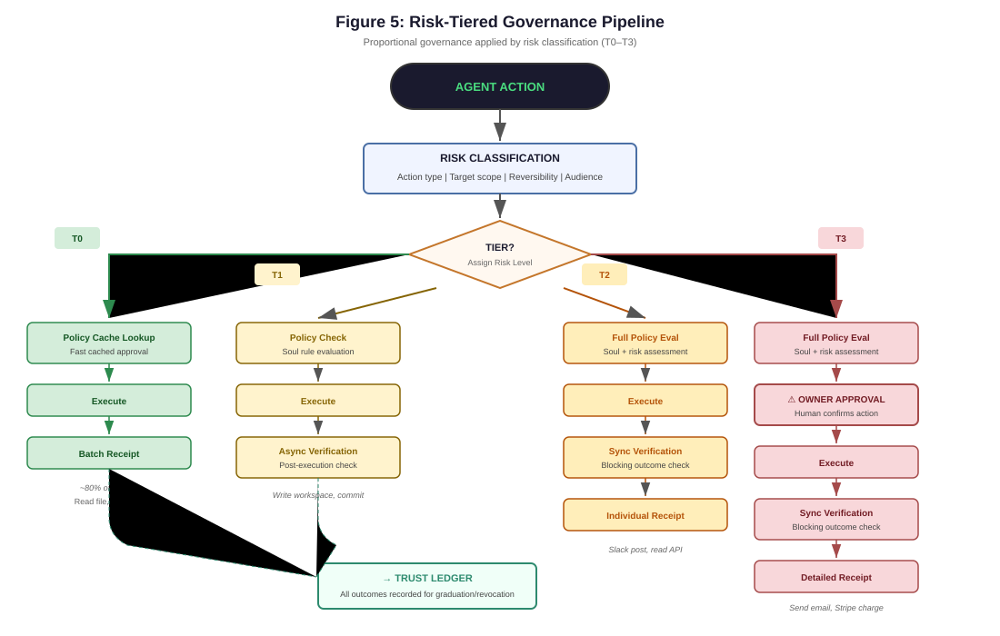
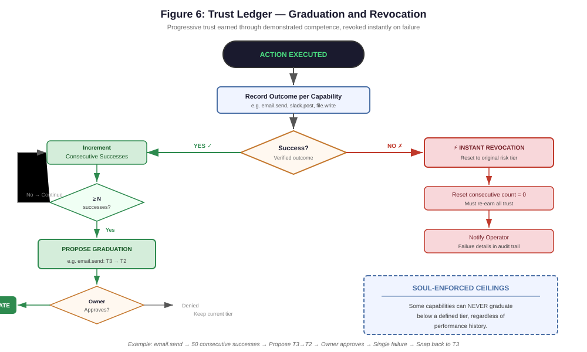

# Governance

A deep dive into Lancelot's governance model — the thing that makes it different from every other AI agent. This is the document you send to a security reviewer.

For a system-level overview, see [Architecture](architecture.md). For the full security model, see [Security Posture](security.md).

---

## Why Governance Matters

Most AI agent systems rely on the model to behave correctly. They use system prompts, few-shot examples, and hope. When the model hallucinates, misinterprets, or gets prompt-injected, there's nothing between it and irreversible action.

Lancelot treats the model as **untrusted logic inside a governed system**. Governance is enforced by code outside the model's control. The model proposes actions; governance decides whether they execute.

---

## The Soul

The Soul is Lancelot's constitutional document — a versioned YAML file that defines invariant behavior. It is **immutable at runtime**. The running system cannot modify its own Soul, regardless of model intent, prompt injection, or hallucination.

### What the Soul Defines

| Section | Purpose | Example |
|---------|---------|---------|
| **Mission** | What Lancelot does and for whom | "Serve as a loyal, transparent, and capable AI agent for the owner" |
| **Allegiance** | Single-owner loyalty | "All actions aligned with the owner's interests" |
| **Autonomy posture** | What can be done alone vs. what needs approval | Autonomous: classify, summarize, redact. Approval: deploy, delete, financial |
| **Risk rules** | Safety boundaries | "Destructive actions require approval" — enforced, not suggested |
| **Approval rules** | How approvals work | Timeout (3600s), escalation on timeout, approved channels |
| **Tone invariants** | Communication constraints | "Never mislead the owner", "Report failures immediately" |
| **Memory ethics** | Data handling rules | "Do not store PII without consent", "Secrets never in memory" |
| **Scheduling boundaries** | Automation limits | Max 5 concurrent jobs, no autonomous irreversible actions |

### Soul Invariants

Five invariant checks run at load time. If any CRITICAL invariant fails, the Soul is rejected:

1. **destructive_actions_require_approval** (CRITICAL) — Destructive actions (deploy, delete, financial_transaction, credential_rotation) must appear in `requires_approval`
2. **no_silent_degradation** (CRITICAL) — Tone invariants must prohibit silent failures
3. **scheduling_no_autonomous_irreversible** (CRITICAL) — Scheduling boundaries must include `no_autonomous_irreversible: true`
4. **approval_channels_required** (CRITICAL) — At least one approval channel must be defined
5. **memory_ethics_required** (WARNING) — At least one memory ethics rule must exist

These invariants prevent common misconfiguration — you cannot accidentally create a Soul that allows uncontrolled autonomous action.

### Soul Amendments

The Soul can only be changed through a controlled amendment workflow:

```
Propose Amendment → PENDING
  → Owner reviews diff → Approves → APPROVED
    → Owner activates → Linter validates → ACTIVATED
```

Each step requires owner authentication (Bearer token). The linter runs all five invariants before activation. If the amendment would break a CRITICAL invariant, activation is blocked and the previous version remains active.

Soul versions are stored in `soul/soul_versions/soul_vN.yaml`. The active version pointer is in `soul/ACTIVE`. You can switch between versions and roll back at any time.

---

## The Policy Engine

The Policy Engine evaluates every proposed action before execution. It sits **between the model's intent and the system's actuators** — the model cannot bypass it.

### How It Works

1. **Capability extraction** — What does this action need? (e.g., `fs.write`, `shell.exec`, `net.post`)
2. **Risk classification** — What tier is this action? (T0 through T3)
3. **Scope check** — Does the scope escalate the risk? (e.g., writing outside workspace → T3)
4. **Soul constraint check** — Does the Soul allow this capability?
5. **Approval gate** — Does this tier/capability require owner approval?
6. **Execute or block** — Approved actions execute; blocked actions generate denial receipts

### Policy Cache

For T0 and T1 actions, the policy engine uses a precomputed cache built at boot time. This makes governance overhead for low-risk actions near-zero — an O(1) lookup on the `(capability, scope, pattern)` tuple.

The cache invalidates automatically when the Soul changes. T2 and T3 decisions are never cached.

---

## Risk Tiers

Every action Lancelot takes is classified into one of four risk tiers. The governance overhead scales proportionally with the risk.

<p align="center">
  
</p>

### T0 — Inert

**Actions:** File reads, directory listings, git status/log/diff, memory reads

**Pipeline:**
```
Policy Cache Lookup → Execute → Batch Receipt
```

**Governance overhead:** Near-zero. Precomputed policy decision, no verification, receipts batched.

These are read-only operations with no side effects. They execute immediately.

### T1 — Reversible

**Actions:** File writes, git commits/branches, memory writes

**Pipeline:**
```
Policy Cache Lookup → Snapshot → Execute → Async Verify → Receipt
```

**Governance overhead:** Low. A rollback snapshot is taken before execution. Verification runs asynchronously in the background. If verification fails, the rollback manager restores the previous state automatically.

Rollback is idempotent — calling it twice is a safe no-op.

### T2 — Controlled

**Actions:** Shell execution, network fetches, Docker container runs

**Pipeline:**
```
[Flush Batch + Drain Async Queue] → Execute → Sync Verify → Receipt
```

**Governance overhead:** Medium. Before a T2 action can execute, all pending T0/T1 work must complete. This is the **tier boundary** — it ensures no "pipeline debt" crosses the risk boundary. If any pending async verification has failed, the T2 action is blocked until the failure is resolved.

Verification is synchronous — the system waits for confirmation before proceeding.

### T3 — Irreversible

**Actions:** Network POSTs, outbound writes, deployments, deletions, financial transactions

**Pipeline:**
```
[Flush Batch + Drain Async Queue] → Approval Gate → Execute → Sync Verify → Receipt
```

**Governance overhead:** Maximum. Same tier boundary enforcement as T2, plus an explicit owner approval gate. The action is presented to the owner in the War Room (or via configured channel) and will not execute until approved.

### Risk Escalation

The base tier for each capability is defined in `config/governance.yaml`. Three escalation mechanisms can upgrade an action to a higher tier:

1. **Scope escalation** — Writing outside the workspace escalates `fs.write` from T1 to T3
2. **Pattern escalation** — Writing to `*.env` files escalates `fs.write` to T3
3. **Soul escalation** — The Soul can override any capability to a higher tier

Unknown capabilities always default to T3 (fail-safe).

### Tier Boundary Enforcement

The critical safety invariant: before ANY T2 or T3 action executes:

1. All pending batch receipts are flushed to disk
2. All pending async verifications are drained and completed
3. Any verification failure triggers automatic rollback

This means the system is always in a clean, verified state before crossing into higher-risk territory.

---

## Trust Ledger

The Trust Ledger tracks how much trust each connector and capability has earned through observed outcomes — not through model confidence or configuration.

<p align="center">
  
</p>


### How Trust Is Earned

Trust starts at zero. Every successful governed action increments the trust score for that connector/capability. Every failure, denial, or rollback affects the score.

### Graduation Proposals

When a connector's trust score crosses a threshold, a graduation proposal is generated:

| Graduation | Required Trust Score | Effect |
|-----------|---------------------|--------|
| T3 → T2 | 50 successful actions | Action no longer requires owner approval |
| T2 → T1 | 100 successful actions | Action verified async instead of sync |
| T1 → T0 | 200 successful actions | Action executes with minimal governance |

Graduation proposals are delivered to the War Room. The owner reviews and accepts or rejects them.

### Revocation

Trust is revocable:

- **On failure:** Trust resets to the default tier for that capability
- **On rollback:** Trust resets to one tier above default
- **After denial:** 50-action cooldown before re-proposing graduation
- **After revocation:** 25-action cooldown

### Soul Ceilings

The Soul can set maximum trust ceilings for specific capabilities. For example, if the Soul says "Stripe operations are always T3," then no amount of successful executions will ever graduate Stripe below T3. The Trust Ledger respects these ceilings unconditionally.

---

## Approval Pattern Learning (APL)

APL detects patterns in owner approval decisions and proposes automation rules. It learns *from the owner*, not from the model.


### How It Works

1. **Observation** — APL records every approval/denial decision with context (connector, action type, parameters, time, outcome)
2. **Pattern detection** — After enough observations (default: 20), APL analyzes decision history looking for consistent patterns
3. **Proposal** — When a pattern reaches confidence threshold (default: 85%), APL proposes an automation rule: "You've approved email sends to verified recipients 20 times in a row — should I auto-approve these?"
4. **Confirmation** — The owner accepts or rejects the proposal in the War Room
5. **Automation** — Accepted rules auto-approve matching actions without owner interaction

### Safety Constraints

- **Never-automate list:** Some actions can never be automated regardless of patterns. Configured in `config/approval_learning.yaml`:
  ```yaml
  never_automate:
    - "connector.stripe.charge_customer"
    - "connector.stripe.refund_charge"
    - "connector.*.delete_*"
  ```
- **Circuit breaker:** Each rule has a per-day limit (default: 50 auto-decisions) and a lifetime limit (default: 500). After the lifetime limit, the rule requires re-confirmation.
- **Cooldown on decline:** If the owner declines a proposal, APL won't re-propose the same pattern for 30 decisions.
- **Maximum active rules:** Default cap of 50 concurrent automation rules.
- **Confidence threshold:** Only patterns with 85%+ consistent approval rate generate proposals.

### Rule Lifecycle

```
Pattern Detected (85%+ confidence)
  → Proposal generated → Owner reviews
    → Accepted → Rule active (auto-approves matching actions)
      → Lifetime limit reached → Re-confirmation required
    → Declined → 30-decision cooldown
```

APL rules are persisted in `data/apl/rules.json` and decision history in `data/apl/decisions.jsonl`.

---

## What Governance Prevents

Mapping common AI agent failure modes to the specific Lancelot mechanism that blocks them:

### Prompt Injection

**Attack:** Malicious instructions hidden in user input, documents, or tool output attempt to override the agent's behavior.

**Defense:**
- InputSanitizer blocks 16 known injection patterns + homoglyph normalization
- The Soul is enforced by code, not by prompt — injection cannot override constitutional constraints
- Tool output is treated as untrusted input and never executed directly
- The Context Compiler enforces authority hierarchy (Soul > operator > user input)

### Skill Supply Chain

**Attack:** A malicious skill or tool is installed that exfiltrates data or escalates privileges.

**Defense:**
- Marketplace skills are restricted to `read_input`, `write_output`, `read_config` only
- Elevated permissions require explicit owner approval
- All skill executions produce receipts
- Feature flags can kill the entire skill subsystem instantly

### Memory Poisoning

**Attack:** Persistent malicious instructions are written into memory to influence future behavior.

**Defense:**
- Memory writes are classified as T1 (reversible) with async verification
- Risky memory edits land in quarantine — they don't affect behavior until promoted
- All memory edits are commit-based with full rollback capability
- The Soul is never stored in memory (memory references Soul version, never Soul content)

### Credential Exposure

**Attack:** Secrets are leaked through logs, memory, or model outputs.

**Defense:**
- Secrets are stored in `.env` and sealed references, never in general memory
- PII redaction runs via the local model before any external API call
- Receipts sanitize inputs and outputs
- Credential access is logged (enforced by Soul risk rule)

### Unintended Autonomous Action

**Attack:** The agent takes irreversible actions without authorization.

**Defense:**
- T3 actions require explicit owner approval (approval gate)
- The Soul defines which actions require approval — and this list is linter-enforced
- Scheduling boundaries prevent autonomous irreversible actions in automated jobs
- Tier boundary enforcement ensures all pending work is verified before high-risk actions

### Silent Failure

**Attack:** The agent fails silently, hiding errors or degrading behavior without alerting the operator.

**Defense:**
- Soul tone invariant: "Report failures immediately and transparently" (linter-enforced)
- Health monitor generates receipts on state transitions (degraded/recovered)
- Response Governor blocks simulated-progress language without a real job running
- Every action produces a receipt — missing receipts indicate system issues

---

## Operator Identity

Every human-initiated governance action carries an **OperatorIdentity** — the named human who initiated it. Automated actions carry the SYSTEM identity. A receipt with `operator_id=null` is automated; a receipt with a populated `operator_id` is a human decision. Auditors can tell the difference at a glance.

### OperatorIdentity Model

| Field | Type | Description |
|-------|------|-------------|
| `operator_id` | UUID | Stable, deterministic — same across sessions for the same person. Derived via UUID5(namespace, username). |
| `display_name` | string | Human-readable name (e.g., "Myles Hamilton"). |
| `session_id` | UUID | Ephemeral — unique per War Room login session. |
| `session_started_at` | ISO 8601 | When the session was created. |
| `auth_method` | string | "local" (War Room login), "api_key" (CLI/API), or "system" (automated). |
| `ip_address` | string | Client IP. Redacted in compliance exports. Never shown in UI. |

### Identity Enforcement

The receipt writer enforces identity requirements **at write time**. 25 governance receipt types are designated as `IDENTITY_REQUIRED` — if any of these receipt types is written without a valid OperatorIdentity, the write is blocked and a `GOVERNANCE_WRITE_ERROR` receipt is persisted as a fallback audit trail.

Identity-required receipt types include: kill switch toggles, T3 approvals/rejections, Soul updates, agent lifecycle, credential management, MCP server management, connector toggles, allowlist modifications, scheduler CRUD, tool store toggles, APL rule decisions, and HIVE interventions.

The SYSTEM identity (`operator_id="SYSTEM"`) is never valid on human-required receipt types — only human identities can authorize governance actions.

### API-Key Attribution

Requests authenticated via API key (not a War Room session) use `auth_method="api_key"` with the operator name derived from the `LANCELOT_OPERATOR_NAME` environment variable.

---

## Configuration

### `config/governance.yaml`

Defines risk classification defaults, scope escalation rules, policy cache settings, async verification parameters, intent template configuration, and batch receipt behavior. See [Configuration Reference](configuration-reference.md) for the complete schema.

### `config/trust_graduation.yaml`

Defines trust score thresholds for tier graduation, revocation behavior, and cooldown periods.

### `config/approval_learning.yaml`

Defines APL detection parameters, rule limits, never-automate list, and persistence paths.

### Soul files (`soul/`)

Constitutional governance documents. See [Authoring Souls](authoring-souls.md) for customization guidance.

---

## Scoped Soul Governance (Hive Agent Mesh)

When the Hive Agent Mesh spawns sub-agents, each agent receives a **scoped Soul** — a task-specific governance document derived from the parent Soul with the **monotonic restriction principle**: scoped Souls can only be more restrictive, never less.

### How Scoped Souls Work

1. Start with the parent Soul's `allowed_autonomous` actions
2. Filter to only the actions matching the subtask's `allowed_categories`
3. If `control_method=MANUAL_CONFIRM`, move all actions to `requires_approval`
4. Preserve all parent risk rules and add Hive-specific rules
5. Tighten scheduling: `max_concurrent_jobs=1`, duration capped to task timeout
6. Validate with `validate_more_restrictive()` — if validation fails, the agent is not spawned

### Soul Overlay (`soul/overlays/hive.yaml`)

The Hive overlay adds five non-negotiable governance rules:

| Rule | Severity | Effect |
|------|----------|--------|
| `hive_no_autonomous_t3` | CRITICAL | Sub-agents may NEVER autonomously execute T3 actions |
| `hive_collapse_on_governance_violation` | CRITICAL | Governance check failure immediately collapses the agent |
| `hive_scoped_soul_monotonic` | CRITICAL | Scoped Souls can only tighten constraints, never loosen |
| `hive_intervention_requires_reason` | CRITICAL | All operator interventions require non-empty reason string |
| `hive_never_retry_identical` | CRITICAL | Replans must produce a new plan (tracked via plan hash) |

### Hive-Specific Risk Rules

- **No autonomous T3** — even agents with `control_method=FULLY_AUTONOMOUS` cannot execute T3 actions without operator approval
- **Collapse on violation** — any governance denial or Soul constraint violation immediately collapses the agent (recommended: `collapse_on_governance_violation: true` in `config/hive.yaml`)
- **Intervention accountability** — the `hive_intervention_requires_reason` rule ensures every operator action has an audit-traceable justification

### How This Extends the Governance Model

The scoped Soul mechanism extends the existing governance model (Soul → Policy Engine → Risk Tiers) with:
- **Per-agent governance** — each sub-agent has its own governance boundary
- **Monotonic restriction** — sub-agents are always less powerful than the parent
- **Hive overlay rules** — additional safety constraints specific to ephemeral multi-agent execution

For the full Hive Agent Mesh architecture, see [Hive](hive.md). For Soul overlay authoring, see [Authoring Souls](authoring-souls.md).

---

## MCP Governance

When `FEATURE_MCP` is enabled, MCP tool server access is governed by an **8-gate fail-closed pipeline** — the most heavily gated execution path in the system.

### Soul MCP Permissions

The Soul document declares MCP permissions under `mcp_permissions`:

```yaml
mcp_permissions:
  - server_id: "github"
    allowed_tools: ["list_repos", "get_issues"]
    risk_tier: "T1"
  - server_id: "database"
    allowed_tools: ["*"]
    risk_tier: "T2"
```

Server IDs not in the list are blocked. Tool names not in `allowed_tools` are blocked. Risk tiers follow the same T0–T3 model as the rest of governance.

### Federation Ceiling

In federation deployments, MCP permissions are **monotonically narrowed** from root to child:

- Child server set ⊆ root server set
- Child tool set ⊆ root tool set per server
- Child risk tier ≥ root risk tier (more restrictive only)
- Child wildcard only if root has wildcard

This uses the same narrowing contract as HIVE scoped Souls — `enforce_mcp_ceiling()` in `src/mcp/federation_ceiling.py`.

### Receipt Obligation

The MCP proxy is **incapable of completing an invocation without generating a receipt**. The constructor raises `ValueError` if `receipt_manager` is None. If receipt persistence fails at Gate 8, the invocation result is discarded — ungoverned success is not allowed.

For the full MCP reference, see [MCP](mcp.md). For argument screening and response guard details, see [Security — MCP Security](security.md#mcp-security).
