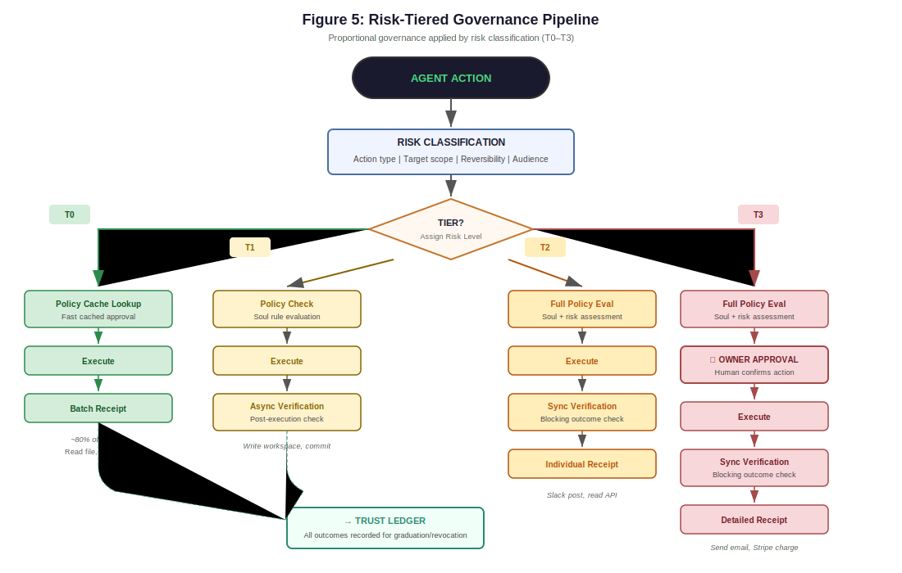
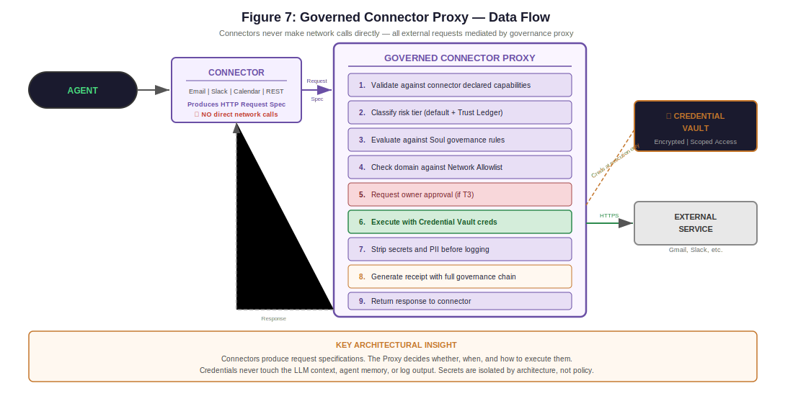

# Security Posture

**Audience:** Security engineers, auditors, anyone evaluating whether to deploy Lancelot in their environment.

Lancelot is a Governed Autonomous System (GAS). It assumes the AI model is **fallible and untrusted** and compensates using architecture, governance, and verification. This document describes the security model in full.

We are honest about what is protected and what is the operator's responsibility.

---

## Security Philosophy

Lancelot does not rely on:
- Model obedience
- Prompt discipline
- Post-hoc review

Instead, it enforces security through **explicit boundaries** and **reversible state**.

**Core principles:**
- Governance over convenience
- Verification over speed
- Least privilege over flexibility
- Reversibility over irreversible autonomy
- Observability over silent failure

---

## Threat Model

### Adversaries

| Threat | Vector |
|--------|--------|
| **Prompt injection** | Via user input, documents, web content, or tool output |
| **Tool output injection** | Malicious tool responses attempting to escalate authority |
| **Memory poisoning** | Persistent malicious instructions injected into memory |
| **Supply chain attacks** | Via third-party skills, tools, or marketplace packages |
| **Operator misconfiguration** | Accidental weakening of governance constraints |
| **Model hallucination** | LLM proposing unsafe or unauthorized actions |

### High-Risk Failure Modes

1. Unintended tool execution (model triggers a tool it shouldn't)
2. Data exfiltration (files, secrets, logs sent to unauthorized destinations)
3. Persistence of malicious instructions in memory
4. Sandbox escape or filesystem traversal
5. Autonomous irreversible actions without approval
6. Silent or unverifiable failures

---

## Governance Layer (Soul + Policy)

Security begins at the constitutional level. The Soul and Policy Engine enforce constraints **outside the model** — the model cannot override them regardless of prompt, context, or intent.

### Soul (Constitutional Governance)

- Defines allowed behaviors, escalation rules, autonomy posture
- Versioned and owner-controlled
- **Immutable at runtime** — the running system cannot modify its own Soul
- Used to *generate* system prompts, not overridden by them
- Amendment requires explicit owner authentication and linter validation

Five invariant checks ensure the Soul cannot be configured in a dangerous state:
1. Destructive actions must require approval
2. Tone invariants must prohibit silent degradation
3. Scheduling must prevent autonomous irreversible actions
4. Approval channels must be defined
5. Memory ethics must have at least one rule

If the Soul forbids an action, it cannot be executed regardless of model intent. This is enforced in code, not in prompts.

### Policy Engine

- Evaluates every proposed action before execution
- Determines required capabilities
- Assigns risk tier (T0-T3)
- Enforces approval gates for high-risk actions
- Uses precomputed cache for T0/T1 decisions (O(1) overhead)

Policies are enforced **outside** the model. The model proposes; the engine decides.

For the full governance model including risk tiers, Trust Ledger, and APL, see [Governance](governance.md).

---

## Architecture Diagrams

The following diagrams illustrate the key security enforcement points in the system:

<p align="center">
  
</p>

<p align="center">
  
</p>

---

## Capability-Based Tool Security

### Tool Fabric

Tools are exposed as **capabilities**, not arbitrary functions:

| Capability | Scope |
|-----------|-------|
| `fs.read` / `fs.write` | Filesystem operations within workspace |
| `fs.list` | Directory listing within workspace |
| `shell.exec` | Command execution in sandbox |
| `net.fetch` / `net.post` | Network requests to allowlisted domains |
| `git.status` / `git.commit` | Repository operations |
| `docker.run` | Container execution |

Each tool declares:
- Required capabilities
- Environment constraints
- Side effects

The Policy Engine validates every call against the Soul and risk tier before execution.

### Least Privilege

- **Default-deny posture** — capabilities not explicitly allowed are blocked
- **Narrow scopes by default** — operations are constrained to the workspace
- **Escalation requires approval and receipt** — requesting broader scope triggers governance
- **Unknown capabilities default to T3** — the highest risk tier with mandatory approval

---

## Execution Containment

### Sandboxing

- Tool execution runs in Docker containers (sibling containers via Docker socket)
- Filesystem access is limited to the mapped workspace directory
- Network access is denied unless explicitly enabled (`FEATURE_TOOLS_NETWORK=true`)
- Process isolation prevents interference between executions

### Workspace Enforcement

All file operations go through workspace boundary enforcement:

- **Path normalization** — resolves relative paths and `..` traversals
- **Symlink rejection** — symlinks pointing outside the workspace are blocked
- **No traversal outside workspace** — the boundary is absolute, not relative
- **Atomic file writes** — writes use temporary files with rename, preventing partial writes on crash
- **Sensitive path protection** — operations on `.env`, credential files, and system paths are blocked or escalated

### Command Denylist

Shell commands are tokenized using `shlex` (proper shell parsing, not substring matching) and checked against a denylist. This prevents:
- Destructive commands (`rm -rf`, `mkfs`, etc.)
- Privilege escalation (`sudo`, `su`, `chmod 777`, etc.)
- Data exfiltration attempts via common tools

The denylist uses token-level matching, which means `rm` in a filename doesn't trigger a false positive — only actual `rm` commands are blocked.

---

## Prompt and Tool Injection Defense

### Prompt Injection

Lancelot defends against prompt injection at multiple layers:

1. **Input sanitization** — 16 banned phrases, 10 regex patterns, Cyrillic homoglyph normalization, zero-width character stripping. Applied before any processing.
1. **Rate limiting** — Sliding-window rate limiter (60 requests/minute per client) enforced at the gateway middleware layer. Requests exceeding the limit receive HTTP 429 with a `Retry-After` header. See the [Rate Limiting](#rate-limiting) section below for details.
2. **Governance context separation** — The Soul and governance rules are structurally separated from untrusted user content. The model receives them as system-level context, not as part of the conversation.
3. **Context compiler authority hierarchy** — The context compiler enforces: Soul > operator instructions > user input. Injected instructions cannot override Soul constraints.
4. **Verifier cross-check** — The Verifier agent analyzes execution outputs for signs of policy bypass or unexpected behavior.

### Tool Output Injection

- Tool output is treated as **untrusted input** — always
- Tool output is never executed directly as code or commands
- Tool output is never allowed to modify policy, Soul, or governance configuration
- Tool output is sanitized before inclusion in receipts

---

## Memory Security

### Tiered Memory

Memory is structured into four tiers with different persistence and sensitivity levels:

| Tier | Persistence | Security Properties |
|------|-------------|-------------------|
| **Core blocks** | Permanent (pinned) | Owner-curated, changes require governance |
| **Working memory** | Task-scoped (ephemeral) | Cleared between tasks |
| **Episodic memory** | Session-scoped | Append-only within session |
| **Archival memory** | Long-term | Searchable, governed writes |

### Quarantine and Promotion

Risky memory writes do not go directly into active memory. They are placed in a **quarantine zone** where they:
- Cannot influence system behavior
- Are visible to the operator in the War Room
- Require explicit approval or verification before promotion to active memory

This prevents memory poisoning attacks from having immediate effect.

### Rollback

All memory edits are **commit-based**:
- Full diff receipts track every change
- Exact rollback to any previous state is supported
- Rollback is idempotent (safe to call multiple times)
- Commit history provides a complete audit trail of memory evolution

### Memory Exclusions

Critical security boundaries for memory:
- The Soul is **never stored in memory** — memory references Soul version numbers, never Soul content. This prevents memory poisoning from corrupting governance.
- Secrets are **never stored in memory** — sealed references only
- PII is redacted before storage (via local model)

---

## Secrets Handling

**Principles:**
- Secrets are never stored in general memory
- Secrets are never logged in plaintext
- Secrets are never sent to models unless explicitly required and approved

**Implementation:**
- API keys and credentials stored in `.env` file (excluded from git via `.gitignore`)
- Environment variables injected at container startup, not baked into images
- Docker env var sanitization prevents shell injection through environment variables
- Sealed secret references allow the system to *use* credentials without *seeing* them in plaintext
- PII redaction via local model runs before any content is sent to external APIs

**Operator responsibility:** The `.env` file and the host machine's security are the operator's responsibility. Lancelot protects secrets within its runtime but cannot protect against host compromise.

---

## Receipts and Audit

Every action emits a receipt containing:

| Field | Description |
|-------|-------------|
| `id` | Unique identifier (UUID) |
| `timestamp` | When the action occurred |
| `action_type` | Category (llm_call, tool_exec, file_op, memory_edit, scheduler_run, verification, governance) |
| `action_name` | Specific action taken |
| `inputs` | Sanitized request data |
| `outputs` | Sanitized response data |
| `status` | Success or failure |
| `duration_ms` | Execution time |
| `cognition_tier` | DETERMINISTIC, CLASSIFICATION, PLANNING, or SYNTHESIS |
| `parent_id` | Link to parent action (for chain reconstruction) |
| `quest_id` | Link to originating goal |

**Receipt guarantees:**
- If there's no receipt, the action didn't happen
- Receipts are append-only — they cannot be modified or deleted at runtime
- Parent-child linking enables complete decision chain reconstruction
- Batch receipts include SHA-256 hashes for integrity verification
- Receipt inputs/outputs are sanitized (secrets redacted, PII stripped)

Receipts are the **ground truth** of system behavior. They enable post-hoc auditing, incident investigation, and trust scoring.

---

## Kill Switches and Safe Defaults

Every high-risk subsystem has an independent kill switch via feature flags:

| Kill Switch | What It Disables |
|------------|-----------------|
| `FEATURE_TOOLS_FABRIC=false` | All tool execution |
| `FEATURE_TOOLS_NETWORK=false` | Network access from sandbox (default: off) |
| `FEATURE_TOOLS_HOST_EXECUTION=false` | Host execution bypass (default: off) |
| `FEATURE_SKILLS=false` | Skill system |
| `FEATURE_SCHEDULER=false` | Automated job execution |
| `FEATURE_MEMORY_VNEXT=false` | Memory writes (default: off) |
| `FEATURE_SOUL=false` | Constitutional governance (not recommended) |

**Safe defaults:**
- No autonomous irreversible actions
- No outbound network writes from sandbox
- Memory edits quarantined by default
- Unknown capabilities classified as T3 (maximum governance)
- Feature flags default to safe values (dangerous features default to off)

---

## Operational Hardening

Recommendations for production deployments:

### Container Security
- Lancelot runs as a non-root user (`lancelot`) inside the container
- The Dockerfile uses `python:3.11-slim` base image (minimal attack surface)
- Only necessary ports are exposed (8000, 8080)
- Docker socket access is limited to sibling container operations

### Network Security
- Outbound domains restricted via `config/network_allowlist.yaml`
- Default allowlist contains only necessary API endpoints
- The War Room is designed for **local access only** — do not expose to the public internet without additional authentication
- No inbound connections are required (Lancelot initiates all external communication)

### Monitoring
- Review receipts regularly via the War Room
- Monitor the memory quarantine queue for unexpected write attempts
- Watch for health degradation alerts
- Audit trust graduation proposals before accepting

### Regular Maintenance
- Keep Docker images updated
- Rotate API keys periodically
- Review and update the Soul as operational requirements change
- Monitor disk usage in `lancelot_data/receipts/` (grows over time)

---

## What Is and Is Not Protected

### Protected by Lancelot

- Prompt injection (input sanitization + governance enforcement)
- Unauthorized tool execution (capability-based access + risk tiers)
- Memory poisoning (quarantine + commit-based rollback)
- Silent failure (tone invariants + receipt system + health monitoring)
- Uncontrolled autonomy (Soul constraints + approval gates)
- Credential exposure in memory and logs (sealed references + redaction)

### Operator's Responsibility

- Host machine security (OS patches, firewall, access control)
- `.env` file protection (file permissions, not committed to git)
- Network perimeter (War Room not exposed publicly)
- API key management (rotation, billing limits on provider accounts)
- Physical security of the deployment environment
- Reviewing and approving trust graduation proposals thoughtfully
- Regular receipt review and quarantine monitoring

Lancelot is designed to be **safe by construction** within its runtime boundary. Security of the deployment environment is a shared responsibility.

---

## UAB Security Model

The Universal Application Bridge introduces host-level desktop app control, which requires additional security measures.

### Risk Classification (3-Tier)

Every UAB action is classified before execution:

| Risk Level | Actions | Governance |
|------------|---------|------------|
| **LOW** | detect, enumerate, query, state, screenshot, all read operations | Autonomous |
| **MEDIUM** | click, type, select, scroll, keypress, hotkey, write operations | May require approval |
| **HIGH** | close, invoke, move, resize, sendEmail | Always requires approval |

### Sensitive App Auto-Escalation

Actions targeting sensitive applications are automatically escalated:
- **Password managers** (1password, bitwarden, keepass, lastpass): read → MEDIUM, mutate → HIGH
- **Banking/financial** (banking apps, venmo, paypal, stripe): read → MEDIUM, mutate → HIGH
- **Email clients** (outlook, thunderbird, gmail): read → MEDIUM, mutate → HIGH
- **Shells** (terminal, powershell, cmd): read → MEDIUM, mutate → HIGH

### Rate Limiting and Audit

- 100 requests per minute per PID (enforced at daemon level)
- Every action produces an `AppControlReceipt` with risk classification
- Audit log tracks all permission checks with app name, action, risk level, and outcome
- Session tracking links individual actions to app connection sessions

### Host Bridge Security Considerations

The UAB daemon runs **outside the Docker container** on the host machine. This is a necessary design decision (UI frameworks require host-level access) but introduces specific security considerations:

- The daemon listens on localhost only (port 7900) — not exposed externally
- Communication is HTTP on `host.docker.internal` — local network only
- The daemon has full host-level UI access — the risk classification and audit system provides accountability
- Feature-gated (`FEATURE_TOOLS_UAB=false` by default) — must be explicitly enabled

---

## Hive Agent Mesh Security

The Hive Agent Mesh introduces ephemeral sub-agents, which require governance at the agent level.

### Scoped Soul Validation

Every sub-agent receives a scoped Soul that is validated to be **strictly more restrictive** than the parent:
- No new `allowed_autonomous` actions beyond what the parent allows
- All parent risk rules preserved (only additions allowed)
- Scheduling boundaries tightened (max 1 concurrent job, duration capped)
- `no_autonomous_irreversible` maintained if parent has it

If validation fails, the agent is not spawned.

### Governance Bridge Pipeline

Every sub-agent action goes through the full governance pipeline:

```
Sub-Agent Action → RiskClassifier (T0–T3) → TrustLedger (effective tier)
  → MCPSentry (hard deny) → GovernanceResult (approved/denied)
```

- T3 actions **always** require operator approval for Hive agents (Soul overlay rule)
- Governance denial collapses the agent immediately (no retry)
- Governance checks produce receipts for audit trail

### Collapse-on-Violation

When `collapse_on_governance_violation: true` (recommended default), any governance check failure immediately collapses the sub-agent. This prevents agents from attempting alternative actions after a governance denial.

### No-Identical-Retry

After a task failure or MODIFY intervention, the Architect must produce a genuinely new plan. Plan hashes are tracked in `_plan_history`. If the new plan matches any previous plan, it is rejected. This prevents infinite loops where the LLM regenerates the same failing approach.

### Ephemeral Security Properties

- Sub-agent working memory is destroyed on collapse — no persistent state leaks between tasks
- Task decomposition context does not leak between unrelated quests
- Each agent's scoped Soul hash is recorded on the agent record for audit linkage
- All state transitions, actions, and interventions produce durable receipts

---

## Rate Limiting

Lancelot enforces a sliding-window rate limiter at the gateway middleware layer to prevent abuse and resource exhaustion.

### Configuration

| Parameter | Value | Notes |
|-----------|-------|-------|
| Window size | 60 seconds | Sliding window |
| Max requests | 60 per window | Per client IP |
| Response on exceed | HTTP 429 | Includes `Retry-After` header |
| Scope | All `/chat` requests | Health/ready endpoints are exempt |

### Behavior

- Each incoming request timestamps are stored in a deque per client
- Expired timestamps (older than 60s) are pruned on each request
- If the deque length exceeds 60, the request is rejected with 429
- The `Retry-After` header indicates seconds until the oldest entry expires
- Rate limiting is applied before input sanitization and authentication

### Error Rate Monitoring

The gateway tracks request-level error metrics:

| Metric | Description |
|--------|-------------|
| `total_requests` | Total HTTP requests since last container restart |
| `error_count` | Requests that returned HTTP 5xx |
| `error_rate` | `error_count / total_requests * 100` (percentage) |

These metrics are exposed in the `/health` endpoint response and displayed in the War Room VitalsBar. Color thresholds: green (< 1%), amber (1–5%), red (> 5%).

### War Room Session Rate Limiting

War Room sessions use the same rate limiter. Additionally:
- Sessions expire after 30 minutes of inactivity (configurable via `WARROOM_SESSION_TIMEOUT_MINUTES`)
- Invalid/expired sessions receive HTTP 401 and are redirected to the login screen
- All login attempts are rate-limited under the same 60/min window
