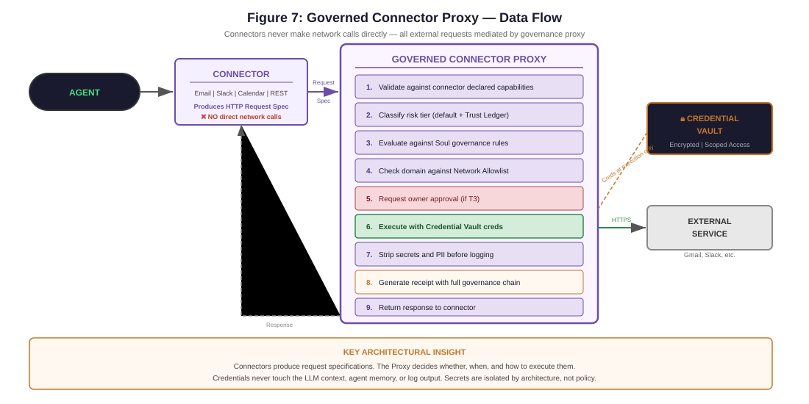

# Security Posture

**Audience:** Security engineers, auditors, anyone evaluating whether to deploy Lancelot in their environment.

Lancelot is a Governed Autonomous System (GAS). It assumes the AI model is **fallible and untrusted** and compensates using architecture, governance, and verification. This document describes the security model in full.

We are honest about what is protected and what is the operator's responsibility.

---

## Security Philosophy

Lancelot does not rely on:
- Model obedience
- Prompt discipline
- Post-hoc review

Instead, it enforces security through **explicit boundaries** and **reversible state**.

**Core principles:**
- Governance over convenience
- Verification over speed
- Least privilege over flexibility
- Reversibility over irreversible autonomy
- Observability over silent failure

### Canonical Network Allowlist Enforcement

Outbound domain control is enforced through a single canonical network allowlist subsystem. Core security, Tool Fabric policy, and the War Room allowlist editor all read and write the same config path, use the same hostname normalization rules, and apply the same suffix-matching contract. The built-in infrastructure domains (`localhost`, `127.0.0.1`, `api.projectlancelot.dev`, `ghcr.io`) remain always allowed, while all configured domains are operator-managed through `config/network_allowlist.yaml`.

That canonical guard is now wired into the main direct HTTP transport chokepoints as well: OIDC discovery/token/userinfo exchange, onboarding provider-validation probes, Telegram onboarding and bot traffic, Anthropic/Google/Codex OAuth token exchange and refresh flows, bonded Google Chat and Telegram alert delivery, flagship provider REST calls, the background update-manifest fetcher, outbound A2A client calls, MCP HTTP transport, federation peer transport and heartbeat streams, and observability webhook delivery all invoke the same allowlist check before a socket is opened. A blocked destination fails closed at the caller with an explicit error instead of silently bypassing the allowlist.

Local control-plane traffic is treated separately from internet egress. The local utility-model endpoint (`LOCAL_LLM_URL`) and host-agent bridge endpoint (`HOST_AGENT_URL`) remain operator-scoped local paths rather than generic outbound destinations, so they are not folded into the external-domain allowlist contract above. The runtime now enforces that distinction directly: `LOCAL_LLM_URL` must stay on loopback, `host.docker.internal`, or a single-label local service hostname, and `HOST_AGENT_URL` must stay on loopback or `host.docker.internal`. Public FQDNs fail closed before any socket is opened.

---

## Threat Model

### Adversaries

| Threat | Vector |
|--------|--------|
| **Prompt injection** | Via user input, documents, web content, or tool output |
| **Tool output injection** | Malicious tool responses attempting to escalate authority |
| **Memory poisoning** | Persistent malicious instructions injected into memory |
| **Supply chain attacks** | Via third-party skills, tools, or marketplace packages |
| **Operator misconfiguration** | Accidental weakening of governance constraints |
| **Model hallucination** | LLM proposing unsafe or unauthorized actions |

### High-Risk Failure Modes

1. Unintended tool execution (model triggers a tool it shouldn't)
2. Data exfiltration (files, secrets, logs sent to unauthorized destinations)
3. Persistence of malicious instructions in memory
4. Sandbox escape or filesystem traversal
5. Autonomous irreversible actions without approval
6. Silent or unverifiable failures

---

## Governance Layer (Soul + Policy)

Security begins at the constitutional level. The Soul and Policy Engine enforce constraints **outside the model** — the model cannot override them regardless of prompt, context, or intent.

### Soul (Constitutional Governance)

- Defines allowed behaviors, escalation rules, autonomy posture
- Versioned and owner-controlled
- **Immutable at runtime** — the running system cannot modify its own Soul
- Used to *generate* system prompts, not overridden by them
- Amendment requires explicit owner authentication and linter validation

Five invariant checks ensure the Soul cannot be configured in a dangerous state:
1. Destructive actions must require approval
2. Tone invariants must prohibit silent degradation
3. Scheduling must prevent autonomous irreversible actions
4. Approval channels must be defined
5. Memory ethics must have at least one rule

If the Soul forbids an action, it cannot be executed regardless of model intent. This is enforced in code, not in prompts.

### Policy Engine

- Evaluates every proposed action before execution
- Determines required capabilities
- Assigns risk tier (T0-T3)
- Enforces approval gates for high-risk actions
- Uses precomputed cache for T0/T1 decisions (O(1) overhead)

Policies are enforced **outside** the model. The model proposes; the engine decides.

For the full governance model including risk tiers, Trust Ledger, and APL, see [Governance](governance.md).

---

## Architecture Diagrams

The following diagrams illustrate the key security enforcement points in the system:

<p align="center">
  
</p>

<p align="center">
  
</p>

---

## Capability-Based Tool Security

### Tool Fabric

Tools are exposed as **capabilities**, not arbitrary functions:

| Capability | Scope |
|-----------|-------|
| `fs.read` / `fs.write` | Filesystem operations within workspace |
| `fs.list` | Directory listing within workspace |
| `shell.exec` | Command execution in sandbox |
| `net.fetch` / `net.post` | Network requests to allowlisted domains |
| `git.status` / `git.commit` | Repository operations |
| `docker.run` | Container execution |

Each tool declares:
- Required capabilities
- Environment constraints
- Side effects

The Policy Engine validates every call against the Soul and risk tier before execution.

### Least Privilege

- **Default-deny posture** — capabilities not explicitly allowed are blocked
- **Narrow scopes by default** — operations are constrained to the workspace
- **Escalation requires approval and receipt** — requesting broader scope triggers governance
- **Unknown capabilities default to T3** — the highest risk tier with mandatory approval

---

## Execution Containment

### Sandboxing

- Tool execution runs in Docker containers (sibling containers via Docker socket)
- Filesystem access is limited to the mapped workspace directory
- Network access is denied unless explicitly enabled (`FEATURE_TOOLS_NETWORK=true`)
- Process isolation prevents interference between executions

### Workspace Enforcement

All file operations go through workspace boundary enforcement:

- **Path normalization** — resolves relative paths and `..` traversals
- **Symlink rejection** — symlinks pointing outside the workspace are blocked
- **No traversal outside workspace** — the boundary is absolute, not relative
- **Atomic file writes** — writes use temporary files with rename, preventing partial writes on crash
- **Sensitive path protection** — operations on `.env`, credential files, and system paths are blocked or escalated

### Command Denylist

Shell commands are tokenized using `shlex` (proper shell parsing, not substring matching) and checked against a denylist. This prevents:
- Destructive commands (`rm -rf`, `mkfs`, etc.)
- Privilege escalation (`sudo`, `su`, `chmod 777`, etc.)
- Data exfiltration attempts via common tools

The denylist uses token-level matching, which means `rm` in a filename doesn't trigger a false positive — only actual `rm` commands are blocked.

When host execution is enabled, the same workspace boundary still applies to shell execution. The runtime now resolves command `cwd` against the configured workspace root before execution, uses argv-style subprocess invocation (`shell=False`) for normal commands, and only uses an explicit `cmd.exe /c` wrapper for a narrow set of Windows shell builtins such as `echo`, `dir`, `type`, `set`, and `ver`.

---

## Prompt and Tool Injection Defense

### Prompt Injection

Lancelot defends against prompt injection at multiple layers:

1. **Input sanitization** — 16 banned phrases, 10 regex patterns, Cyrillic homoglyph normalization, zero-width character stripping. Applied before any processing.
1. **Rate limiting** — Sliding-window rate limiter (60 requests/minute per client) enforced at the gateway middleware layer. Requests exceeding the limit receive HTTP 429 with a `Retry-After` header. See the [Rate Limiting](#rate-limiting) section below for details.
2. **Governance context separation** — The Soul and governance rules are structurally separated from untrusted user content. The model receives them as system-level context, not as part of the conversation.
3. **Context compiler authority hierarchy** — The context compiler enforces: Soul > operator instructions > user input. Injected instructions cannot override Soul constraints.
4. **Verifier cross-check** — The Verifier agent analyzes execution outputs for signs of policy bypass or unexpected behavior.
5. **Auditable refusal path** — Suspicious chat input now writes an immutable `prompt_injection_blocked` verification receipt with quest/session/operator provenance before the refusal is returned, so hostile input never reaches the frontier provider silently.

### Tool Output Injection

- Tool output is treated as **untrusted input** — always
- Tool output is never executed directly as code or commands
- Tool output is never allowed to modify policy, Soul, or governance configuration
- Tool output is sanitized before inclusion in receipts

---

## Memory Security

### Tiered Memory

Memory is structured into four tiers with different persistence and sensitivity levels:

| Tier | Persistence | Security Properties |
|------|-------------|-------------------|
| **Core blocks** | Permanent (pinned) | Owner-curated, changes require governance |
| **Working memory** | Task-scoped (ephemeral) | Cleared between tasks |
| **Episodic memory** | Session-scoped | Append-only within session |
| **Archival memory** | Long-term | Searchable, governed writes |

### Quarantine and Promotion

Risky memory writes do not go directly into active memory. They are placed in a **quarantine zone** where they:
- Cannot influence system behavior
- Are visible to the operator in the War Room
- Require explicit approval or verification before promotion to active memory

This prevents memory poisoning attacks from having immediate effect.

### Rollback

All memory edits are **commit-based**:
- Commit receipts include bounded per-edit diffs with content previews, hashes, targets, status suggestions, and editor identity
- Item-tier rollback uses persisted undo logs; core block rollback uses retained snapshots persisted under `lancelot_data/memory/snapshots/`
- Rollback emits its own receipt and is safe to retry when the target rollback state is still available
- Commit history provides a complete audit trail of memory evolution

### Memory Exclusions

Critical security boundaries for memory:
- Raw Soul documents are not stored recursively in tiered memory. Memory may reference a Soul version; copied Soul YAML/content is quarantined and excluded from context.
- Detected API keys, tokens, and credentials are redacted before memory persistence.
- Long-term memory containing detected email addresses, phone numbers, or SSN-like identifiers is quarantined unless explicit consent metadata is present.

---

## Secrets Handling

**Principles:**
- Secrets are never stored in general memory
- Secrets are never logged in plaintext
- Secrets are never sent to models unless explicitly required and approved

**Implementation:**
- Bootstrap secrets can originate from `.env` or the installer, but the supported runtime migrates them into the encrypted vault and then serves them through `secret_cache`
- Modules read secrets from the in-memory cache after bootstrap instead of treating `os.environ` as the canonical runtime store
- Migrated secrets — including the vault bootstrap key when present — are scrubbed from `os.environ` after cache bootstrap
- Docker env var sanitization prevents shell injection through environment variables
- Sealed secret references allow the system to *use* credentials without *seeing* them in plaintext
- Frontier-bound PII handling is controlled by the runtime frontier scrub policy. In `required` or `preferred` mode, Lancelot uses the local redaction lane before frontier egress when local scrubbing is available. `required` blocks frontier egress if local scrubbing is unavailable. `preferred` allows direct frontier fallback and records the degraded privacy event. `disabled` permits direct frontier egress without local scrubbing. The canonical enforcement surface is `src/core/frontier_scrubber.py`: `LocalPIIScrubber.scrub_text()` governs text egress, `scrub_payload()` walks nested provider payload structures recursively, and the residual-PII validator normalizes zero-width characters plus common Unicode separator variants before matching so string fields carrying structured PII are caught even when they appear under arbitrary nested keys or lightly obfuscated separators rather than only top-level prompt fields. The deterministic pre-scrub covers known high-risk shapes first, including SSNs, payment cards, emails, phones, dates of birth, account/ticket/case identifiers, street addresses, private credential URLs, reset/OTP/PIN codes, passwords, API keys, bearer tokens, and common provider tokens. The large-payload path supports role-based local scrubbing when deterministic redaction still leaves semantically suspicious lines: deterministic pre-scrub, small-model region finding, larger-model segment verification, then deterministic residual validation. Clean deterministic large payloads do not wait on model verification, while payloads that still need semantic review keep changed lines plus nearby or suspicious lines so secret lines do not hide unrelated names or identifiers nearby. The orchestrator now persists immutable `pii_scrub_applied`, `pii_scrub_fallback`, and `pii_scrub_blocked` verification receipts with payload-path metadata, so degraded privacy mode and fail-closed blocks are visible in the same audit trail as the rest of governance.

**Operator responsibility:** Bootstrap material (`.env`, installer-generated secrets, vault key custody) and the host machine's security remain the operator's responsibility. Lancelot protects secrets within its runtime but cannot protect against host compromise.

---

## Receipts and Audit

Every action emits a receipt containing:

| Field | Description |
|-------|-------------|
| `id` | Unique identifier (UUID) |
| `timestamp` | When the action occurred |
| `action_type` | Category (llm_call, tool_exec, file_op, memory_commit_apply, memory_commit_rollback, memory_compile, memory job events, scheduled_job_run, scheduled_job_failed, scheduled_job_skipped, verification, governance) |
| `action_name` | Specific action taken |
| `inputs` | Sanitized request data |
| `outputs` | Sanitized response data |
| `status` | Success or failure |
| `duration_ms` | Execution time |
| `cognition_tier` | DETERMINISTIC, CLASSIFICATION, PLANNING, or SYNTHESIS |
| `parent_id` | Link to parent action (for chain reconstruction) |
| `quest_id` | Link to originating goal |
| `operator_id` | Stable UUID of the human who initiated the action (null = automated) |
| `session_id` | Ephemeral War Room session UUID |

**Receipt guarantees:**
- If there's no receipt, the action didn't happen
- Finalized receipts are append-only — they cannot be modified or deleted at runtime
- Parent-child linking enables complete decision chain reconstruction
- Finalized receipt hashes are sequentially chained and HMAC-signed by default; operators can override the signing key with `LANCELOT_RECEIPT_HMAC_KEY`
- Batch receipts include SHA-256 hashes for integrity verification
- Receipt inputs/outputs are sanitized (secrets redacted, PII stripped)

Receipts are the **ground truth** of system behavior. They enable post-hoc auditing, incident investigation, and trust scoring.

### Operator Identity Enforcement

25 governance receipt types are designated **identity-required** — the receipt writer blocks these if no valid OperatorIdentity is attached. This prevents ungoverned human-decision actions from being recorded without attribution. When enforcement blocks a write, a `GOVERNANCE_WRITE_ERROR` receipt is persisted as a fallback audit trail.

Identity is resolved at the API layer: War Room sessions inject identity via `resolve_operator_identity()`, API-key requests use `get_api_key_identity()` with `LANCELOT_OPERATOR_NAME`. The SYSTEM identity (`operator_id="SYSTEM"`) is reserved for automated actions and is never valid on identity-required types.

---

## Kill Switches and Safe Defaults

Every high-risk subsystem has an independent kill switch via feature flags:

| Kill Switch | What It Disables |
|------------|-----------------|
| `FEATURE_TOOLS_FABRIC=false` | All tool execution |
| `FEATURE_TOOLS_NETWORK=false` | Network access from sandbox (default: off) |
| `FEATURE_TOOLS_HOST_EXECUTION=false` | Host execution bypass (default: off) |
| `FEATURE_SKILLS=false` | Skill system |
| `FEATURE_SCHEDULER=false` | Automated job execution |
| `FEATURE_MEMORY_VNEXT=false` | Structured memory subsystem (default: on) |
| `FEATURE_SOUL=false` | Constitutional governance (not recommended) |
| `FEATURE_HIVE=false` | Hive Agent Mesh sub-agents |
| `FEATURE_TOOLS_UAB=false` | Universal Application Bridge (default: off) |
| `FEATURE_FEDERATION=false` | Federation multi-instance coordination (default: off) |
| `FEATURE_MCP=false` | MCP tool server access (default: off) |
| `FEATURE_CONNECTORS=false` | External service connectors (default: on) |
| `FEATURE_VAULT_SECRETS=true` | Vault-backed secret storage |

**Safe defaults:**
- No autonomous irreversible actions
- No outbound network writes from sandbox
- Memory edits quarantined by default
- Unknown capabilities classified as T3 (maximum governance)
- Feature flags default to safe values (dangerous features default to off)

---

## Operational Hardening

Recommendations for production deployments:

### Container Security
- Lancelot runs as a non-root user (`lancelot`) inside the container
- The Dockerfile uses `python:3.11-slim` base image (minimal attack surface)
- Only necessary ports are exposed (8000, 8080)
- Docker socket access is limited to sibling container operations

### Network Security
- Outbound domains restricted via `config/network_allowlist.yaml`
- Default allowlist contains only necessary API endpoints
- If allowlist enforcement is enabled, an empty or missing allowlist fails closed instead of silently allowing outbound domains
- The War Room is designed for **local access only** — do not expose to the public internet without additional authentication
- No inbound connections are required (Lancelot initiates all external communication)

### API Boundary Hardening
- Management and governance request-body models reject undeclared JSON fields instead of silently ignoring them. That fail-closed request validation is enforced across HIVE, A2A, MCP, Time-Travel, Observability, Compliance, credential onboarding, Memory, Federation graph/settings, Providers, Skills, ActionCards, Flags, Connectors, and Scheduler management routes.

### Monitoring
- Review receipts regularly via the War Room
- Monitor the memory quarantine queue for unexpected write attempts
- Watch for health degradation alerts
- Audit trust graduation proposals before accepting

### Regular Maintenance
- Keep Docker images updated
- Rotate API keys periodically
- Review and update the Soul as operational requirements change
- Monitor disk usage in `lancelot_data/receipts/` (grows over time)

---

## What Is and Is Not Protected

### Protected by Lancelot

- Prompt injection (input sanitization + governance enforcement)
- Unauthorized tool execution (capability-based access + risk tiers)
- Memory poisoning (quarantine + commit-based rollback)
- Silent failure (tone invariants + receipt system + health monitoring)
- Uncontrolled autonomy (Soul constraints + approval gates)
- Credential exposure in memory and logs (sealed references + redaction)

### Operator's Responsibility

- Host machine security (OS patches, firewall, access control)
- `.env` file protection (file permissions, not committed to git)
- Network perimeter (War Room not exposed publicly)
- API key management (rotation, billing limits on provider accounts)
- Physical security of the deployment environment
- Reviewing and approving trust graduation proposals thoughtfully
- Regular receipt review and quarantine monitoring

Lancelot is designed to be **safe by construction** within its runtime boundary. Security of the deployment environment is a shared responsibility.

---

## UAB Security Model

The Universal Application Bridge introduces host-level desktop app control, which requires additional security measures.

### Risk Classification (3-Tier)

Every UAB action is classified before execution:

| Risk Level | Actions | Governance |
|------------|---------|------------|
| **LOW** | detect, enumerate, query, state, screenshot, all read operations | Autonomous |
| **MEDIUM** | click, type, select, scroll, keypress, hotkey, write operations | May require approval |
| **HIGH** | close, invoke, move, resize, sendEmail | Always requires approval |

### Sensitive App Auto-Escalation

Actions targeting sensitive applications are automatically escalated:
- **Password managers** (1password, bitwarden, keepass, lastpass): read → MEDIUM, mutate → HIGH
- **Banking/financial** (banking apps, venmo, paypal, stripe): read → MEDIUM, mutate → HIGH
- **Email clients** (outlook, thunderbird, gmail): read → MEDIUM, mutate → HIGH
- **Shells** (terminal, powershell, cmd): read → MEDIUM, mutate → HIGH

### Rate Limiting and Audit

- 100 requests per minute per PID (enforced at daemon level)
- Every action produces an `AppControlReceipt` with risk classification
- Audit log tracks all permission checks with app name, action, risk level, and outcome
- Session tracking links individual actions to app connection sessions

### Host Bridge Security Considerations

The UAB daemon runs **outside the Docker container** on the host machine. This is a necessary design decision (UI frameworks require host-level access) but introduces specific security considerations:

- The daemon listens on localhost only (port 7900) — not exposed externally
- Communication is HTTP on `host.docker.internal` — local network only
- The daemon has full host-level UI access — the risk classification and audit system provides accountability
- Feature-gated (`FEATURE_TOOLS_UAB=false` by default) — must be explicitly enabled

---

## Hive Agent Mesh Security

The Hive Agent Mesh introduces ephemeral sub-agents, which require governance at the agent level.

### Scoped Soul Validation

Every sub-agent receives a scoped Soul that is validated to be **strictly more restrictive** than the parent, and the live execution path now seals that scope into an immutable spawn-time capability boundary:
- No new `allowed_autonomous` actions beyond what the parent allows
- All parent risk rules preserved (only additions allowed)
- Scheduling boundaries tightened (max 1 concurrent job, duration capped)
- `no_autonomous_irreversible` maintained if parent has it
- Runtime and UAB execution consult the immutable boundary derived from the parent Soul plus the frozen task scope, so later mutation of a raw scoped Soul object cannot widen child permissions

If validation fails, the agent is not spawned.

### Governance Bridge Pipeline

Every sub-agent action goes through the full governance pipeline:

```
Sub-Agent Action → RiskClassifier (T0–T3) → TrustLedger (effective tier)
  → MCPSentry (hard deny) → GovernanceResult (approved/denied)
```

- T3 actions **always** require operator approval for Hive agents (Soul overlay rule)
- Governance denial collapses the agent immediately (no retry)
- Governance checks produce receipts for audit trail
- If the MCP permission boundary errors, HIVE denies the action instead of approving by exception

### Collapse-on-Violation

When `collapse_on_governance_violation: true` (recommended default), any governance check failure immediately collapses the sub-agent. This prevents agents from attempting alternative actions after a governance denial.

### No-Identical-Retry

After a task failure or MODIFY intervention, the Architect must produce a genuinely new plan. Plan hashes are tracked in `_plan_history`. If the new plan matches any previous plan, it is rejected. This prevents infinite loops where the LLM regenerates the same failing approach.

### Ephemeral Security Properties

- Sub-agent working memory is destroyed on collapse — no persistent state leaks between tasks
- Task decomposition context does not leak between unrelated quests
- Each agent's scoped Soul hash is recorded on the agent record for audit linkage
- All state transitions, actions, and interventions produce durable receipts

---

## Federation Security

The Federation Data Plane introduces inter-instance communication, requiring additional security measures.

### Instance Identity (Ed25519)

Every instance generates a unique Ed25519 keypair on first activation, stored in the Credential Vault:

- **Private key** — Signs all outbound federation requests
- **Public key** — Shared with peers during registration, used for verification
- **Fingerprint** — SHA256[:16] of public key for compact identification

### Request Signing

All inter-instance HTTP requests are signed:

- Headers: `X-Federation-Instance-Id`, `X-Federation-Timestamp`, `X-Federation-Nonce`, `X-Federation-Signature`
- Canonical string: `"{METHOD}\n{PATH}\n{TIMESTAMP}\n{NONCE}\n{SHA256(BODY)}"`
- Verification uses the peer's public key from the `TopologyRegistry`

### Replay Protection

- Nonce deduplication via SQLite-backed store
- Timestamp window: ±30 seconds (configurable)
- Nonces older than 120 seconds are pruned automatically

### Soul Propagation Security

3-tier risk model ensures critical changes (risk rules, scheduling boundaries) require per-instance confirmation. Soul consistency is tracked federation-wide (SYNCHRONIZED, PROPAGATING, STALE, DIVERGED).

### Kill Switch Authority Hierarchy

| Level | Scope | Who |
|-------|-------|-----|
| **L1 (Federation Root)** | Any instance | Root only |
| **L2 (Local)** | Self only | Any instance |
| **L3 (Automated)** | Context-dependent | Governance triggers |

### Divergence Handling

Connectivity loss triggers divergence detection. During divergence, T3 operations are queued. Reconciliation on reconnection classifies conflicts as COMPATIBLE (auto-merge) or INCOMPATIBLE (operator review required).

### Circuit Breaker

Per-peer circuit breakers prevent cascade failures: CLOSED → OPEN (5 failures) → HALF_OPEN (60s) → test → CLOSED or OPEN.

For the full reference, see [Federation](federation.md).

---

## MCP Security

The MCP subsystem introduces external tool server communication, governed by an 8-gate fail-closed pipeline.

### Transport Restriction

**HTTP+SSE only.** Stdio process spawning is explicitly excluded as an attack surface in a containerized governance system. This is a deliberate security decision.

### 8-Gate Governance Pipeline

Every MCP tool invocation passes through all gates sequentially:

1. **Soul Permission** — Server+tool must be explicitly permitted in Soul `mcp_permissions`
2. **Kill Switch** — Master (`FEATURE_MCP`) and per-server flags must be enabled
3. **Server Status** — Server must be registered and not suspended/error
4. **Network Allowlist** — Endpoint domain must be in network allowlist
5. **Argument Screening** — 6 injection categories checked (SQL, path traversal, command injection, prompt injection, NoSQL, size limits)
6. **Credential Resolution** — Vault credential resolved with scoped accessor ID
7. **MCP Execution** — HTTP+SSE JSON-RPC 2.0 call
8. **Receipt Persistence** — **Mandatory.** If receipt write fails, invocation result is discarded

### Argument Screening (Deep Inspection)

| Category | Patterns | Examples |
|----------|----------|---------|
| SQL Injection | 11 | `OR '1'='1'`, `UNION SELECT`, `SLEEP()` |
| Path Traversal | 8 | `../`, URL-encoded, `/etc/passwd`, null bytes |
| Command Injection | 7 | `;ls`, backticks, `$()`, reverse shell |
| Prompt Injection | 8 | `<\|system\|>`, `IMPORTANT: ignore` |
| NoSQL Injection | 3 | MongoDB `$` operators, `$where` |
| Size Limits | — | 50KB per string, 200KB total |

**Compound attack detection:** If 2+ categories trigger in the same invocation, severity escalates to **critical** and the invocation is hard-blocked.

### Response Guard

MCP server responses are scrubbed before entering the agent context:

- **13 credential patterns** — OpenAI keys, GitHub PATs, Slack tokens, AWS keys, JWTs, connection strings, private keys
- **6 prompt injection markers** — System role markers, instruction override directives
- **500KB size limit** — Oversized responses truncated

### Credential Isolation

Each MCP server's credential is stored in the Vault with a scoped access policy: `accessor_id=f"mcp:{server_id}"`. A server can only access its own credential — no cross-server credential leakage.

### Federation Ceiling Enforcement

Child/peer MCP permissions are monotonically narrowed from the root Soul:

- Child servers ⊆ root servers
- Child tools ⊆ root tools per server
- Child risk tier ≥ root risk tier (more restrictive)
- Child wildcard only if root has wildcard

This prevents federation children from escalating MCP access beyond what the root Soul permits.

For the full reference, see [MCP](mcp.md).

---

## Rate Limiting

Lancelot enforces a sliding-window rate limiter at the gateway middleware layer to prevent abuse and resource exhaustion.

### Configuration

| Parameter | Value | Notes |
|-----------|-------|-------|
| Window size | 60 seconds | Sliding window |
| Max requests | 60 per window | Per client IP |
| Response on exceed | HTTP 429 | Includes `Retry-After` header |
| Scope | All `/chat` requests | Health/ready endpoints are exempt |

### Behavior

- Each incoming request timestamps are stored in a deque per client
- Expired timestamps (older than 60s) are pruned on each request
- If the deque length exceeds 60, the request is rejected with 429
- The `Retry-After` header indicates seconds until the oldest entry expires
- Rate limiting is applied before input sanitization and authentication

### Error Rate Monitoring

The gateway tracks request-level error metrics:

| Metric | Description |
|--------|-------------|
| `total_requests` | Total HTTP requests since last container restart |
| `error_count` | Requests that returned HTTP 5xx |
| `error_rate` | `error_count / total_requests * 100` (percentage) |

These metrics are exposed in the `/health` endpoint response and displayed in the War Room VitalsBar. Color thresholds: green (< 1%), amber (1–5%), red (> 5%).

### War Room Session Rate Limiting

War Room sessions use the same rate limiter. Additionally:
- Sessions expire after 30 minutes of inactivity (configurable via `WARROOM_SESSION_TIMEOUT_MINUTES`)
- Invalid/expired sessions receive HTTP 401 and are redirected to the login screen
- All login attempts are rate-limited under the same 60/min window
