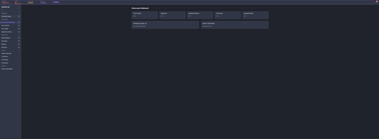
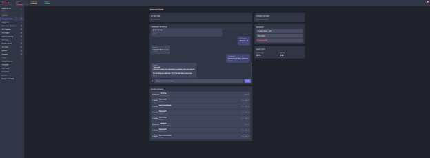
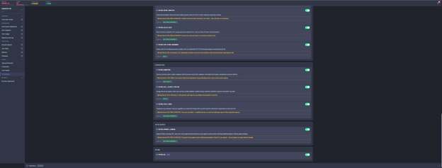
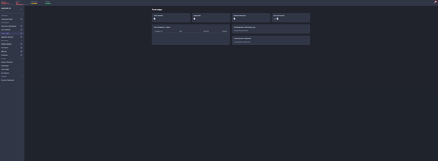
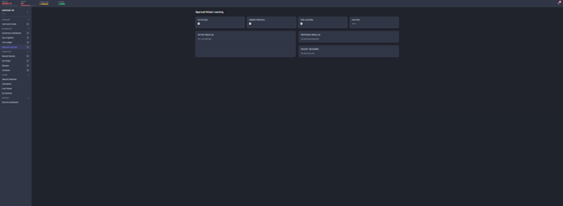
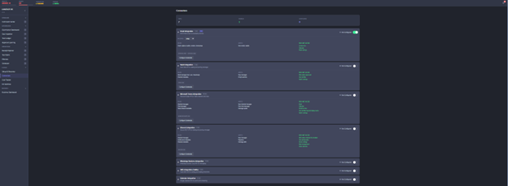
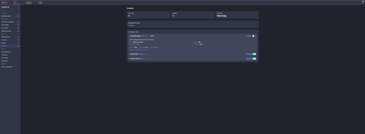
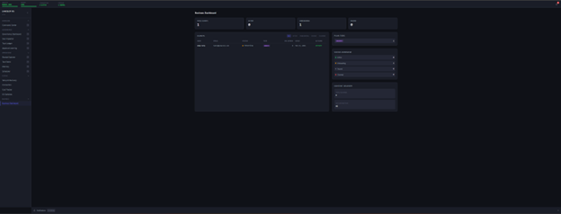

# War Room Guide

The operator's manual for Lancelot's command center — a panel-by-panel walkthrough of the War Room dashboard.

The War Room is a React SPA (Vite + React 18 + TypeScript + Tailwind) accessible at `http://localhost:8000/war-room/`. It communicates with Lancelot exclusively through the Gateway REST API.

---

## Overview

The War Room provides full observability into every aspect of Lancelot's operation. It is organized into tabbed panels, each focused on a specific subsystem. The sidebar provides navigation, and the header shows system vitals at a glance.

**Access:** Local only (localhost). The War Room is not designed for public internet exposure. If you need remote access, add your own authentication layer in front of it.

---

## Header & Vitals Bar

The persistent header displays real-time system vitals:

| Indicator | What It Shows | What to Do If... |
|-----------|--------------|-------------------|
| **System Status** | Overall health (Healthy / Degraded / Down) | If degraded, check the Health panel for specific failures |
| **Active Soul** | Current Soul version (e.g., "v1") | If missing, check `soul/ACTIVE` file |
| **LLM Status** | Local model + cloud provider availability | If local is down, check container logs for `lancelot_local_llm` |
| **Uptime** | Time since last restart | Use for diagnosing intermittent issues |

The **Notification Tray** in the header shows pending items that need your attention: approval requests, graduation proposals, APL rule suggestions, quarantined memory edits.

---

## Command Panel

The primary interaction interface — send messages to Lancelot and see governed responses.

**Features:**
- Chat input with message history
- Response display with receipt IDs (clickable to drill into the receipt)
- Intent classification badge showing how the message was routed
- Model lane indicator showing which LLM handled the request
- Crusader mode toggle for high-agency execution

**What to watch for:**
- The intent badge tells you how Lancelot classified your request (PLAN_REQUEST, EXEC_REQUEST, KNOWLEDGE_REQUEST, CONVERSATIONAL)
- The lane indicator shows cost efficiency — local model calls cost nothing, flagship calls use API tokens
- Receipt IDs in responses are clickable — use them to audit the full governance trace

---

## Health Panel

System-wide health monitoring with subsystem-level detail.

**Displays:**
- Overall readiness status
- Per-subsystem health: Soul, Skills, Scheduler, Memory, Tool Fabric, Local LLM
- Degradation history (when things went wrong and when they recovered)
- Health check timing (last tick, interval)

**Status meanings:**

| Status | Meaning | Action |
|--------|---------|--------|
| **Healthy** | All checks passing | None needed |
| **Degraded** | One or more subsystems failing | Check `degraded_reasons` for specifics |
| **Local LLM Down** | Local model not responding | Check `lancelot_local_llm` container: `docker compose logs local-llm` |
| **Scheduler Stopped** | Scheduler not running | Verify `FEATURE_SCHEDULER=true` and system is in READY state |

**What to do if degraded:**
1. Read the `degraded_reasons` list — it tells you exactly what's wrong
2. Check container status: `docker compose ps`
3. Check container logs: `docker compose logs -f lancelot-core`
4. If the local LLM is the problem, it may still be loading the model (takes up to 2 minutes on first start)

---

## Governance Panel

Risk tier distribution, policy decisions, and the approval queue.

**Displays:**
- Risk tier distribution chart (how many T0/T1/T2/T3 actions in the current session)
- Recent policy decisions with outcomes (approved, denied, escalated)
- Pending approval queue (T3 actions waiting for your authorization)
- Policy cache status (hit rate, invalidations)

**Approval Queue:**

When a T3 action requires your approval, it appears here with:
- What the action is (capability, target, parameters)
- Why it's T3 (base tier or escalation reason)
- The full context of the request

Actions: **Approve** (execute the action) or **Deny** (block and receipt the denial).

**What to watch for:**
- A sudden spike in T3 actions may indicate unusual behavior — investigate
- Denied actions are receipted — check denial patterns to see if Soul rules need adjustment
- Policy cache hit rate should be high (>90%) for normal operation — low hit rate suggests frequent Soul changes or unusual action patterns

---

## Trust Panel

Per-connector trust scores, graduation history, and revocation alerts.

**Displays:**
- Trust score per connector and capability
- Graduation history (which connectors have graduated to lower tiers)
- Pending graduation proposals
- Revocation events (trust resets after failures)

**Graduation Proposals:**

When a connector earns enough trust (e.g., 50 successful T3 actions), a graduation proposal appears:
- Current tier and proposed new tier
- Evidence (number of successful actions, zero failures)
- Accept or decline

**What to watch for:**
- Review graduation proposals carefully — accepting means less oversight for that connector
- Revocation alerts indicate a previously trusted connector had a failure — investigate
- Cooldown indicators show how many actions before a re-proposal can be generated

---

## APL Panel

Approval Pattern Learning — detected patterns, active automation rules, and proposals.

**Displays:**
- Active automation rules (what's being auto-approved and how often)
- Pending rule proposals (patterns APL has detected)
- Pattern confidence levels
- Per-rule usage counters (daily and lifetime)
- Never-automate list (actions that can never be auto-approved)

**Rule Proposals:**

When APL detects a consistent approval pattern (85%+ confidence after 20+ observations), it proposes a rule:
- The pattern description (connector, action type, conditions)
- Confidence level and evidence count
- Proposed limits (daily max, lifetime max)
- Accept or decline

**What to watch for:**
- Daily usage counters approaching limits (circuit breaker will pause the rule)
- Lifetime counters approaching re-confirmation threshold
- Declined proposals won't re-appear for 30 decisions (cooldown)

---

## Receipt Explorer

Searchable audit trail of every action Lancelot has taken.

**Features:**
- Chronological list of all recent receipts
- Filter by: action type, status (success/failure), time range, cognition tier, quest ID
- Full receipt detail view with all fields
- Parent-child chain navigation (click parent_id to trace the decision chain)
- Governance metadata (risk tier, policy decision, approval status)

**How to use it:**
- To audit a specific action: search by time range and action type
- To trace a complete workflow: find the initial receipt, then follow the quest_id
- To investigate a failure: filter by `status: failure` and drill into the error details
- To understand governance decisions: look at the metadata for risk_tier and policy_decision

---

## Connector Status

Per-connector health, configuration, and usage metrics.

**Displays:**
- Enabled/disabled status per connector
- Rate limit usage (requests used vs. limit per minute)
- Credential status (valid, expired, missing)
- Recent activity per connector
- Error rates and last error details

**What to watch for:**
- Rate limit usage approaching limits — consider adjusting in `config/connectors.yaml`
- Credential expiry warnings — rotate credentials before they expire
- High error rates — check connector logs and external service status

---

## Scheduler Panel

Automated job management and execution history.

**Displays:**
- Active jobs with schedule (cron expression or interval)
- Run history per job (last N runs with status)
- Skip reasons (why a job didn't execute — gating failures, approval required)
- Manual trigger buttons for testing

**Job statuses:**

| Status | Meaning |
|--------|---------|
| **Ran** | Job executed successfully |
| **Failed** | Job executed but encountered an error |
| **Skipped (gate)** | Job didn't run because a gate check failed (not READY, LLM down) |
| **Skipped (approval)** | Job requires owner approval that wasn't granted |

**What to do if a job keeps skipping:**
1. Check the skip reason — is the system in READY state?
2. Verify dependencies — is the local LLM healthy?
3. For gated jobs — have you granted the required approval?

---

## Memory Panel

Memory tier overview, quarantine management, and commit history.

**Displays:**
- Tier sizes (core blocks, working items, episodic entries, archival records)
- Core block viewer (content, token usage, last updated)
- Quarantine queue (pending items with approve/deny actions)
- Commit history with diff preview and rollback buttons
- Context compiler trace (last N compilations with token breakdown)

**Quarantine Management:**

The quarantine queue shows memory edits that need your review:
- What the agent wanted to write
- Which tier and block it targeted
- Why it was quarantined (risky target, low confidence, security filter)
- Provenance (where the data came from)

Actions: **Approve** (promote to active memory) or **Reject** (discard with receipt).

**What to watch for:**
- Growing quarantine queue — check regularly and process items
- Unexpected core block edits — investigate why the agent is trying to change its identity
- Token budget warnings — core blocks approaching their limits

---

## Kill Switches

Emergency controls for disabling subsystems.

Each kill switch has a confirmation dialog before activation. Disabling a subsystem:
- Takes effect immediately
- Does not destroy data
- Is reversible (re-enable by toggling the feature flag and restarting)

| Switch | What It Controls | When to Use |
|--------|-----------------|-------------|
| **Tool Fabric** | All tool execution | If unexpected commands are being run |
| **Network** | Outbound network from sandbox | If suspicious network activity is detected |
| **Skills** | Skill system | If a skill is behaving unexpectedly |
| **Scheduler** | All automated jobs | If scheduled jobs are causing problems |
| **Memory Writes** | Memory edit capability | If memory is being polluted |

**Important:** Disabling Soul governance is possible but not recommended — it removes constitutional constraints entirely.

---

## Keyboard Shortcuts

| Shortcut | Action |
|----------|--------|
| `/` | Focus the command input |
| `Esc` | Close any open modal or panel |
| `Ctrl+K` | Quick search across receipts |

---

## Tips for Daily Operation

1. **Start your session** by checking the Health panel — make sure everything is green
2. **Check the notification tray** for pending approvals, proposals, and quarantined items
3. **Review the approval queue** in the Governance panel before doing other work
4. **Process the quarantine** in the Memory panel — don't let it grow unchecked
5. **Spot-check receipts** periodically — look for unexpected patterns or failures
6. **Monitor trust scores** — accept graduation proposals only after reviewing the evidence
