# War Room Guide

The operator's manual for Lancelot's command center — a panel-by-panel walkthrough of the War Room dashboard.

The War Room is a React SPA (Vite + React 18 + TypeScript + Tailwind) accessible at `http://localhost:8000/war-room/`. It communicates with Lancelot exclusively through the Gateway REST API.

  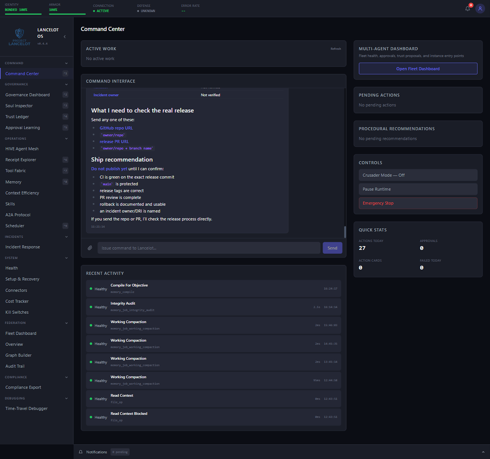

---

## Overview

The War Room provides full observability into every aspect of Lancelot's operation. It is organized into tabbed panels, each focused on a specific subsystem. The sidebar provides navigation, and the header shows system vitals at a glance.

**Access:** Local only (localhost). The War Room is not designed for public internet exposure. If you need remote access, add your own authentication layer in front of it.

---

## Header & Vitals Bar

The persistent header displays real-time system vitals:

| Indicator | What It Shows | What to Do If... |
|-----------|--------------|-------------------|
| **System Status** | Overall health (Healthy / Degraded / Down) | If degraded, check the Health panel for specific failures |
| **Active Soul** | Current Soul version (e.g., "v1") | If missing, check `soul/ACTIVE` file |
| **LLM Status** | Local model + cloud provider availability | If local is down, check container logs for `lancelot_local_llm` |
| **Uptime** | Time since last restart | Use for diagnosing intermittent issues |

The **Notification Tray** in the header shows pending items that need your attention: approval requests, graduation proposals, APL rule suggestions, quarantined memory edits.

### Status Surfaces

War Room now distinguishes three different subsystem conditions:

| State | Meaning |
|------|---------|
| **Disabled** | Feature intentionally off |
| **Not initialized** | Feature expected, but runtime dependencies are not wired |
| **Runtime degraded** | Feature mounted, but one or more live runtime checks failed |

Where supported by the backend, subsystem pages now surface:

- `runtime_degraded`
- `degraded_reasons`
- `runtime_errors`
- explicit loaded-vs-ready runtime state where the subsystem supports it

This is deliberate. A blank table or a default status should no longer be treated as proof that the subsystem is healthy.

---

## Command Panel

  

The primary interaction interface — send messages to Lancelot and see governed responses.

**Features:**
- Chat input with message history
- Response display with receipt IDs (clickable to drill into the receipt)
- Intent classification badge showing how the message was routed
- Model lane indicator showing which LLM handled the request
- Crusader mode toggle for high-agency execution
- Live governance progress cards for model routing, tool execution, approval waits, and completion/failure states
- Text commands are queued through `POST /chat/async`; the UI shows active run state, current progress message, phase timing, and renders the final assistant message from `chat.run_*` events instead of waiting on a long HTTP request
- Active async command runs can be cancelled from the run card; failed or cancelled runs can be retried as a new governed run
- Inline ActionCards for approvals; cards lead with operator-readable intent/scope and keep raw tool parameters under technical details
- Confirmed approvals surface an inline **Continue** prompt so the operator can resume the approved workflow without guessing the next chat command
- Runtime pause/resume control for stopping new work across chat, scheduler, HIVE, A2A, and TaskRun ingress
- Emergency stop control for forcing the runtime into paused state and collapsing live HIVE agents through the control plane

**What to watch for:**
- The intent badge tells you how Lancelot classified your request (PLAN_REQUEST, EXEC_REQUEST, KNOWLEDGE_REQUEST, CONVERSATIONAL)
- The lane indicator shows cost efficiency — local model calls cost nothing, flagship calls use API tokens
- Receipt IDs in responses are clickable — use them to audit the full governance trace
- A queued/running command means the backend accepted the request and is still executing; terminal `chat.run_completed`, `chat.run_blocked`, or `chat.run_failed` events produce the final chat response
- The active run card shows the latest governance progress message plus recent phase timing so operators can distinguish slow model calls from approval, classification, or finalization delay
- Cancel marks the persisted async run terminal and prevents late completion from changing the visible result. It is cooperative, so a blocking provider/tool call may still finish in the backend after the UI has been released.
- Retry creates a new run linked to the failed/cancelled run. It re-enters the normal governance path and does not reuse prior approvals.
- If a governed action pauses for approval, the blocked tool flow remains visible beside the ActionCard until the decision is resolved
- If an ActionCard approval succeeds, use the inline **Continue** prompt to resume only the approved scope
- Runtime pause blocks new work but does not cancel work already in flight; active tasks finish unless you use a stronger stop or kill control
- Emergency stop is the stronger control: it pauses new work and issues a live local stop across the HIVE execution mesh
- The pause button is a real control-plane action now. It reflects the persisted backend state and switches to **Resume Runtime** when the runtime is paused.
- Emergency stop is also a real control-plane action now. It no longer relies on chat interpretation, and its source is preserved in runtime pause state and receipts.

Operational details for receipt-backed completion, approval context, workspace boundaries, and long-running status troubleshooting are in [Command Center Execution Runbook](operations/runbooks/command-center-execution.md).

---

## Health Panel

  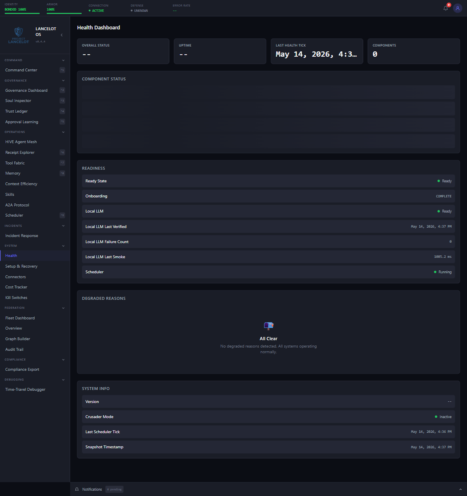

System-wide health monitoring with subsystem-level detail.

**Displays:**
- Overall readiness status
- Per-subsystem health: Soul, Skills, Scheduler, Memory, Tool Fabric, Local LLM
- Degradation history (when things went wrong and when they recovered)
- Health check timing (last tick, interval)

**Status meanings:**

| Status | Meaning | Action |
|--------|---------|--------|
| **Healthy** | All checks passing | None needed |
| **Degraded** | One or more subsystems failing | Check `degraded_reasons` for specifics |
| **Local LLM Down** | Local model not ready for inference | Check `lancelot_local_llm` container: `docker compose logs local-llm` |
| **Scheduler Stopped** | Scheduler not running | Verify `FEATURE_SCHEDULER=true` and system is in READY state |

**What to do if degraded:**
1. Read the `degraded_reasons` list — it tells you exactly what's wrong
2. Check container status: `docker compose ps`
3. Check container logs: `docker compose logs -f lancelot-core`
4. If the local LLM is the problem, check whether it is merely loaded or actually ready. War Room now shows both states separately, along with the last readiness error and the last successful verification time.

---

## Governance Panel

  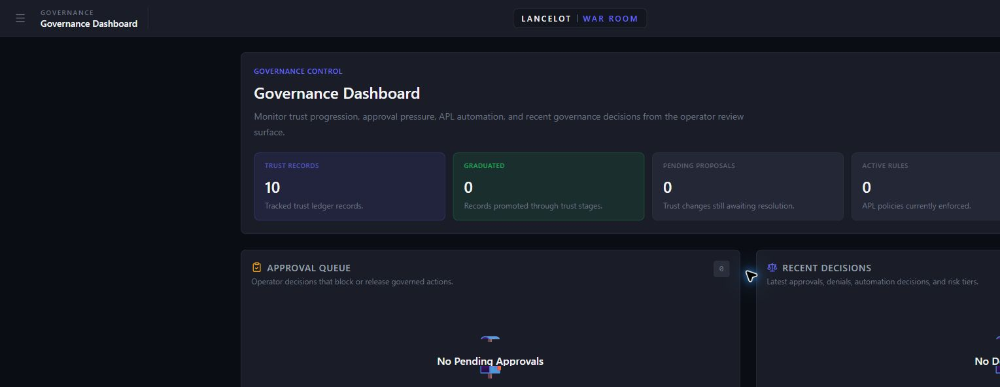

Risk tier distribution, policy decisions, and the approval queue.

**Displays:**
- Risk tier distribution chart (how many T0/T1/T2/T3 actions in the current session)
- Recent policy decisions with outcomes (approved, denied, escalated)
- Pending approval queue (T3 actions waiting for your authorization)
- Policy cache status (hit rate, invalidations)

**Approval Queue:**

When a T3 action requires your approval, it appears here with:
- What the action is (capability, target, parameters)
- Why it's T3 (base tier or escalation reason)
- The full context of the request

T3 actions from the MCP Sentry are marked with a yellow **T3 ACTION** badge and show the tool parameters. Graduation proposals and APL rule proposals also appear in the same queue.

Actions: **Approve** (execute the action) or **Deny** (block and receipt the denial). Both actions are logged to the Decision Log and appear in the Recent Decisions panel.

**What to watch for:**
- A sudden spike in T3 actions may indicate unusual behavior — investigate
- Denied actions are receipted — check denial patterns to see if Soul rules need adjustment
- Policy cache hit rate should be high (>90%) for normal operation — low hit rate suggests frequent Soul changes or unusual action patterns

---

## Trust Panel

  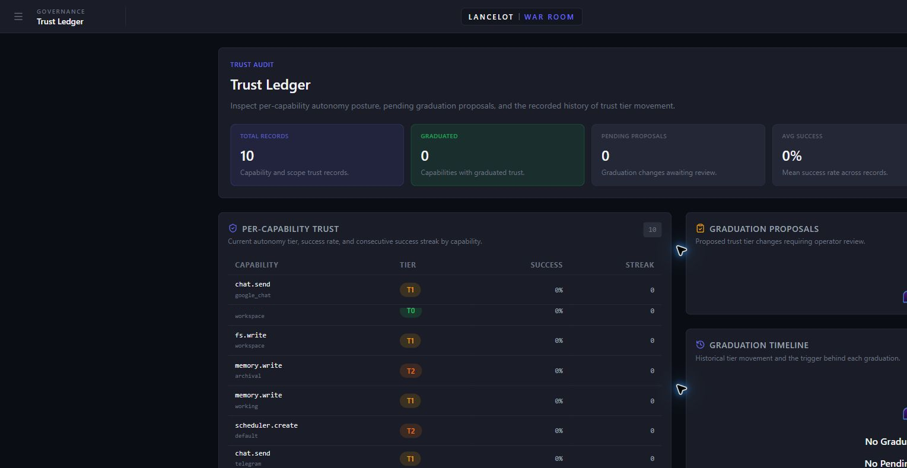

Per-connector trust scores, graduation history, and revocation alerts.

**Displays:**
- Trust score per connector and capability
- Graduation history (which connectors have graduated to lower tiers)
- Pending graduation proposals
- Revocation events (trust resets after failures)

**Graduation Proposals:**

When a connector earns enough trust (e.g., 50 successful T3 actions), a graduation proposal appears:
- Current tier and proposed new tier
- Evidence (number of successful actions, zero failures)
- Accept or decline

**What to watch for:**
- Review graduation proposals carefully — accepting means less oversight for that connector
- Revocation alerts indicate a previously trusted connector had a failure — investigate
- Cooldown indicators show how many actions before a re-proposal can be generated

---

## APL Panel

  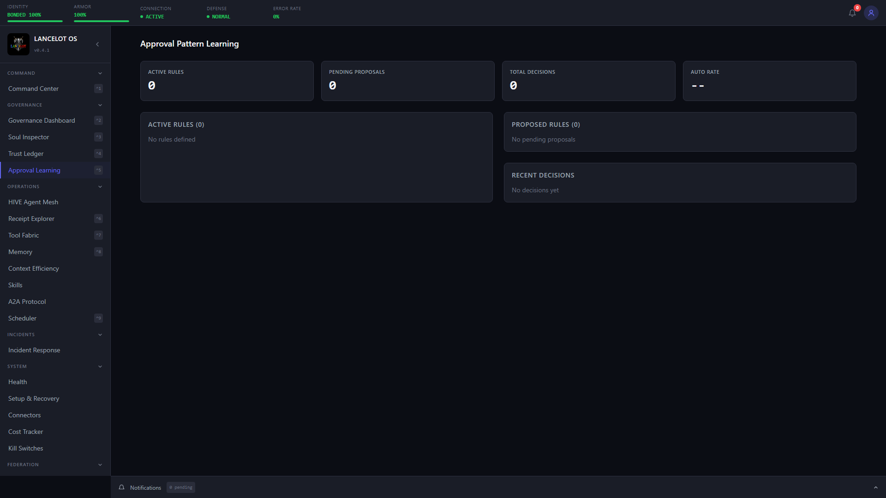

Approval Pattern Learning — detected patterns, active automation rules, and proposals.

**Displays:**
- Active automation rules (what's being auto-approved and how often)
- Pending rule proposals (patterns APL has detected)
- Pattern confidence levels
- Per-rule usage counters (daily and lifetime)
- Never-automate list (actions that can never be auto-approved)

**Rule Proposals:**

When APL detects a consistent approval pattern (85%+ confidence after 20+ observations), it proposes a rule:
- The pattern description (connector, action type, conditions)
- Confidence level and evidence count
- Proposed limits (daily max, lifetime max)
- Accept or decline

**What to watch for:**
- Daily usage counters approaching limits (circuit breaker will pause the rule)
- Lifetime counters approaching re-confirmation threshold
- Declined proposals won't re-appear for 30 decisions (cooldown)

---

## Receipt Explorer

  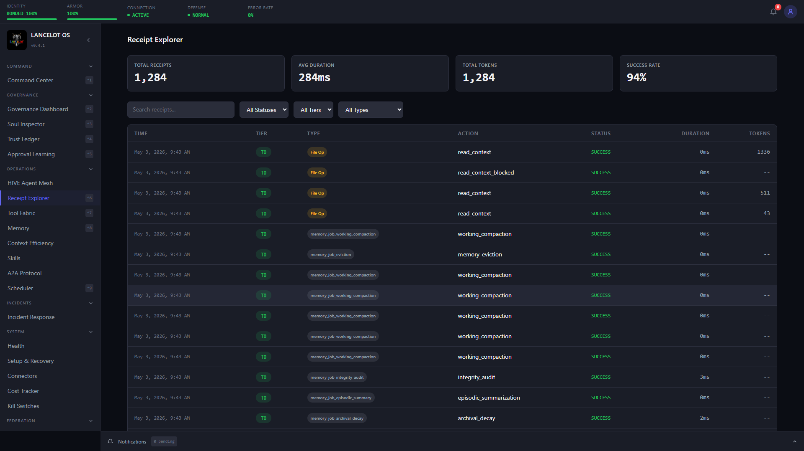

Searchable audit trail of every action Lancelot has taken.

**Features:**
- Chronological list of all recent receipts
- Filter by: action type, status (success/failure), time range, cognition tier, quest ID
- Full receipt detail view with all fields
- Parent-child chain navigation (click parent_id to trace the decision chain)
- Governance metadata (risk tier, policy decision, approval status)

**How to use it:**
- To audit a specific action: search by time range and action type
- To trace a complete workflow: find the initial receipt, then follow the quest_id
- To investigate a failure: filter by `status: failure` and drill into the error details
- To understand governance decisions: look at the metadata for risk_tier and policy_decision

---

## Skills Panel

  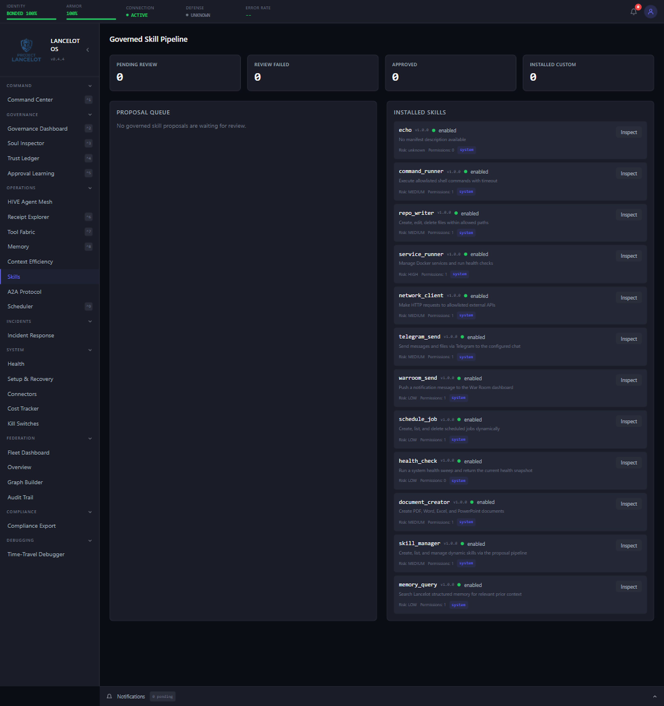

Governed skill proposal review and install lifecycle.

**Displays:**
- Proposal queue with `pending`, `review_failed`, `approved`, and `installed` states
- Runtime permissions, derived security capabilities, target domains, and vault-key declarations
- Stage-by-stage security pipeline evidence (manifest validation, static analysis, sandbox test, owner review)
- Runtime/security manifests, generated implementation code, generated tests, and artifact hashes
- Installed dynamic-skill inventory beside the proposal queue

**Operator workflow:**
1. Review the proposal contract first: permissions, capabilities, domains, vault keys, and risk.
2. Inspect the pipeline evidence. `review_failed` means the artifact never became install-ready.
3. Approve only proposals whose reviewed artifact hashes and stage output match the intended use.
4. Install only after approval. Installation re-validates the same artifact package before it reaches the live registry.

**What to watch for:**
- Unexpected domains or vault keys on low-risk skills
- Capability expansion that does not match the runtime permission list
- Stage failures in `static_analysis` or `sandbox_test`
- Install blocks caused by artifact hash drift after approval

---

## Connector Status

  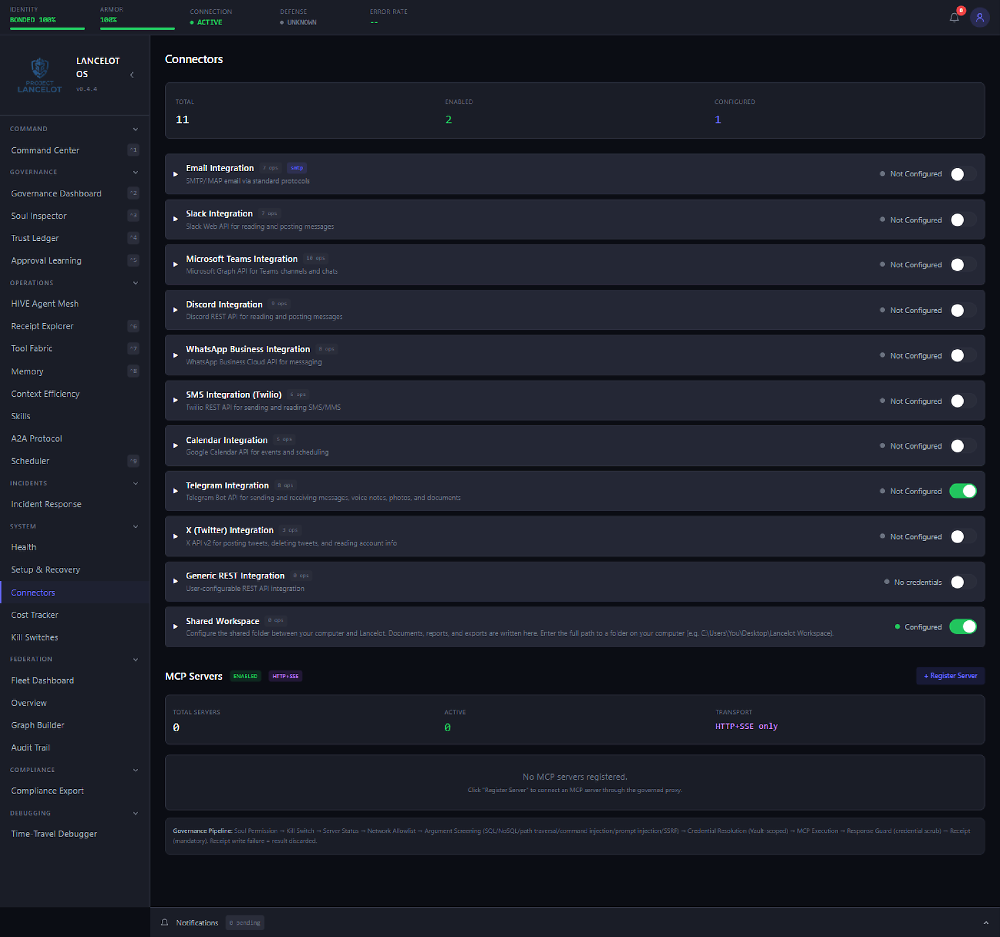

Per-connector health, configuration, and usage metrics.

**Displays:**
- Enabled/disabled status per connector
- Rate limit usage (requests used vs. limit per minute)
- Credential status (valid, expired, missing)
- Recent activity per connector
- Error rates and last error details

**What to watch for:**
- Rate limit usage approaching limits — consider adjusting in `config/connectors.yaml`
- Credential expiry warnings — rotate credentials before they expire
- High error rates — check connector logs and external service status

---

## Cost Tracker

  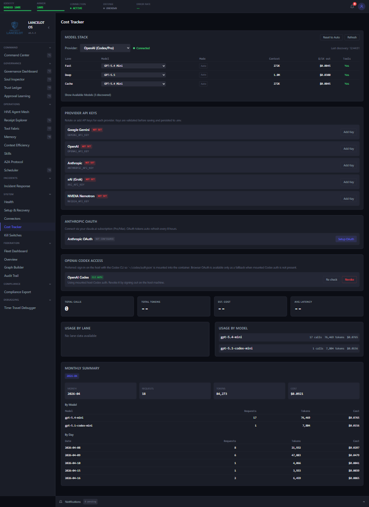

Provider usage, key status, and provider-side authentication controls.

**Codex access path:**
- The OpenAI Codex card now treats mounted host Codex auth as the preferred enterprise path.
- If `~/.codex/auth.json` is mounted into the container, the card reports `CLI AUTH` and no browser OAuth flow is required.
- The action button performs a re-check first; browser OAuth is opened only when mounted Codex auth is not available.
- Revoking `CLI AUTH` is done by signing out on the host machine, not by deleting vault-backed OAuth tokens inside Lancelot.

**Persistence contract:**
- The active provider should survive container restarts and rebuilds through the durable data volume, even if the container is recreated.
- Onboarding should remain `READY` after a healthy rebuild; dropping back to incomplete because provider state was lost is a defect, not expected behavior.
- If the Cost Tracker or onboarding regresses after a rebuild, check `/home/lancelot/data/provider_config.json` and the onboarding snapshot before assuming the provider itself is broken.

---

## Scheduler Panel

  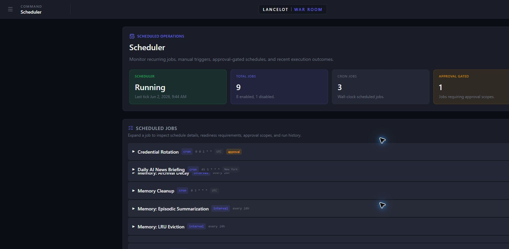

Automated job management and execution history.

**Displays:**
- Active jobs with schedule (cron expression or interval)
- Run history per job (last N runs with status)
- Skip reasons (why a job didn't execute — gating failures, approval required)
- Manual trigger buttons for testing

**Job statuses:**

| Status | Meaning |
|--------|---------|
| **Ran** | Job executed successfully |
| **Failed** | Job executed but encountered an error |
| **Skipped (gate)** | Job didn't run because a gate check failed (not READY, LLM down) |
| **Skipped (approval)** | Job requires owner approval that wasn't granted |

**What to do if a job keeps skipping:**
1. Check the skip reason — is the system in READY state?
2. Verify dependencies — is the local LLM healthy?
3. For gated jobs — have you granted the required approval?

---

## Memory Panel

  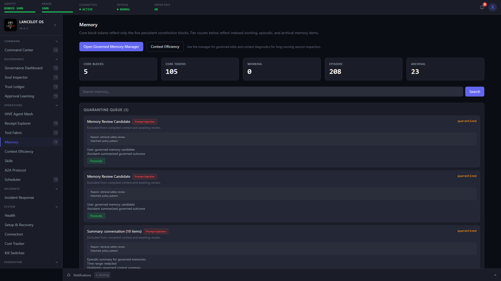

Memory tier overview, quarantine management, and commit history.

**Displays:**
- Tier sizes (core blocks, working items, episodic entries, archival records)
- Core block viewer (content, token usage, last updated)
- Quarantine queue (pending items with approve/deny actions)
- Search across working, episodic, and archival memory
- Recent tiered memory items
- Link to the Governed Memory Manager for commits, governed edits, removals, quarantine review, and future rollback tooling

The Context Efficiency view exposes compile telemetry from `POST /memory/compile`
and `memory_compile` receipt data. Operators can run an objective-specific
diagnostic and inspect budget use, static versus dynamic tokens, memory hits,
exclusions, retrieval miss rate, cache eligibility, task/template reuse, and
compaction status.

**Quarantine Management:**

The quarantine queue shows memory edits that need your review:
- What the agent wanted to write
- Which tier and block it targeted
- Why it was quarantined (risky target, low confidence, security filter)
- Provenance (where the data came from)

Actions: **Approve** (promote to active memory) or **Reject** (discard with receipt).

**What to watch for:**
- Growing quarantine queue — check regularly and process items
- Unexpected core block edits — investigate why the agent is trying to change its identity
- Token budget warnings — core blocks approaching their limits

---

## Kill Switches

  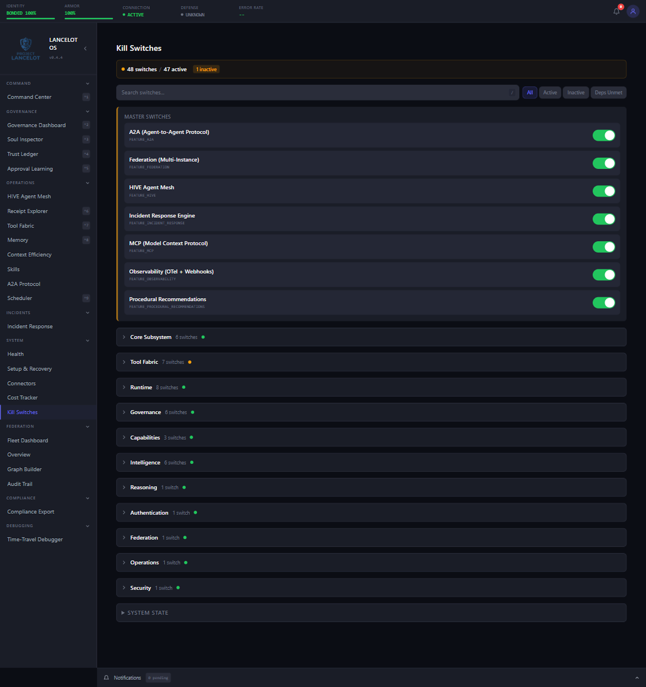

Emergency controls for disabling subsystems.

Each kill switch has a confirmation dialog before activation. Disabling a subsystem:
- Takes effect immediately (hot-toggled — no restart required)
- Gracefully shuts down the subsystem (stops background threads, closes database connections)
- Does not destroy data
- Is reversible (re-enable by toggling the switch back to lazily reinitialize)

**Persistence:** Kill switch state is persisted to `.flag_state.json` in the Docker data volume. Toggles made in the War Room survive container restarts. The priority order is: persisted state > `.env` values > code defaults.

**Hot-Toggle:** Runtime-managed feature flags are hot-toggleable via the SubsystemManager. Core runtime subsystems such as Soul, Skills, Scheduler, Health Monitor, and Memory are lazily initialized when toggled ON and gracefully shut down when toggled OFF where the subsystem supports live start/stop. Startup-only flags still show an operator confirmation because they may require a container restart to fully initialize or shut down.

The War Room kill-switch story is unified even when the underlying implementations differ. Subsystem feature flags and MCP master/per-server kills use the same shared kill-switch contract (`switch_id`, `scope`, `reason`, `allowed`), while federation kill commands remain a specialized propagation workflow on top of that operator model.

| Switch | What It Controls | When to Use |
|--------|-----------------|-------------|
| **Tool Fabric** | All tool execution | If unexpected commands are being run |
| **Network** | Outbound network from sandbox | If suspicious network activity is detected |
| **Skills** | Skill system | If a skill is behaving unexpectedly |
| **Scheduler** | All automated jobs | If scheduled jobs are causing problems |
| **Memory Writes** | Memory edit capability | If memory is being polluted |

**Important:** Disabling Soul governance is possible but not recommended — it removes constitutional constraints entirely.

---

## Setup & Recovery

  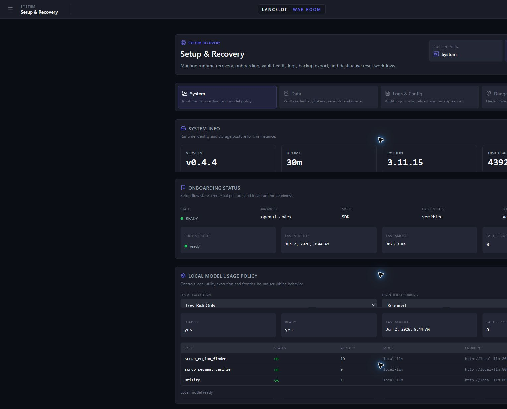

The system administration hub — 4 tabs covering all operational and destructive controls.

### System Tab

- **System Info**: Version, uptime, Python version, disk usage (polled live)
- **Container Controls**: Restart (exit code 0 — Docker auto-restarts) and Shutdown (exit code 1 — stays stopped). Both require confirmation dialogs.
- **Onboarding Status**: Current state, provider, credentials, local model install status, local model runtime readiness, cooldown info. Visible only to authenticated War Room operators.
- **Recovery Commands**: Check Status, Go Back, Restart Step, Resend Code

### Data Tab

- **Connector Vault Health**: Shows non-secret connector-vault status, key source/origin, key id, encrypted file presence, and operator-facing failure details when the vault failed closed.
- **Vault Credentials**: Lists all credential keys with type and created_at (values are never displayed). Individual keys can be deleted.
- **Execution Tokens**: Lists active tokens with status. Active tokens can be revoked.
- **Receipt Management**: Shows total receipt count. Finalized receipts are append-only; complete fresh starts require an external volume reset.
- **Usage Counters**: Reset in-memory usage counters for a fresh tracking period.

### Logs & Config Tab

- **Log Viewer**: Terminal-style viewer showing the last 200 lines of the audit log (or vault access log). Supports refresh and auto-scroll to bottom.
- **Configuration Reload**: Triggers a re-read of YAML configs (feature flags, scheduler, connectors). Shows per-subsystem reload results.
- **Export/Backup**: Downloads a ZIP file containing configs, soul YAML, memory data, flag state, and scheduler data.

### Danger Zone Tab

Red-bordered destructive operations — all require confirmation:

| Action | What It Does | Confirmation |
|--------|-------------|-------------|
| **Reset Connector Vault** | Archives encrypted connector-vault artifacts under `data/vault/reset_backups/<timestamp>/` and restarts the container so a clean vault can be re-created | Type "RESET CONNECTOR VAULT" |
| **Factory Reset** | Deletes all data directory contents, resets flags, clears onboarding | Type "RESET" |
| **Purge Memory** | Deletes core_blocks.json and SQLite memory stores | Confirm dialog |
| **Reset Feature Flags** | Deletes .flag_state.json, resets all flags to code defaults | Confirm dialog |
| **Reset Onboarding** | Clears onboarding progress, restarts setup flow | Confirm dialog |

All destructive operations are audit-logged.

### Local Model Runtime Signals

Setup & Recovery and the Health panel now distinguish:

- **Install state** — whether the local model package and weights are present
- **Runtime loaded** — whether the model process initialized successfully
- **Runtime ready** — whether a recent local inference smoke passed
- **Role readiness** - whether the scrub region-finder, scrub segment-verifier, and utility roles are configured, enabled, and ready

If the model is loaded but not ready, Lancelot does not treat the local execution or local scrub lane as healthy. If role-specific endpoints are configured, Setup & Recovery shows each role's endpoint label, model label, readiness, last error, and smoke timing so operators can distinguish "the local model is down" from "only the scrub verifier endpoint is degraded." When every enabled role-specific endpoint is ready, the top-level local model lane is considered ready even if the legacy fallback `LOCAL_LLM_URL` endpoint is unavailable.

---

## Update Banner

A notification banner appears at the top of every War Room page when a new version of Lancelot is available. The system checks for updates every 6 hours in the background.

**Severity levels:**

| Severity | Color | Dismissible | Meaning |
|----------|-------|-------------|---------|
| **Info** | Blue | Yes (reappears after 24h) | Minor update, no urgency |
| **Recommended** | Accent | Yes (reappears after 24h) | Recommended update with improvements |
| **Important** | Yellow | No | Significant update, should apply soon |
| **Critical** | Red | No | Security or critical fix, apply immediately |

**Banner actions:**
- **View Changelog** — Opens the release notes in a new tab
- **Check Now** — Forces an immediate version check (normally checks every 6 hours)
- **Dismiss** — Hides the banner for 24 hours (info/recommended only; important/critical are always visible)

**Configuration:**
- Version manifest URL: `LANCELOT_VERSION_URL` environment variable (default: `https://api.projectlancelot.dev/v1/version`)
- The `VERSION` file at the repo root is the single source of truth for the running version

The update checker is informational and does not affect `/health/ready`. If the
instance cannot reach the manifest service, `/api/updates/status` reports
`check_state: "offline"`, `check_error_kind: "network_unreachable"`, and
`next_check_after` for the scheduled retry. Expected DNS or offline failures are
kept out of normal startup logs; policy blocks, invalid manifests, and server
errors still log as warnings because they require operator attention.

---

## Keyboard Shortcuts

| Shortcut | Action |
|----------|--------|
| `/` | Focus the command input |
| `Esc` | Close any open modal or panel |
| `Ctrl+K` | Quick search across receipts |

---

## Hive Agent Mesh

  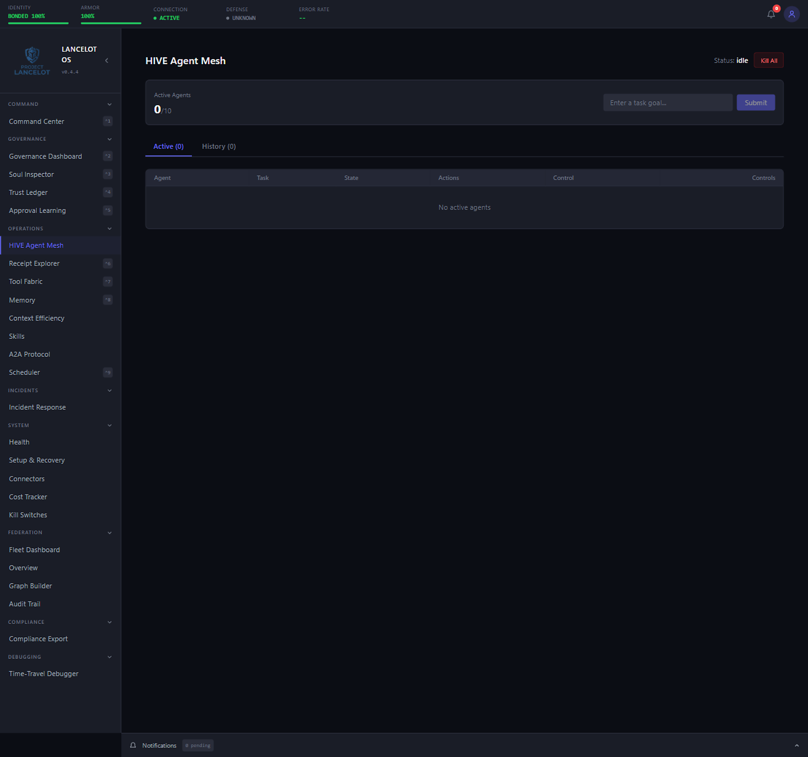

The Hive Agent Mesh page provides real-time monitoring and control of ephemeral sub-agents.

**Access:** Available in the sidebar when `FEATURE_HIVE` is enabled.

### Agent Table

The main view shows all active agents in a table:

| Column | Description |
|--------|-------------|
| **Agent ID** | Truncated UUID with copy-to-clipboard |
| **State** | Color-coded badge: gray (spawning), blue (ready), green (executing), yellow (paused), purple (completing), red (collapsed) |
| **Task** | Subtask description from decomposition |
| **Actions** | Action count / max actions |
| **Control** | Autonomy level (fully_autonomous, supervised, manual_confirm) |
| **Controls** | Pause/Resume/Kill/Modify buttons per agent |

### Task Submission

The top of the page has a goal input field. Enter a high-level goal and click Submit to trigger task decomposition and agent spawning.

### Per-Agent Controls

Each agent row has context-appropriate control buttons:
- **Pause** (executing agents) — opens InterventionDialog with required reason
- **Resume** (paused agents) — immediately resumes execution
- **Kill** (any non-collapsed agent) — opens InterventionDialog with required reason
- **Modify** (any non-collapsed agent) — opens InterventionDialog with reason and feedback fields

### InterventionDialog

A modal dialog that appears when pausing, killing, or modifying an agent:
- **Type-specific title and description** — explains consequences of the action
- **Required reason field** — must be non-empty to submit
- **Optional feedback field** — shown only for MODIFY actions, used in replan context
- **Type-specific button colors** — yellow (pause), red (kill), blue (modify)

### Kill-All Emergency Button

A prominent red button at the top collapses all active agents immediately. Opens InterventionDialog with required reason. Use only in emergencies.

### History Tab

Switch to the history tab to view archived (collapsed) agents with:
- Collapse reason badge (color-coded: green for completed, red for kills, orange for violations, yellow for timeouts)
- Collapse message
- Final action count and duration

**Polling:** The page polls every 3 seconds for live status updates.

### HIVE Status Contract

`GET /api/hive/status` now exposes both mesh state and runtime readiness:

- `enabled`
- `status`
- `active_agents`
- `max_agents`
- `architect_ready`
- `lifecycle_ready`
- `registry_ready`
- `receipt_manager_ready`
- `config_ready`
- `runtime_degraded`
- `degraded_reasons`
- `runtime_errors`

This prevents the old failure mode where HIVE could look merely "idle" or "not initialized" even though a live dependency was failing internally.

---

## UAB Status Panel

  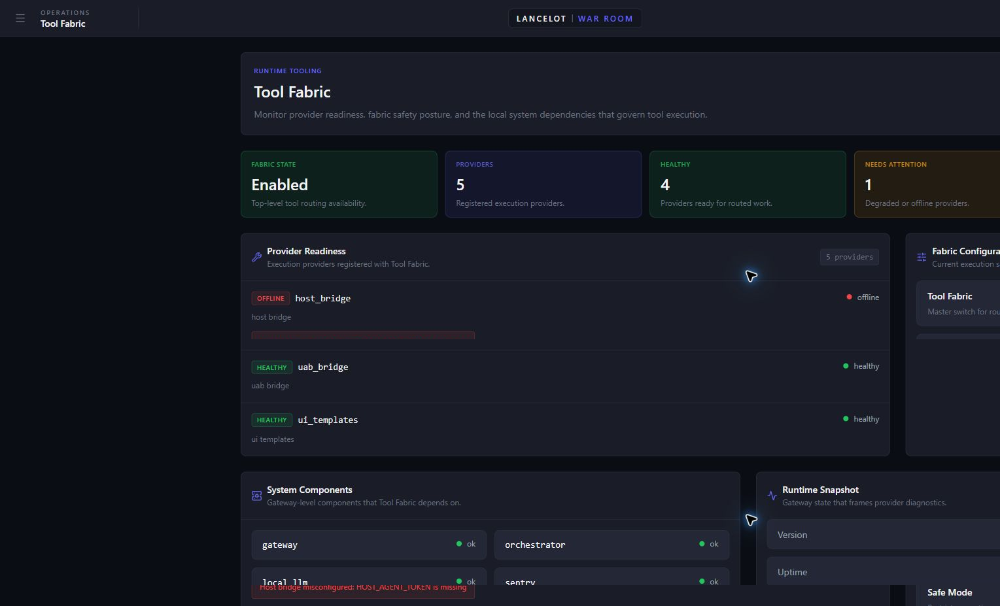

The UAB daemon status panel appears on the **Kill Switches** page when `FEATURE_TOOLS_UAB` is enabled.

### What It Shows

When the daemon is running:
- **Status indicator** — green pulsing dot with "Running"
- **Version** — UAB daemon version
- **Connected apps** — count of apps with active connections
- **Supported frameworks** — list of available framework plugins
- **Connected apps table** — name, PID, framework, connection method per app

When the daemon is offline:
- **Status indicator** — red "Offline"
- **Instructions** to start the daemon with the appropriate script

### Activation

The UAB panel appears automatically when the `FEATURE_TOOLS_UAB` flag is enabled and the flag metadata includes `has_editor: "uab_panel"`. No additional configuration is needed.

**Polling:** The panel polls every 5 seconds for live daemon status.

---

## Federation Overview

  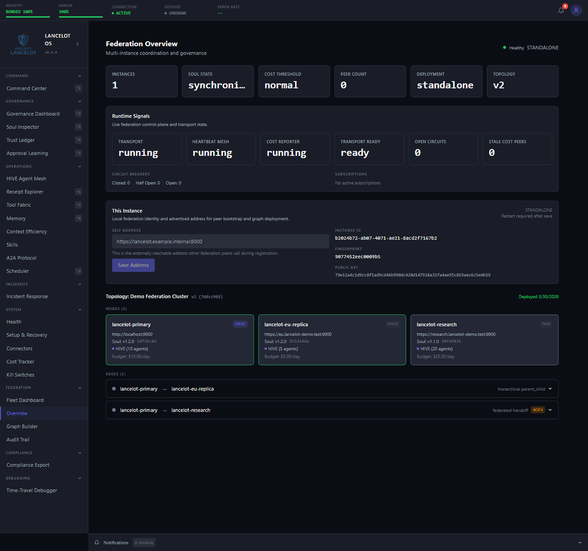

The Federation Overview page is now the operator-facing mesh health dashboard, not just a topology viewer.

### This Instance Card

Federation Overview owns the local instance identity settings:

- `self_address`
- instance ID
- fingerprint
- public key
- deployment mode

Graph Builder should reuse this configured `self_address` for the local node instead of inventing a second endpoint source of truth.

### Runtime Degradation Panel

Federation Overview now surfaces runtime degradation directly from `/api/federation/status`, including:

- transport started state
- heartbeat mesh running state
- cost reporter running state
- circuit breaker summary
- subscription lifecycle state
- last stream outcome and stream errors
- stale budget peers
- active Soul propagation state
- divergence state and reconciliation data

That means the page can now reflect real federation control-plane degradation instead of only showing peer freshness and topology counts.

---

## Fleet Dashboard

  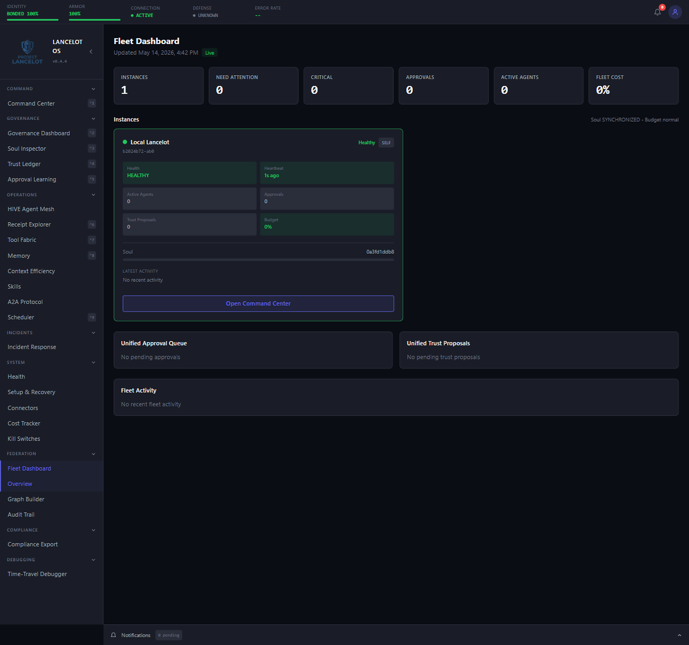

The Fleet Dashboard is the multi-instance operator view for federated Lancelot deployments. It appears in the Federation navigation when both `FEATURE_FEDERATION=true` and `FEATURE_FEDERATION_DASHBOARD=true`.

**Access:** `/war-room/federation/fleet`

Use it as the first screen when you are operating more than one Lancelot instance. It surfaces health awareness, heartbeat freshness, budget state, pending approvals, trust proposals, active HIVE agent counts, recent receipt activity, and attention reasons in one place.

### Instance Cards

Each card represents one Lancelot instance and is sorted by urgency by default. The card shows:

- local health monitor state
- heartbeat freshness
- Soul hash/version signal
- active agent count
- pending approval count
- pending trust proposal count
- budget utilization
- latest receipt-backed activity
- specific `Needs Attention` notices

The `Open Command Center` button deep-links to that instance's Command Center, not just the War Room root. For the local instance it opens `/war-room/command`; for remote peers it opens the peer address with `/war-room/command` appended. If the operator must sign in first, the auth flow preserves the destination and returns to the deep link after login.

### Health vs. Needs Attention

`Health` is the instance readiness/health monitor result. It should only show degraded or error when the instance health snapshot says so.

`Needs Attention` is broader. A card can be healthy and still need attention because it has pending approvals, pending trust proposals, stale heartbeat, stale budget telemetry, remote detail unavailable, Soul mismatch, or federation runtime notices.

`Latest Activity` comes from receipts. It should begin populating after governed chat actions, HIVE events, approvals, denials, kills, pauses, or other receipted work runs on that instance.

### Unified Approval Queue

The Unified Approval Queue aggregates pending T2/T3 governance approvals across the local instance and federated peers. Approve and Deny actions are sent through the federation dashboard proxy, carry the operator identity, and emit governance receipts.

Use the instance Governance Dashboard for detailed local review when needed, but the fleet queue is the control point for operating multiple instances without tab hopping.

### Fleet Activity

Fleet Activity is receipt-backed. It is not a standalone event log. If no activity appears after an agent or governed command runs, check that the instance is emitting receipts and that remote dashboard detail is reachable through signed federation traffic.

### Troubleshooting

If the Fleet Dashboard page is missing, verify both feature flags and `dashboard.enabled` in `config/federation.yaml`.

If a peer card says remote detail is unavailable, check peer registration, `self_address`, signed federation auth, and the peer's `/api/federation/dashboard/local` endpoint.

If `Needs Attention` names stale cost peers, confirm those peer IDs are still registered. Stale cost telemetry for unregistered peers should be filtered out.

---

## Tips for Daily Operation

1. **Start your session** by checking the Health panel — make sure everything is green
2. **Check the notification tray** for pending approvals, proposals, and quarantined items
3. **Review the approval queue** in the Governance panel before doing other work
4. **Process the quarantine** in the Memory panel — don't let it grow unchecked
5. **Spot-check receipts** periodically — look for unexpected patterns or failures
6. **Monitor trust scores** — accept graduation proposals only after reviewing the evidence
